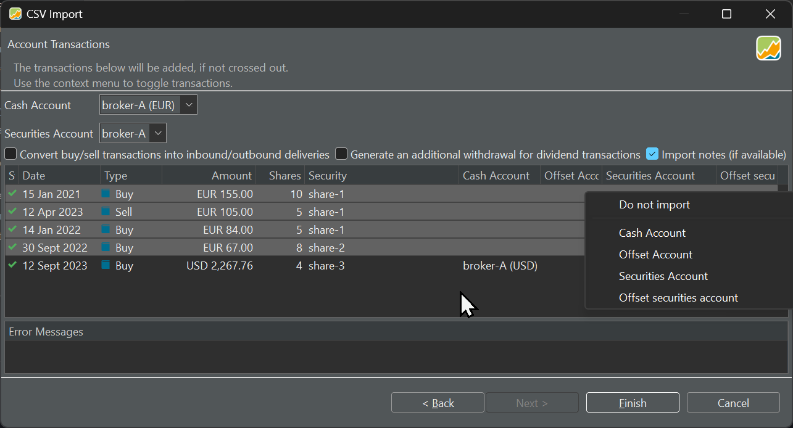

Sometimes, it is necessary to transfer securities between different portfolios, which involves copying information between physical XML files. However, the challenge lies in the fact that each security has historical pricing data associated with it, along with transactions tied to various cash accounts.

## Drag & drop

After opening two or more portfolios, they are displayed as tabs in the portfolio bar located just below the menu bar. The active portfolio, typically the last one opened, is easily discernible. It appears with a lighter color and an x-mark after the name, allowing you to close the tab. To switch between portfolios, simply select the corresponding tab in the portfolio bar. Only one portfolio can be viewed at a time.

However, for tasks like copying securities between portfolios, it's necessary to have both portfolios visible side by side. Securities cannot be directly dragged and dropped or copied and pasted between portfolios from the tabs in the portfolio bar.

Figure: Side-by-side display of two portfolios.{class=pp-figure}


To **arrange** portfolios side by side, choose one in the portfolio bar, click and hold the mouse to drag it to a new position. With two portfolios, you can position them either horizontally (left to right) or vertically (top to bottom). In Figure 1, the arrangement is left to right. This process can be repeated with multiple portfolios, allowing you to make more than two portfolios visible at the same time. To restore the original arrangement, drag the portfolio into the portfolio bar.

For **copying** securities between portfolios, both portfolios need to be visible. Then, you can select a security from Portfolio A and drag it to the `All Securities` option in the side panel of portfolio B. There, you can drop the security to create a copy. Pay attention, as it's feasible to unintentionally create identical securities (e.g. two instances of `share-1`). You can also drop the security to a Watchlist. It will be added to this list then automatically.

!!! Important
    
    When you copy securities from one portfolio to another with drag-and-drop, the associated transactions will **NOT** be copied along with them. Only the security master data, including historical price information, will be transferred to the new portfolio. This means that any trades, dividends, or other transactions that were recorded for the security in the original portfolio will not be reflected in the new one. In the relatively rare case you need also the transactions, you can either enter them manually or use the following method.

## Exporting & importing

With the menu File > Export > CSV Files, you can create a list of all securities, historical prices, and transactions. See [File > Export](../reference/file/export.md) for more info. Copying the securities with their historical prices however is much easier with the drag & drop technique, described above.

For example, after dragging share-3 from Figure 1 above to the demo-portfolio-03.xml, you can export the transactions of demo-portfolio-04.xml and import them in demo-portfolio-03.xml. You can either use the import type `Accounts transactions` or `Portfolio transactions`. The result of the export however contains **ALL** transactions of the project, not only those that are linked with `share-3`. 

| Date | Type | Value | Transaction Currency | Gross Amount | Currency Gross Amount | Exchange Rate | Fees | Taxes | Shares | ISIN | WKN | Ticker Symbol | Security Name | Note |
| --- | --- | --- | --- | --- | --- | --- | --- | --- | --- | --- | --- | --- | --- | --- |
| 2021-01-15T00:00 | Buy | 155 | EUR |  |  |  | 3 | 2 | 10 |  |  | DTE.DE | share-1 | 2 |
| 2023-04-12T00:00 | Sell | -105 | EUR |  |  |  | 5 | 2 | 5 |  |  | DTE.DE | share-1 | 8 |
| 2022-01-14T00:00 | Buy | 84 | EUR |  |  |  | 3 | 1 | 5 |  |  | DTE.DE | share-1 | 4 |
| 2022-09-30T00:00 | Buy | 67 | EUR |  |  |  | 2 | 1 | 8 |  |  | TMV.DE | share-2 | 6 |
| 2023-09-12T00:00 | Buy | 2,267.76 | USD |  |  |  | 14 | 6 | 4 |  |  | ADBE | share-3 | 10-copy |

From this table, in fact, you need only the last row. Please note, that the purchase of share-3 is in USD. Because the main cash account is set to EUR, this will generate an error, unless you change (via the context menu) the cash account to USD for that particular transaction.

As can be seen in Figure 2, all transactions will be imported (green checkmark to the left). You can exclude the first four with the context menu `Do not import` (see Figure 2). Alternatively, you can delete the unwanted transactions from the original CSV file before importing it. 

Figure: Importing transactions with change of cash account and exclusion. {class=pp-figure}



## Copy between XML

Theoretically, one could also copy the transaction code between the two XML files. A Buy transaction, for example, is represented by the following code snippet:
```
<account-transaction>
    <uuid>0e6a94e5-da57-44d4-aeb1-37dc792d40ef</uuid>
    <date>2024-03-14T00:00</date>
    <currencyCode>EUR</currencyCode>
    <amount>19800</amount>
    <security reference="../../../../../securities/security[2]"/>
    <crossEntry class="buysell">
        <portfolio>
            <uuid>c1c03e7d-c320-4167-8737-2f35cfb1a2e0</uuid>
            <name>broker-1</name>
            <isRetired>false</isRetired>
            <referenceAccount reference="../../../../.."/>
            <transactions>
                <portfolio-transaction>
                    <uuid>75c79e11-4c3d-4b39-bf91-08ab04fe0088</uuid>
                    <date>2024-03-14T00:00</date>
                    <currencyCode>EUR</currencyCode>
                    <amount>19800</amount>
                    <security reference="../../../../../../../../../securities/security[2]"/>
                    <crossEntry class="buysell" reference="../../../.."/>
                    <shares>9900000000</shares>
                    <updatedAt>2024-03-14T10:06:25.707240300Z</updatedAt>
                    <type>BUY</type>
                </portfolio-transaction>
            </transactions>
            <attributes>
                <map/>
            </attributes>
            <updatedAt>2024-03-13T18:11:15.593620500Z</updatedAt>
        </portfolio>
        <portfolioTransaction reference="../portfolio/transactions/portfolio-transaction"/>
        <account reference="../../../.."/>
        <accountTransaction reference="../.."/>
    </crossEntry>
    <shares>0</shares>
    <updatedAt>2024-03-14T10:06:25.707240300Z</updatedAt>
    <type>BUY</type>
</account-transaction>

```
In practice, the XML code for a moderate project with a few transactions and historical prices often becomes excessively large and complex to navigate confidently. Additionally, relative references such as `<security reference="../../../../../../../../../securities/security[2]"/>` assume an identical structure between the source and target XML, concerning list of securities. Moreover, this method is -of course- not applicable to binary-coded portfolios.

