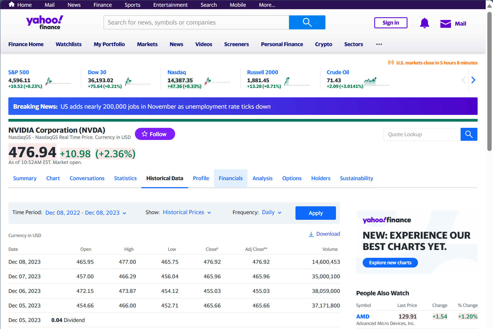

Identifying the optimal data source for downloading historical and latest prices of a specific currency can be challenging. Portfolio Performance already provides many alternatives (see Figure 1) but many more are described in the [Forum](https://forum.portfolio-performance.info/t/quellen-fur-historische-kurse/46) (in German).

Figure: Default data sources for downloading Historical Prices.{class=pp-figure}

# Some technical background

There are three primary methods for obtaining financial data from the web: downloading, using an API (Application Programming Interface), or scraping it from a webpage. The website [finance.yahoo.com](https://finance.yahoo.com/quote/NVDA/history?p=NVDA) supports all three methods.

Figure: Webpage from finance.yahoo.com to download the historical prices of NVIDIA.{class=pp-figure}

## Downloading the data
Each website may have a distinct approach. Typically, you need to navigate to the desired security and locate the download link on that webpage. For instance, by clicking the Search box at the top of the screen and entering "NVIDIA," you can access the webpage shown in Figure 1. Here, select the Historical Prices tab in the middle of the screen. From there, you can specify the Time Period and frequency before downloading a CSV file containing historical prices. Import this CSV file into Portfolio Performance using the menu File > Import > CSV Files, choosing the Historical Prices option and assigning it to the correct security.

It's important to note that this method provides a snapshot of historical prices. To obtain the quotes of tomorrow, you must repeat the process by downloading and importing the new CSV file again.

## Import the data through an API

An API is a set of rules and protocols that allows one software to communicate with another. Some websites, such as finance.yahoo.com, provide APIs that allow users to access their data in a structured and standardized format. For example, one can use the Yahoo Finance API to get historical stock prices. 

However, not all websites offer APIs, or they may limit the amount and frequency of data that can be accessed through them. In such cases, one may need to scrape the web pages directly, using tools such as Python, BeautifulSoup, Selenium, or Octoparse1. These tools can parse the HTML code of the web pages and extract the relevant data, such as stock prices, company data, news articles, etc. However, scraping web pages directly requires more coding skills, and it may be more prone to errors and inconsistencies, as the web pages may change over time or block the scraping requests.

As you can see in Figure 4, the website [https://finance.yahoo.com/](https://finance.yahoo.com/) is selected. Searching this website for the historical prices of a stock named "Deutsche Telekom" (which is in reality `share-1`) will produce the following URL: [https://finance.yahoo.com/quote/DTE.DE/history?p=DTE.DE](https://finance.yahoo.com/quote/DTE.DE/history?p=DTE.DE). However, if you should consult this webpage, you will notice that the historical prices are by default only given for one year. Additional actions are required to set the time period. All of this is handled by PP.

    

The Quote Feed Provider and Exchange input boxes will provide PP with exactly this information.

Some of these Quote Feeds such as Alpha Vantage and EOD Historical Data need an API key.  Most of them are free but with some limitations. You need to register for this key on the website of the provider. The API keys then are stored in PP. You can set them with the menu `Help > Preferences > API keys`.