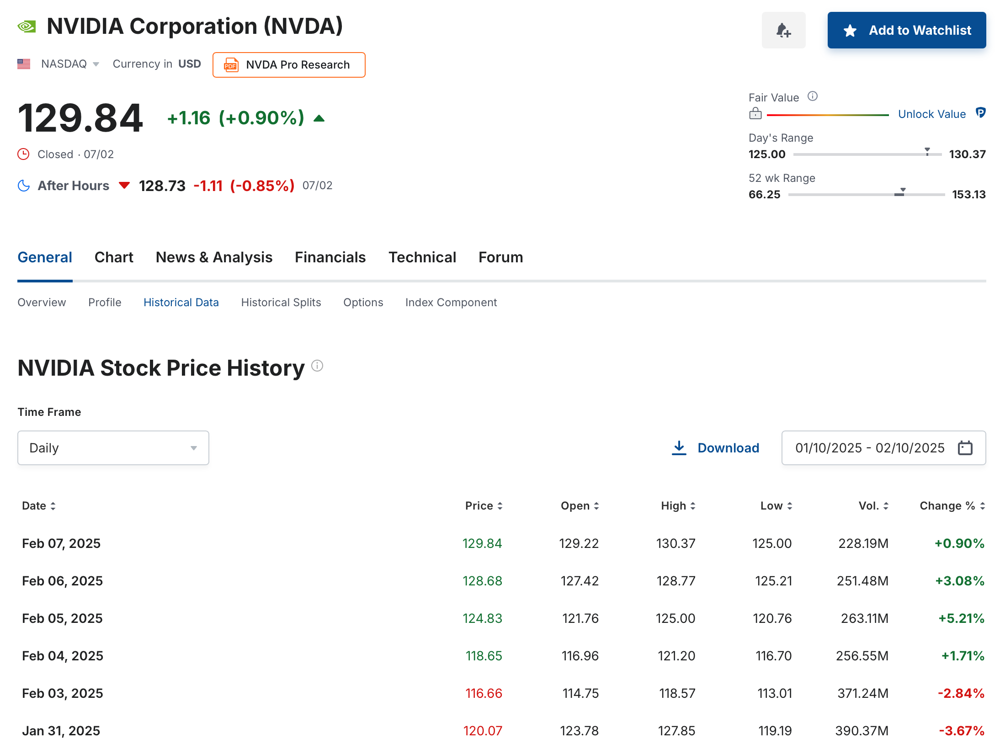
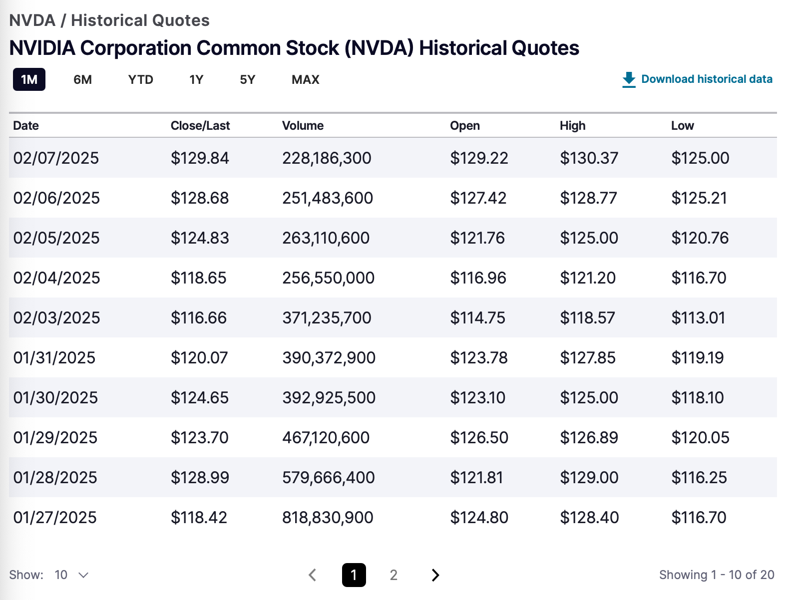

In PP, importing historical prices from a CSV file is a straightforward process through the menu [`File > Import > CSV Files`](../../reference/file/import/csv-import.md#1-historical-quotes-import). Naturally, you would require a file containing the relevant quotes for this operation.

A csv file is a comma-separated values file, which is a text file that stores tabular data. Each row in the file represents a record, and each column represents a field. For example, a typical historical quotes CSV file will contain two columns (date and quote) and several rows, one for each date with its corresponding historical quote. A csv file can be opened and edited by spreadsheet software and easily imported into PP.

Each website may have a distinct approach for downloading a CSV file of the historical data. Typically, you need to navigate to the desired security and locate the download link on that webpage. Many websites require (free) registration for downloading.

It's important to note that this method provides a snapshot of historical prices. To obtain the quotes of tomorrow, you should repeat the process. In practice, you need to combine this approach with one of the automatic quote download methods. Remember that you can [keep the existing historical quotes](../../reference/file/import/images/mnu-file-import-reload-quotes.png) in PP, even if you change the quote provider to automatic download.  For example, in both scenarios below, after importing the CSV file, you can set the Quote Feed Provider to the [Table on Website](./table-website.md) method for daily updates of historical prices.

## Investing.com

Investing.com is a comprehensive financial website providing real-time quotes, financial news, analysis, and tools for investors. You can localize its content for more than 30 countries including several European languages.

Figure: Webpage from investing.com to download the historical prices of NVIDIA.{class=pp-figure}

Clicking the Search box (top right) will display your recent searches and popular ones. You can enter the name, ticker, or ISIN of the security you're interested in. A graphical overview of the quote history (1 month) is presented. Click `Historical Data` (in the middle above the chart) to see the table. For downloading or changing the period, registration with your email address is required (free). All data are available, but there is a limit of 20 years that you can download in one pass.

## Yahoo Finance

Unfortunately, [Yahoo Finance](https://finance.yahoo.com) changed its policy in late 2024, placing CSV data downloads behind a paywall. While you can still **view** the data (and manually copy and paste it), free downloads are no longer available.

## Various Stock Markets  

Most stock exchanges provide an option to view and download historical stock data for listed companies. For example, searching for the **NVDA** ticker on the [NASDAQ website](https://www.nasdaq.com/market-activity/stocks/nvda) displays a **historical price chart** for the past day. To access and download **tabular historical prices**:

1. Adjust the time period as needed.  
2. Select **"Historical Quotes"** from the left sidebar.  
3. Click **"Download historical data"**.

Figure: Webpage from nasdaq.com to download the historical prices of NVIDIA.{class=pp-figure}

