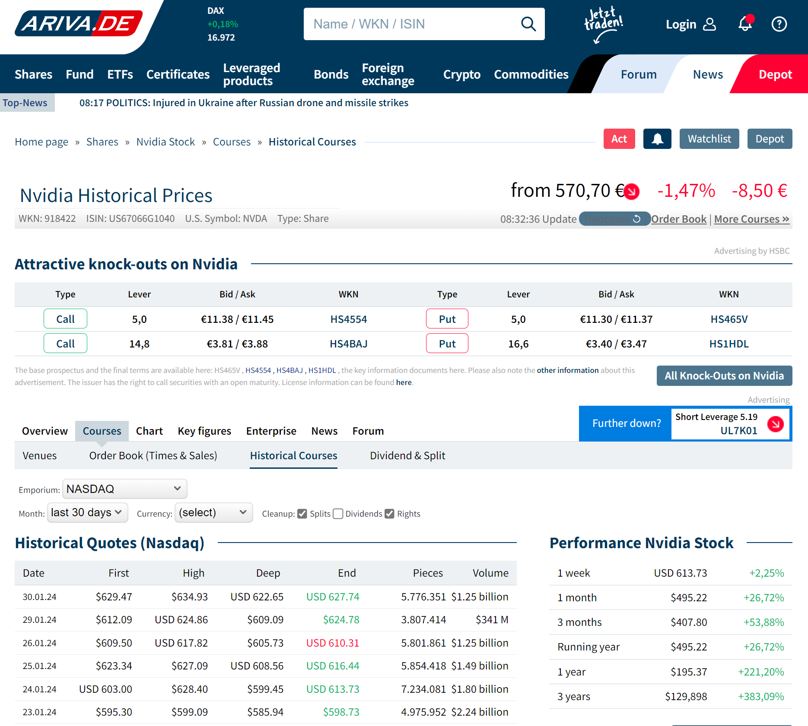

In PP, importing historical prices from a CSV file is a straightforward process through the menu [`File > Import > CSV Files`](../../reference/file/import/csv-import.md#historical-quotes-import). Naturally, you would require a file containing the relevant quotes for this operation.

A csv file is a comma-separated values file, which is a text file that stores tabular data. Each row in the file represents a record, and each column represents a field. For example, a typical historical quotes CSV file will contain two columns (date and quote) and several rows, one for each date with its corresponding historical quote. A csv file can be opened and edited by spreadsheet software and easily imported into PP.

Each website may have a distinct approach for downloading a CSV file of the historical data. Typically, you need to navigate to the desired security and locate the download link on that webpage. Many websites require (free) registration for downloading, Yahoo Finance being an exception.

It's important to note that this method provides a snapshot of historical prices. To obtain the quotes of tomorrow, you should repeat the process. In practice, you need to combine this approach with one of the automatic quote download methods. Remember that you can [keep the existing historical quotes](../../reference/file/import/images/mnu-file-import-reload-quotes.png) in PP, even if you change the quote provider to automatic download.  For example, in both scenarios below, after importing the CSV file, you can set the Quote Feed Provider to the [Table on Website](./table-website.md) method for daily updates of historical prices.

## Yahoo Finance

After navigating to [Yahoo Finance](https://finance.yahoo.com), you can enter the name "NVIDIA" in the Search box at the top of the screen (see Figure 1). Select the Historical Prices tab in the middle of the screen. From there, you can specify the Time Period and frequency before downloading a CSV file containing historical prices. Import this CSV file into Portfolio Performance using the menu `File > Import > CSV Files`, choosing the Historical Prices option and assign it to the correct security.

Figure: Webpage from finance.yahoo.com to download the historical prices of NVIDIA.{class=pp-figure}

Hovering over the download link, you may have noticed the URL endpoint: `https://query1.finance.yahoo.com/v7/finance/download/NVDA?period1=1674359406&period2=1705895406&interval=1d&events=history&includeAdjustedClose=true` (see Figure 1 at the bottom of the image).

This is the request you send to the Yahoo server. It contains the ticker symbol of the security (NVDA), the time period expressed as Unix timestamps or the number of seconds that have elapsed since January 1, 1970, the frequency or interval (1d), the type of info you want (events=history), and the Adjusted Close price. The CSV file contains 7 columns: Date, Open, High, Low, Close, Volume, and Adj Close.

You can change this URL to obtain different results. For example, the following URL will retrieve the last three months of prices (same columns):

`https://query1.finance.yahoo.com/v7/finance/download/NVDA?range=3mo&interval=1d`

## Investing.com

Investing.com is a comprehensive financial website providing real-time quotes, financial news, analysis, and tools for investors. You can localize its content for more than 30 countries including several European languages.

Clicking the Search box will display your recent searches and popular ones. You can enter the name, ticker, or ISIN of the security you're interested in. A graphical overview of the quote history (1 month) is presented. Click `Historical Data` to see the table. For downloading or changing the period, registration with your email address is required (free). All data are available, but there is a limit of 20 years that you can download in one pass.

