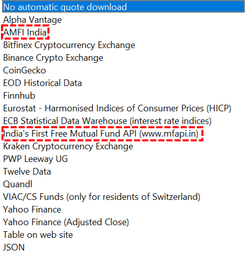
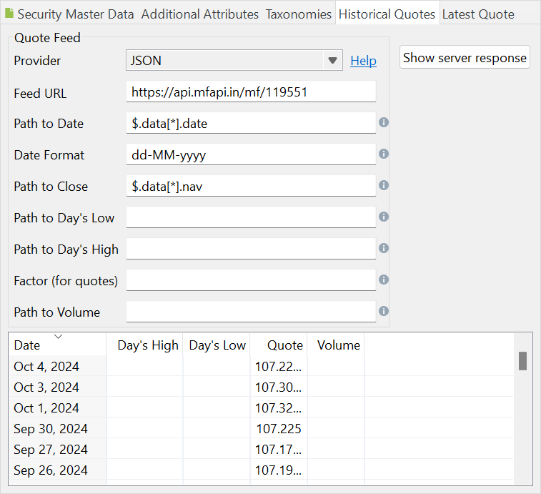

Figure: Indian Quote Feed Providers. {class= align-right style="width:50%"}




You are looking to invest in Indian securities, preferably ETFs quoted in Indian Rupees (INR). Access to historical quotes can be made easier through two available data feeds (see Figure 1):

- AMFI India: [Association of Mutual Funds of India](https://www.amfiindia.com/)
- MFAPI: [India's First Free Mutual Fund API](https://www.mfapi.in/).


## AMFI

To use this quote feed provider, you will need the ISIN code of the ETF. A complete list of available ETFs, along with their ISINs, can be found under the [Download NAV](https://www.amfiindia.com/nav-history-download) link. Click on `Download Complete NAV Report in Text Format` to access the data. For example, the ISIN code for the *Aditya Birla Sun Life Mutual Fund* is `INF209KA12Z1`. As of 4th October 2024, the latest quote is 107.2257 INR (see below). Please note that there are multiple schemes available (e.g., Regular Monthly, Regular Quarterly, etc.).

You will need to enter the ISIN code in the [Security Master Data](../../reference/file/new.md#security-master-data) panel.

!!! Note
    The quote feed provider will only supply the latest price. If you require historical prices, you must download them as a text file. Select the ETF name from the drop-down box, specify the type and date range, and download the historical NAV. You can download data for a maximum of 90 days at a time.

Figure: List of ETF's at AMFI. {class=pp-figure}


```
Scheme Code;ISIN Div Payout/ ISIN Growth;ISIN Div Reinvestment;Scheme Name;Net Asset Value;Date
 
Open Ended Schemes(Debt Scheme - Banking and PSU Fund)
 
Aditya Birla Sun Life Mutual Fund
 
119551;INF209KA12Z1;INF209KA13Z9;Aditya Birla Sun Life Banking & PSU Debt Fund  - DIRECT - IDCW;107.2257;04-Oct-2024
119552;INF209K01YM2;-;Aditya Birla Sun Life Banking & PSU Debt Fund  - DIRECT - MONTHLY IDCW;115.4552;04-Oct-2024
119553;INF209K01YO8;-;Aditya Birla Sun Life Banking & PSU Debt Fund  - Direct - Quarterly IDCW;102.8152;04-Oct-2024
108272;INF209K01LX6;INF209KA11Z3;Aditya Birla Sun Life Banking & PSU Debt Fund  - REGULAR - IDCW;151.0032;04-Oct-2024
110282;INF209K01LU2;-;Aditya Birla Sun Life Banking & PSU Debt Fund  - REGULAR - MONTHLY IDCW;111.6213;04-Oct-2024
108274;INF209K01LN7;-;Aditya Birla Sun Life Banking & PSU Debt Fund  - REGULAR - Quarterly IDCW;101.1877;04-Oct-2024
110490;INF209K01LR8;-;Aditya Birla Sun Life Banking & PSU Debt Fund  - retail - monthly IDCW;111.4018;04-Oct-2024
106157;INF209K01LS6;-;Aditya Birla Sun Life Banking & PSU Debt Fund  - retail - quarterly IDCW;102.2589;04-Oct-2024
108273;INF209K01LV0;-;Aditya Birla Sun Life Banking & PSU Debt Fund - Regular Plan-Growth;345.5725;04-Oct-2024
103176;INF209K01LT4;-;Aditya Birla Sun Life Banking & PSU Debt Fund - Retail Plan-Growth;518.7508;04-Oct-2024
119550;INF209K01YN0;-;Aditya Birla Sun Life Banking & PSU Debt Fund- Direct Plan-Growth;357.7647;04-Oct-2024
 
Axis Mutual Fund
 
128952;INF846K01NF8;-;Axis Banking & PSU Debt Fund - Direct Plan - Bonus Option;1532.8272;14-Jun-2017
120437;-;INF846K01CU0;Axis Banking & PSU Debt Fund - Direct Plan - Daily IDCW;1038.5921;04-Oct-2024
120438;INF846K01CR6;-;Axis Banking & PSU Debt Fund - Direct Plan - Growth Option;2554.2888;04-Oct-2024
120439;INF846K01CT2;INF846K01CS4;Axis Banking & PSU Debt Fund - Direct Plan - Monthly IDCW;1034.0405;04-Oct-2024
120436;INF846K01CV8;INF846K01CW6;Axis Banking & PSU Debt Fund - Direct Plan - Weekly IDCW;1038.4695;04-Oct-2024
128953;INF846K01NG6;-;Axis Banking & PSU Debt Fund - Regular Plan - Bonus Option;1289.4075;18-May-2015
117447;-;INF846K01CC8;Axis Banking & PSU Debt Fund - Regular Plan - Daily IDCW;1038.5836;04-Oct-2024
117446;INF846K01CB0;-;Axis Banking & PSU Debt Fund - Regular Plan - Growth option;2482.1514;04-Oct-2024
117449;INF846K01CF1;INF846K01CG9;Axis Banking & PSU Debt Fund - Regular Plan - Monthly IDCW;1033.9605;04-Oct-2024
117448;INF846K01CD6;INF846K01CE4;Axis Banking & PSU Debt Fund - Regular Plan - Weekly IDCW;1038.4353;04-Oct-2024
 
Bajaj Finserv Mutual Fund
...
...
```

## MFAPI

On the [MFAPI](https://www.mfapi.in/) website, you can begin typing the name of a mutual fund in the search box, such as "Aditya Birla Sun Life". As you continue typing, a list of available ETFs will appear (see Figure 3).

Figure: List of ETFs on MFAPI. {class=pp-figure}


Selecting a mutual fund will display the URL where you can find either the historical prices or the latest price.

To retrieve historical prices using Portfolio Performance, you will need the scheme code (the last six digits of the number), e.g. `119551`. This scheme code can also be obtained from the AMFI website; it is the first number listed before the ISIN code in the response (see Figure 2).

Figure: Quote Feed Provider for MFAPI website. {class=pp-figure}


With some coding, you can achieve the same result using the JSON Quote Feed Provider. For example, the URL could be: [https://api.mfapi.in/mf/119551](https://api.mfapi.in/mf/119551). The path to the date and closing price is shown in Figure 4.

Figure: Retrieving the historical prices through the JSON Quote Feed Provider. {class=pp-figure}

