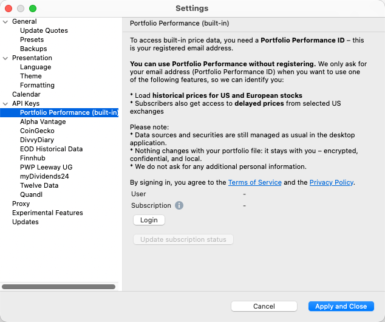
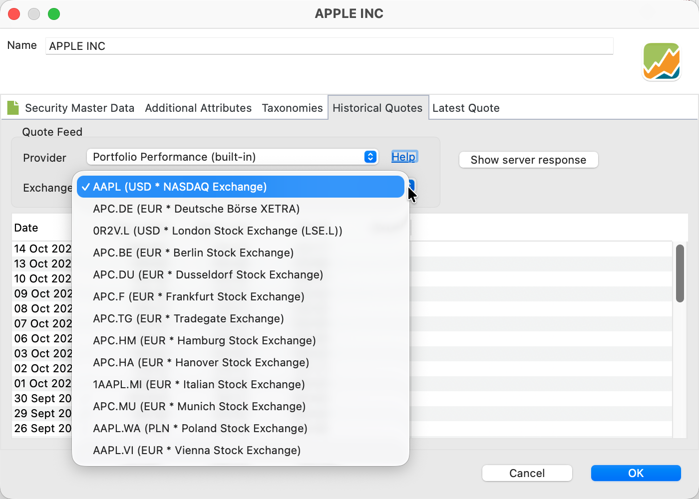

# Portfolio Performance (built-in)

The **Portfolio Performance (built-in)** data source for historical quotes is the easiest to use and the most reliable provider for retrieving historical market data. It covers more than 20 European exchange markets and the major American stock exchanges. The provider is built into the Portfolio Performance application and is free to use.  

To use the built-in provider, you must:

- Create a`Portfolio Performance ID` (only a verifiable e-mail address is required).  
- Log in to the service and refresh your session approximately every three months.  
- Set the data source of a security to the built-in provider.  

Please note that the built-in provider is just one of more than 20 data sources available in Portfolio Performance, such as Yahoo Finance, Alpha Vantage, JSON, and others (see [Downloading historical prices](./index.md) for an overview). Therefore, you can use Portfolio Performance without relying on the built-in provider.

1. **Creating a Portfolio Performance ID**

Before using the built-in quote provider, you must register by creating a **free Portfolio Performance ID**. This only needs to be done once. A verified e-mail address is required — meaning you have to enter a verification code sent to that address before proceeding. No additional personal information is requested. The easiest way to register is via the **Settings/Preferences** option in the **Application menu (macOS)** or **Help menu (Windows)**; see Figure 1a.  

Figure: Registering your Portfolio Performance ID.{class=pp-figure}

- {width="400" .center}
- {width="400" .center}
- {width="400" .center}
- {width="400" .center}

Clicking the `Login` button opens the [Registration/Sign-in website](https://accounts.portfolio-performance.info/sign-in) (Figure 1b). Select `Create account`, enter a verifiable e-mail address, obtain the verification code from your e-mail, and paste it as prompted (see Figure 1d).  

Next, set up a password for future logins. You may then close the browser. Your credentials are securely stored on a dedicated identity server. You can unregister at any time by sending an e-mail to [info@portfolio-performance.app](mailto:info@portfolio-performance.app). See the [Privacy Policy](https://www.portfolio-performance.app/privacy-policy) webpage for further details.

2. **Logging in to the Service**

Using the same `Settings` panel, you can log in to the service with your Portfolio Performance ID and password.  
After a successful login, your e-mail address (Portfolio Performance ID) is displayed next to the user field in the Settings panel (see Figure 1a).

The login creates a **refresh token**, which is stored locally in the workspace directory — not in the portfolio XML file.  This login is independent of other logins, such as those used for the forum or for cloud services like OneDrive or Google Drive. The refresh token allows automatic re-authentication whenever historical prices are refreshed. It remains valid for **90 days**, after which you must log in again to renew it.

There is also a separate `Subscription` field. You can subscribe to the service using the same e-mail address as your (paid) mobile app account. The subscription type (e.g. `Premium`) will then appear next to the label.  
A subscribed user can not only download historical prices but also access delayed quotes, which can be used in the [Latest quote](../../reference/file/new.md#latest-quote) tab of the Security Data panel.

---

3. **Setting the Data Source of a Security to the Built-in Provider**

You can assign the built-in data source to a security either via the [New Instrument Creation Wizard](../../getting-started/adding-securities.md) — which handles all steps, including ID creation and login — or manually in the [Historical Quotes](../../reference/file/new.md#historical-quotes) tab of the Security Data panel.

- In the [Security Master Data](../../reference/file/new.md#security-master-data) tab of the Security Data panel, enter at least the `ticker symbol` used by your chosen exchange (for example, `AAPL` for Apple Inc. on NASDAQ).  
- Then, in the `Historical Quotes` tab, set the `Quote feed provider` to `Portfolio Performance (built-in)`.  
- If multiple exchange markets are available, you can also select the relevant market.  
  As shown in Figure 2, the built-in provider supports 12 European exchange markets in addition to the American NASDAQ for the `AAPL` ticker symbol.  

**Figure:** Historical quotes from the built-in provider {class=pp-figure}  

If you have a paid subscription for the mobile app, you can also specify the `Latest price` provider to download delayed prices. Currently, this option is available only for US securities.