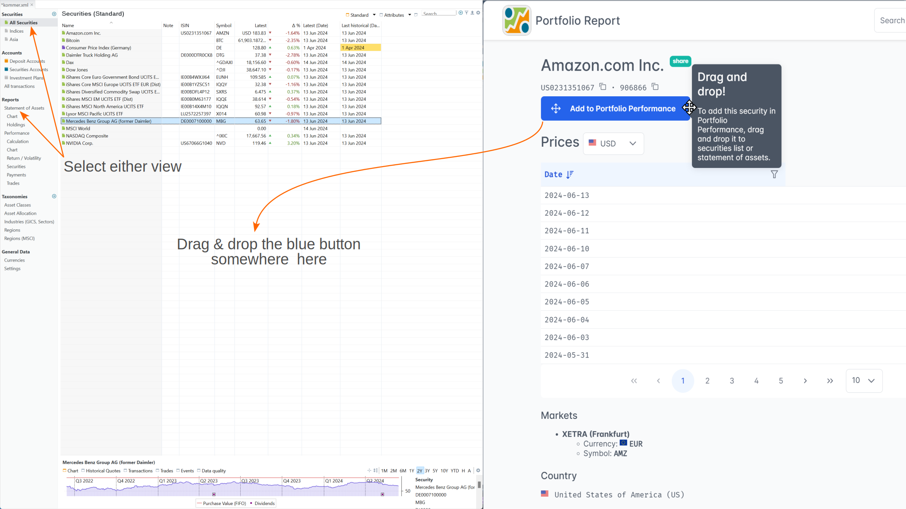

Portfolio Report (PR) is an open-source project that works closely together with the Portfolio Performance (PP) app. Its primary goal is to enhance Portfolio Performance by providing master data for securities, including name, ISIN, WKN, and ticker symbol, as well as historical prices in various currencies.

PR allows you to look up information about securities, such as symbols, industries, and historical prices. Furthermore, it enables the creation of securities within Portfolio Performance from PR and the provision of historical prices for securities that already exist in PP.

## Looking up information

When you navigate to the Portfolio Report website [https://www.portfolio-report.net/](https://www.portfolio-report.net/), you will be presented with the following simple but efficient search form (see Figure 1).

Figure: Portfolio Report website. {class=pp-figure}

In the first box of the search form, you can enter the ISIN, WKN, Symbol, or the full name of the security. Please refer to [Basic concepts > PP-terminology](../../concepts/PP-terminology.md) for a definition of each term. Note that the use of wildcards, such as 'Amaz*', is not permitted for name searches. On the other hand, one word in the name suffices. For example, searching for `Group` will produce Cimic Group, NN Group, IBI Group, ... Searching for `col` will show Colruyt and Coca Cola Co.

Specifying the security type (share, fund, crypto, or bond) is not necessary, as the default search setting (blank or *) includes all categories.

When you retrieve the historical prices of a security, you have the option to select the currency in which the quotes are displayed with the `Prices` dropdown. Please note that the prices are always retrieved from the XETRA (Frankfurt) exchange market and that this price (in EUR) is converted through the [exchange rates of the ECB](../../reference/view/general-data/currencies.md).

Figure: Search Result{class=pp-figure}

## Creating new securities in Portfolio Performance with PR

- Navigate to the [Portfolio Report website](https://www.portfolio-report.net/); start the Portfolio Performance app and, if possible, position both windows side by side on the computer screen, as illustrated in Figure 2.
- Utilize the Search box located at the top right (refer to Figure 3) to search for the desired security using its name, ISIN, or WKN.

    If the security is in PR's database, the name (e.g *Amazon.com Inc.*), ISIN (*US0231351067*), and eventually WKN are displayed, together with a logo of the security (white arrow on blue background) and some extra information such as the trading market (*XETRA*), the currency (*EUR*), the ticker symbol on the specified trading market (*AMZ*), the country (*United States of America (US)*) and eventually the industry sector of the company. On multiple tabs (1, 2, 3, etc.), you can view the historical prices of the security. By default, only the 10 most recent prices are shown. However, using the drop-down menu on the right, you can adjust the number of prices displayed per page, with options ranging from 10, 30, 100, to 300.

    Only securities that are traded on XETRA (Deutsche Börse) are available within PR. Historical prices, specifically closing prices after the end of trading, are provided. Current prices, which are prices during trading on a marketplace, are not available.

- Drag (= click, hold, and drop) the big blue button `Add to Portfolio Performance` upon the open window of PP. This is -of course- very easy if the two applications are placed next to each other on the screen (see Figure 2). Otherwise, you need to drag the button upon the Portfolio Performance icon in the taskbar.

    Figure: Using Portfolio Report to create a security in Portfolio Performance.{class=pp-figure}

    

- You can verify the successful addition of the newly created security by checking the master data tab. A message stating `Linked to Portfolio Report` should be visible (see Figure 4). Additionally, on the Historical Quotes tab, the Quote Feed should be populated with the correct information.

    It's important to note that due to the association with PR, the fields `ISIN`, and `WKN` become unmodifiable. If there is a need to update these fields, you must use the "Unlink" button to detach the security. Unfortunately, this also removes the Quote Feed of the Historical Quotes.

    Figure: Master data and historical prices of newly created security. {class=pp-figure}

    

## Linking an existing security with PR

It's also possible to link an existing security to PR; in particular to gain access to its quote feed of historical prices.

- Navigate to the [Portfolio Report website](https://www.portfolio-report.net/) and search for the desired security.
- Copy the URL of the webpage. It should start with `https://www.portfolio-report.net/securities/`, followed by an identifier such as `8761e2dd-873a-4f1c-99c5-65939819eed9`. This is the internal code that PR assigns to this security. You can find this URL in the address bar or at the bottom of the screen when hovering over the big blue button `Add to Portfolio Performance`.
- In PP, select the desired security in the `All Securities` list; right-click and choose `Link to Portfolio Report`. Additionally, you must manually set  Portfolio Report as the Quote Feed.
- Securities that no longer exist in Portfolio Report are automatically unlinked.

## Privacy rules

Whenever Portfolio Performance initiates an update, such as through the menu `Online > Update Quotes` a request is sent to the PR website. Portfolio Report only receives information that is technically necessary, including:

- Identification details of the security, the marketplace and, if applicable, the period.
- The version number of the requesting Portfolio Performance app.
- The IP address of the requesting device.

This information is temporarily stored in log files on the server. The IP address is stored anonymously. In addition, no storage or evaluation of the data takes place.

The above info is based on a German [article by developer Thomas](https://forum.portfolio-performance.info/t/historische-kurse-von-portfolio-report/8600). The [source code](https://github.com/portfolio-report/pr-www) could be retrieved at Github.