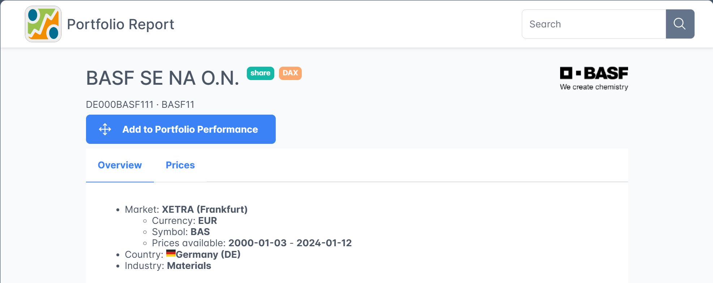
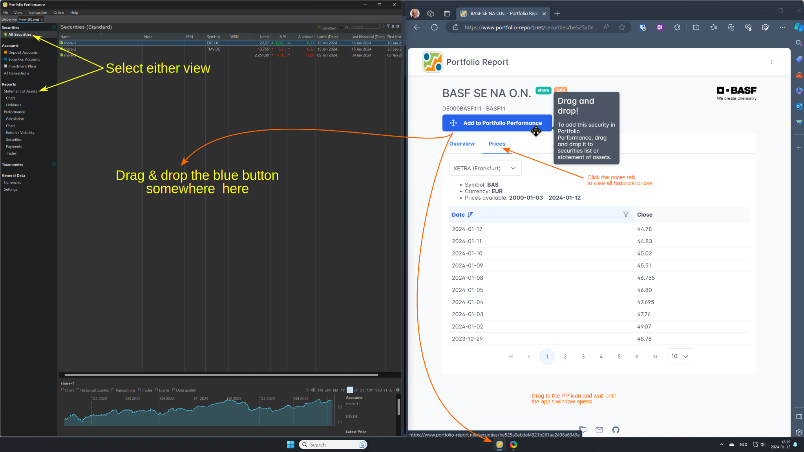

Portfolio Report (PR) is an open-source project that works closely together with the Portfolio Performance app. Its primary goal is to enhance Portfolio Performance by supplying master data, including name, ISIN, WKN, and ticker symbol, as well as historical prices for selected securities.

You can use PR to create securities or to provide historical prices for already existing securities.

## Creating new securities with PR

- Navigate to the Portfolio Report website [https://www.portfolio-report.net/](https://www.portfolio-report.net/)
- Open the PP app and, if possible, position both windows side by side on the computer screen, as illustrated in Figure 2.
- Utilize the Search box located at the top right (refer to Figure 1) to search for the desired security using its name, ISIN, or WKN.

    Figure: Search Result{class=pp-figure}

    

    If the security is in PR's database, the name (e.g *BASF S NA O.N.*), ISIN (*DE000BASF111*), and WKN (*BASF11*) are displayed, together with a logo of the security (*We create chemistry*) and some extra information such as the trading market (*XETRA*), the currency (*EUR*), the ticker symbol on the specified trading market (*BAS*), the availability of prices (*2000-01-03 - 2024-01-12*), the country (*Germany*) and the industry sector (*Materials*) of the company. On a second tab `Prices`, you can find the historical prices of the security.

    For now, only securities that are traded on XETRA (Deutsche Börse) are available in PR. Also, only historical prices (i.e. closing prices after the end of trading) are provided, not current prices (i.e. during trading on a marketplace).

- Drag (= click, hold, and drop) the big blue button `Add to Portfolio Performance` upon the window of PP. This is -of course- very easy if the two applications are placed next to each other on the screen (see Figure 2). Otherwise, you need to drag the button upon the PP icon in the taskbar.

    Figure: Using Portfolio Report to create a security.{class=pp-figure}

    

- You can verify the successful addition of the newly created security by checking the master data tab. A message stating `Linked to Portfolio Report` should be visible (see Figure 3). Additionally, on the Historical Quotes tab, the Quote Feed should be populated with the correct information.

    It's important to note that due to the association with PR, the fields `ISIN`, and `WKN` become unmodifiable. If there is a need to update these fields, you must use the "Unlink" button to detach the security. Unfortunately, this also removes the Quote Feed of the Historical Quotes.

    Figure: Master data and historical prices of newly created security. {class=pp-figure}

    

## Linking an existing security with PR

It's also possible to link an existing security to PR; in particular to gain access to its quote feed of historical prices.

- Navigate to the [Portfolio Report website](https://www.portfolio-report.net/) and search for the desired security.
- Copy the URL of the webpage. It should start with `https://www.portfolio-report.net/securities/`, followed by an identifier such as `be525a0ebdef4921b261aa2498a6949e`. This is the internal code that PR assigns to this security. You can find this URL in the address bar or at the bottom of the screen, as shown in Figure 2.
- In PP, select the desired security in the `All Securities` list; right-click and choose `Link to Portfolio Report`. Additionally, you must manually add the Quote Feed by selecting Portfolio Report as the Quote Feed and configuring the appropriate market place (e.g., XETRA). 

## Retrieving historical quotes from PR

Whenever PP initiates an update, such as through the menu `Online > Update Quotes` a request is sent to the PR website. Portfolio Report only receives information that is technically necessary, including:

- Identification details of the security, the marketplace and, if applicable, the period.
- The version number of the requesting Portfolio Performance app.
- The IP address of the requesting device.

This information is temporarily stored in log files on the server. The IP address is stored anonymously. In addition, no storage or evaluation of the data takes place.

The above info is based on a German [article by developer Thomas](https://forum.portfolio-performance.info/t/historische-kurse-von-portfolio-report/8600). The [source code](https://github.com/portfolio-report/pr-www) could be retrieved at Github.