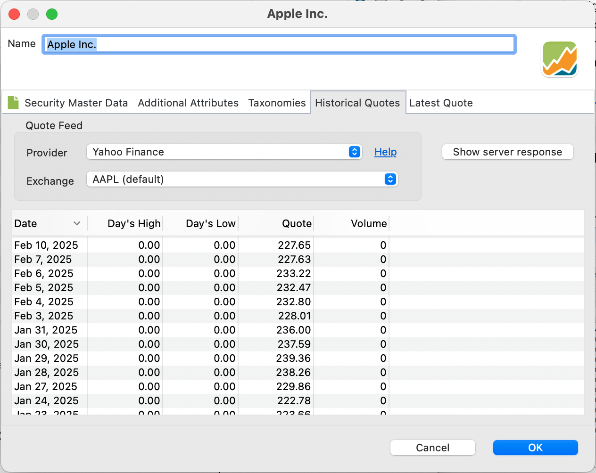

[Yahoo Finance](https://finance.yahoo.com/) provides a wide array of tools and financial resources, including historical and real-time stock quotes, interactive charts, and news updates that cover a diverse range of financial markets.

Figure: Yahoo Finance website with historical prices of Apple.{class=pp-figure}

Click on the search box at the top and enter a (partial) name; for instance "App". Select the correct security, which in this case is Apple Inc (AAPL). Navigate to the second menu and click on Historical Data (see Figure 1). Subsequently, you can adjust the Time Period and Frequency as needed.

!!! Note
    The Yahoo (ticker) symbol is visible in parentheses after the security name, as illustrated in Figure 1. The ticker symbol is a series of letters representing a publicly traded company or financial instrument. For example, the ticker symbol for Apple Inc. is `AAPL`. When there could be confusion as with `DTE` (which corresponds to two different companies), the market place is added. For example, `DTE.DE` refers to Deutsche Telekom, a security traded on the Deutsche Börse, while `DTE (default)` refers to DTE Energy Company, which is traded on the NASDAQ.

Since late 2024, one cannot any longer download these historical prices as a CSV file, without a paid subscription.  In the chapter on [CSV file](./csv-file.md), we explore this topic in more detail.

Figure: Data sources Historical Quotes.{class=align-right style="width:40%"}

PP has a predefined Quote Feed provider for Yahoo Finance and Yahoo Finance (Adjusted Close). Please note that the Day's High, Day's Low, and Volume info is not retrieved in both cases.

To retrieve the historical quotes of `Apple`, enter the ticker symbol (AAPL) in the Security Master Data (see Figure 1, top left) and select Yahoo Finance as the Quote Feed Provider within the Historical Quotes tab. A list of 30 quotes, starting from today will appear.

In the background, PP initiates the following query (becomes visible in the event of an error, for example with ticker symbol DTE.XX).

`https://query1.finance.yahoo.com/v8/finance/chart/AAPL?range=3mo&interval=1d`

If you need a different amount of historical data, data from an alternative period, or you want to include the High, Low, and Volume fields, you can initiate the query manually. This functionality is available through the [JSON Quote Feed Provider](./json.md).

