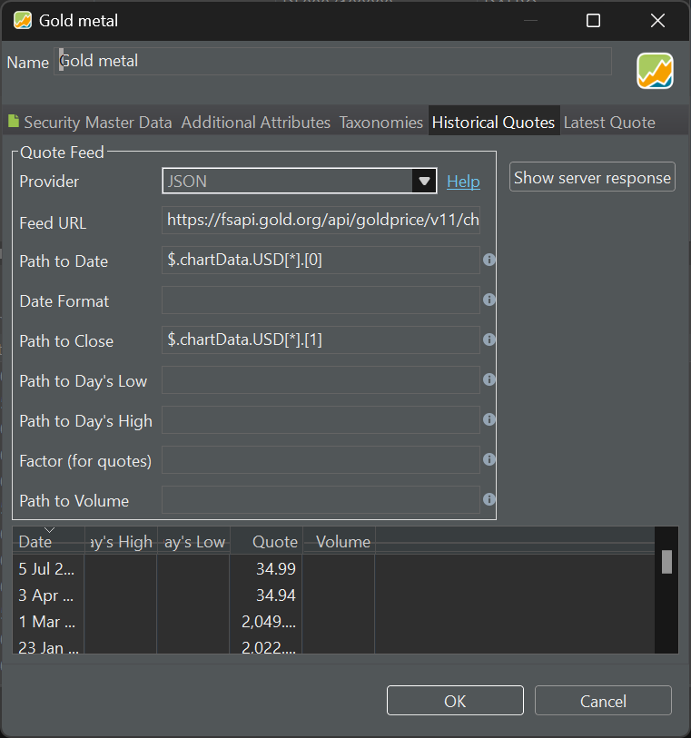

Investing in gold is often chosen in times of economic uncertainty. There are multiple ways to gain exposure to gold. One popular method is investing in physical gold, which involves purchasing gold bullion, coins, or jewelry. Another approach is investing in gold exchange-traded funds (ETFs) or gold trackers, such as [Invesco Physical Gold](https://www.invesco.com/uk/en/financial-products/etfs/invesco-physical-gold-etc.html). These financial instruments aim to replicate the performance of the gold price by holding physical gold in a secure vault. A third but indirect method of investing in gold is by purchasing shares of gold mining companies. Gold miners engage in the exploration, extraction, and production of gold, and their stock prices can be influenced by the price of gold.

Investing in gold through ETFs and gold mining company shares can be handled similarly to regular stocks like Apple Inc., offering ease of access, liquidity, and potential income. While physical gold differs from traditional stocks in several aspects (e.g. gold does not provide ownership in a company or entitle the holder to dividends), it can still be considered an investment that can be bought, sold, and managed as part of a well-diversified portfolio. And therefore, it can be handled in PP as a regular security.

The PP forum has a thread [Wo kann ich aktuelle und historische Gold- und Silberkurse laden?](https://forum.portfolio-performance.info/t/wo-kann-ich-aktuelle-und-historische-gold-und-silberkurse-laden/14/49). This section provides a summary and expands upon the information discussed in the thread.

## Website Ariva.de

The `ariva.de` website has a specific page for [commodities](https://www.ariva.de/rohstoffe/) such as gold, silver, and others. Downloading the latest gold price is as easy as setting the [Quote Feed to a webpage](./downloading-historical-prices/table-website.md) `https://www.ariva.de/goldpreis_gold-kurs/kurse/historische-kurse`. Unfortunately, this method only provides data for the last 30 days. As time progresses, the data will be updated for future days with this method, gradually accumulating several months of gold price history.

Figure: Ariva.de website (translated) with historical gold prices . {class= pp-figure}


You can also replace the Quote Feed URL by one of the previous months (e.g. `https://www.ariva.de/goldpreis_gold-kurs/kurse/historische-kurse?go=1&boerse_id=172&month=2024-02-29`). When importing the data, PP will ask if you want to keep the existing historical prices. By choosing to keep the previous data, you can maintain a continuous record of gold prices for all the months you have downloaded.

But, perhaps the better method is to use a [dynamic data URLs](https://help.portfolio-performance.info/de/kursdaten_laden/#dynamische-kursdaten-urls). Replace the `month=2024-02-29` in the URL from above in the macro version `month={DATE:yyyy-MM-32}`. This macro will iterate through all previous months (going back to 2003) and send a request for each month until there is no data available. If you start from scratch, this process can take some time and will put a significant load on the ariva.de web server.

Another option to obtain historical gold prices is to register for a free account. Then you can download the historical prices as a CSV file, which can be [imported](../reference/file/import/csv-import.md#csv-files-comma-separated-values) into Portfolio Performance (PP).


## London Bullion Market Association (LBMA)

The [London Bullion Market](https://www.lbma.org.uk/prices-and-data/precious-metal-prices#/table) is the world's largest and most significant market for trading gold and silver. You can retrieve the prices for gold, silver, platinum and palladium per year, going back to 1968, in USD, GBP, and EUR. There are two auctions per day (AM and PM). The data can be displayed as a graph or table per year.

Unfortunately, this table could not be parsed by PP (as it does not contain the necessary keywords such as `Close`). However, as User [ristretto](https://forum.portfolio-performance.info/t/wo-kann-ich-aktuelle-und-historische-gold-und-silberkurse-laden/14/49) pointed out, you can retrieve the prices through the JSON `Quote Feed` (see [How-to > Downloading Historical Prices](./downloading-historical-prices/json.md)). The `Feed URL` is `https://prices.lbma.org.uk/json/gold_pm.json` for the PM auction. The three prices under the "v" (value) key represent USD, GBP, and EUR, respectively. Please note that in 1968, there is no price available in EUR.

```
[
    {
        "is_cms_locked": 0,
        "d": "1968-04-01",
        "v": [
            37.7,
            15.68,
            0
        ]
    },
    {
        "is_cms_locked": 0,
        "d": "1968-04-02",
        "v": [
            37.3,
            37.3,
            0
        ]
    },
    ...
]
```

You can discover the JSON Endpoint URL by opening the developers tool panel in the webbrowser, selecting the network tab, and refreshing the chart. The `Path to Date` is `$.*.d` and the `Date Format` is `yyyy-MM-dd`. The `Path to Close` is `$.*.v[0]` for the price in USD. 

Figure: Gold prices through JSON Quote Feed from London Bullion Market.{class=pp-figure}


## Website Gold.org

The website gold.org offers historical gold prices in different currencies and for various quantities (oz, grams, kg; 1 (troy) ounce = 31.1034768 gr). To access the numerical data, you'll need a workaround. First, open the [gold prices graph](https://www.gold.org/goldhub/data/gold-prices). The server sends a text file (JSON file) containing the data, which is then used to create the graph locally on your computer. This method is more efficient in terms of time and bandwidth.

To find the URL for the JSON download, follow these steps:

1. Open the developer tools window in your browser, usually by pressing the F12 key.
2. Change something in the graph, such as the period, to trigger a data update.
3. Look for a change in the network tab of the developer tools window.
4. Copy the URL that appears. It should look something like the one shown in Figure 1.

Figure: gold.org website with developer tools visible. {class= pp-figure}


The URL should look something like:

`https://fsapi.gold.org/api/goldprice/v11/chart/price/usd/oz/1693853240038,1709582076959?cache`

Upon entering this URL in your browser, you will see the result displayed below.

```
{
    "system": {
        "request_time": "2024-03-04 20:19:20",
        "APIserverHostname": "fsapi.gold.org",
        "protocol": "https",
        "uri": "https://fsapi.gold.org/api/goldprice/v11/chart/price/usd/oz/1693853240038,1709582076959",
        "route": "fsapi.gold.org",
        "cached": false,
        "q": false,
        "params": {},
        "user": null,
        "response_size": 3318,
        "time_start": "2024-03-04 20:19:21",
        "time_stop": "2024-03-04 20:19:21",
        "mem_start": 32540152,
        "time": "0.021 secs",
        "mem_stop": 57446376,
        "mem_used": "24322.48 KB",
        "size": "3.33 KB"
    },
    "chartData": {
        "USD": [
            [
                1693872000000,
                1926.1
            ],
            [
                1693958400000,
                1922.05
            ],
            [
                1694044800000,
                1918.35
            ],
            [
                1694131200000,
                1927.8
            ],
```

You may remove the `?cache` parameter. Keep in mind that the workaround may change if the website updates its structure or data retrieval method.

This URL provides JSON data of gold prices between two dates, expressed as Unix timestamps (number of milliseconds since January 1st, 1970), for example, 1693853240038 and 1709582076959. You can easily convert these timestamps to human-readable dates and vice versa using the [Epoch Converter](https://www.epochconverter.com/) website. Luckily, PP can work natively with these dates.

- 1693853240038: Monday, September 4, 2023
- 1709582076959: Monday, March 4, 2024

Of course, you want the gold prices until today, not March 4, 2024. Leaving out the second parameter will do that. So, the following URL will display the gold prices from September 4, 2023 until today (note the comma at the end).

- Feed URL: `https://fsapi.gold.org/api/goldprice/v11/chart/price/usd/oz/1693853240038,`
- Path to Date: $.chartData.USD[*].[0]
- Path to Close: $.chartData.USD[*].[1]


To extract the date and the price, you need the JSON-path (see Figure 4).

Figure: Quote Feed JSON Provider with Feed URL and Path to Date and Close. {class= pp-figure}


