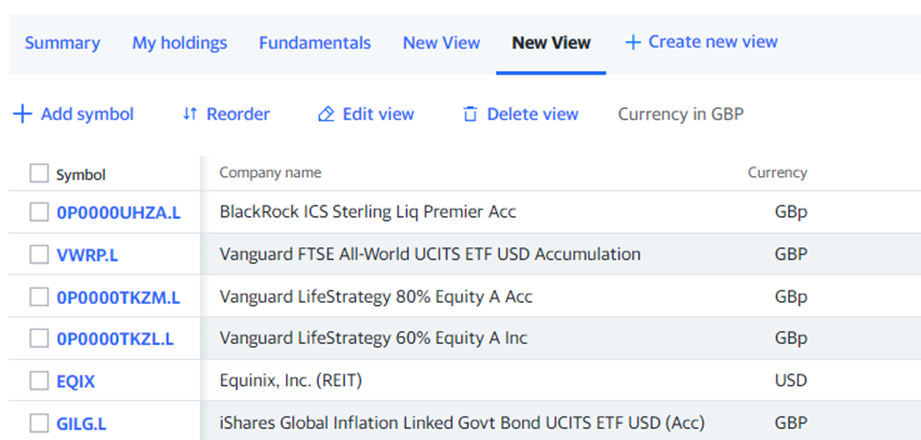

---
title: How to use the CSV Import functions for GBX priced securities?
--- 
# How to use the CSV Import functions for GBX priced securities

The following *how-to* is based on a discussion *[Getting started: Cash vs Deposit/Reference accounts](https://forum.portfolio-performance.info/t/getting-started-cash-vs-deposit-reference-accounts/27365/20)* in the English language forum.

## Introduction
Portfolio Performance (Portfolio Performance from now on) supports importing of different currencies when importing transactions and movements on cash/deposit accounts. Before reading this guide, you should refer to the main guide on importing which covers things which we will not duplicate here.

This guide is mainly about the peculiar situations which can arise from the UK market habit of pricing some securities (in particular funds) in pence (GBX in Portfolio Performance language) rather than pounds (GBP). This causes complications because our accounts (Securities accounts where we hold the actual securities and Cash accounts used to show money deposited for purchases and obtained from sales of securities) will be in GBP. GBP and GBX are different currencies in the eyes of Portfolio Performance (and many other portfolio tools). So there is actually a conversion which is treated as a currency exchange by Portfolio Performance that needs to happen -- it's a special case.

The importer does a lot well, but has limitations and is at times more helpful or less helpful when it comes to error messages. The process needed to make this work is not always intuitive. It is also possible to successfully import and then find later that the transactions are not actually correct.

The main guide on importing now helps a great deal. It is possible to figure out how to do it now that that guide exists. This extra information is intended to spell out exactly how to do it and hopefully spare some frustration which can otherwise occur.

## The Basics

If you have a securities account (and probably an associated cash/deposit account) in pounds (GBP), and you need to import anything which was handled in pence, *you are doing a currency conversion during the import.* The exchange rate is always the same (i.e. 1 GBP = 100 GBX), but it is still a conversion which Portfolio Performance will not handle automatically unless you tell it the currency and exchange rate.

This is NOT a guide about importing GBP and GBX transactions into accounts operated in another currency (e.g. Euros or USD). Some of this information may still be useful in such cases, but it has been written, checked and tested to cover a specific scenario.

It is worth learning how to prepare your import data in a spreadsheet. The more that is done like this, the easier and more reliable your imports will be. It will be more work up front (especially if you need to learn some spreadsheet tricks), but pays dividends later.

For now, we will cover the import assuming the use of spreadsheets in the right form. To be accurate, we will actually be using comma separated value (CSV) files for the actual importing, but the most likely way to create these will be using a spreadsheet tool (e.g. Excel or Google Sheets). The process will involve:

- Creating your Securities
- Preparing Your Transaction Data
- Importing Securities transactions
- Importing Dividends

## Creating your Securities

***Special care is needed creating securities when dealing with GBX denominated securities.***

It is better to create your Securities FIRST in PP.

If you import transactions where a security does not yet exist, Portfolio Performance will create the security. But it will create it with a currency of GBP if the Securities account is in GBP.

You cannot change the currency of a security once you have imported transactions against it and it also creates other extra work. So this is best avoided.

You can create the securities manually, but here we will cover how to use an import.

### Preparing Securities Data

The main guide to import covers how to import Securities so we will focus here on things to watch out for when creating GBX securities.

**Quick Version**

Create a CSV file for the import with the right headings and information for each security. As the main guide to importing securities explains, there are no mandatory fields for a securities import, but one of the descriptors of the security (Ticker Symbol, ISIN, WKN or Security Name) will be needed or you will be importing nothing.

For the purposes of this guide we will be assuming we want to use Yahoo! Finance (YF from now on) later for our historical quotes (prices) and will focus on that case. If you plan to use a different provider of historical quotes, it will be worth looking into what ticker symbol or other identifier (e.g. ISIN, WKN) that source uses and including it at this stage. The YF ticker symbols are really only used by YF. To make things more complex, YF does use some more generic symbols sometimes. You can see this in the example below for VWRP.L, EQIX and GILG.L.

So the information in this CSV will consist of (at a minimum): Ticker Symbol, Currency.

It is worth adding Security Name while you're at it. Like this:

Figure: Securities Import spreadsheet example. {class=pp-figure}

The figure above shows an example of a spreadsheet with a number of securities defined. This can be saved as a comma-separated values (CSV) file for import into PP.

Follow the main Securities Import guide for how to import the file.

**Explanation**

It is worth getting the list of all the securities you want to use across all Securities Accounts together with the Ticker Symbol of your chosen provider of historical quotes (prices) and the security's currency (e.g. GBP, USD, GBp/GBX). If you will be using YF for your historical prices, it is unlikely your broker export will provide the Yahoo! Ticker symbol so you will need to add this.

YF's portfolio tools can be helpful here as it is possible to create a list of securities by searching for each one and adding it to a portfolio. You can create a view of that portfolio showing the information needed above. See example below:

Figure: Example Yahoo! Finance portfolio view. {class=pp-figure}

Unfortunately the YF export function does **not** respect the view you created. Instead, select the data from your browser and then copy and paste into a spreadsheet. When pasting, select to paste as text only.

If using this route it will be necessary to change YF's symbol for pence (GBp) to PP's symbol (GBX). But a simple (but remember case-sensitive) Find/Replace can do that. In the example below, the column names have been changed to match what is required by Portfolio Performance and GBp has been replaced by GBX.

It is worth reiterating a point made in the main Import guide. The currency column should be named "Transaction Currency". This is despite Portfolio Performance calling it "Currency" in the Import wizard. If you label the column "Currency" it will not be automatically selected for import (you will see that the column is not green in the Import Wizard). It is simple to select the column heading in the Import Wizard however if needed.

The name "Transaction Currency" may confuse. When you actually buy and sell, your broker platform will probably do everything in GBP not GBX, so it may seem odd that the Transaction Currency is being defined here in GBX. What is really meant is the denomination of the security for pricing/quotes. Portfolio Performance needs to understand what currency the price/quote it receives from a provider is in.

Figure: Example Securities CSV import created from a copy/paste from Yahoo! Finance. {class=pp-figure}

### Importing

Follow the main guide to importing Securities.

Make sure that all the columns of your data are highlighted green in Portfolio Performance when you start the Import Wizard. Various issues (such as invisible characters present in the column name of the CSV) can mean that Portfolio Performance will not automatically detect the right column name mapping. If this happens, double click where it says "Double click here" and select the correct field name from the dropdown.

As discussed in the main guide, although Portfolio Performance will search for providers of historical quotes (prices) it probably will not find many and will not select YF as the source.

You can select historical pricing providers later manually after importing the securities. You may wish to delay this step until after you have checked and imported some transaction data so that you know you are happy that your Securities have been created correctly.

Now that we have our securities loaded, we can move on to importing transactions against these.

## **Preparing Your Transaction Data**

**Quick Version**

Create a CSV containing all the transactions you wish to import that looks like the (spreadsheet format) example below and has these column names.

Figure: Example Portfolio Transactions import data. {class=pp-figure}

Important - Import using the "Portfolio Transactions" type of data in the Import Wizard. Using the default of Account Transactions will not work.

**Explanation**

In these examples, the transaction currency is GBP. So the Value, Fees and Taxes are in GBP.

The objective here is to ensure that your CSV of portfolio transactions is consistent and has the correct currency units and exchange rates before importing.

It is necessary because data exported from broker platforms is very unlikely to be exactly right for Portfolio Performance import and additional data will be needed.

Figure: Example Portfolio Transactions import data. {class=pp-figure}

In the example above we have the following columns:

Date -- the transaction date. Here we have formatted in the Portfolio Performance default date and time format. It can also be just in YYYY-MM-DD format. This can be changed by using a "Custom" number format if using Excel and entering YYYY-MM-DD as the format. The date can be in other formats, but then you will need to choose the right format in the import wizard which is slower and is easy to forget leading to incorrect dates being imported. Essential.

Securities Account -- this helps avoid errors from overlooking the selection of the correct Securities Account in the Import Wizard. It is essential if you want to import transactions into more than one account in the same import, otherwise it is optional.

Cash Account -- this is included for the same reasons as Securities Account.

Type -- the type of transaction. Essential.

Value -- the net value of the transaction in the base currency of the securities account (i.e. the number of shares x the price of the transaction in the base currency of the securities account). In this case, all the values here are in GBP (£s) NOT GBX/pence. Essential.

Currency Gross Amount -- the denominated currency of the security. NOT the transaction amount currency. Where the pricing currency of the security matches the currency of the securities account, this is blank, but is Essential where there is a difference.

Exchange Rate -- the rate to convert ***from*** the Value ***to*** the denominated currency (GBX) of the security amount by ***multiplication***. Essential where the currency is not the same as the securities account currency -- i.e. essential when you have a GBX or say USD denominated security. Only non- essential when the security is priced in GBP.

Fees and Taxes -- self-explanatory and optional. These need to be in the base currency of the securities account/cash account -- in our case, GBP/£. Optional.

Shares - the number of units/shares traded. Essential.

Ticker Symbol -- the unique ticker symbol used to identify the security. In this case, this is the YF ticker. One of Ticker Symbol, Security Name, ISIN or WKN is required. When we created the securities (see earlier), we specified the Ticker Symbol and the Security Name only. Either of these will do.

### Importing

Follow the main guide to importing portfolio transactions.

When you click "Next" after the first wizard screen, Portfolio Performance will show you which transactions have loaded (green tick) and which may have failed (white cross in a red circle and struck through) in the "Status" column as shown below (Status is abbreviated to S. because of the column width).

Figure: Import showing two incorrect transactions and a transaction where no security exists. {class=pp-figure}

In the above example, two transactions are marked as errors. The security (iShares Global Inflation Linked Govt...) is actually priced in GBP, but I changed the currency of the security in Portfolio Performance to GBX before this import to illustrate the error.

Because the import CSV (see earlier) does not have an exchange rate for transactions on this security, Portfolio Performance does not know how to convert from the transaction currency (GBP) to the security currency (GBX).

Also note the last line of this import screen showing a Type of transaction "Security". This is there because I did not create this security in Portfolio Performance before importing transactions for it (you will notice it was missing from the Securities import example earlier). Portfolio Performance is smart enough to create the security when you first import a transaction. If it is a GBP security this is helpful and a timesaver.

BUT, if the security is a GBX priced security, this will cause a problem because Portfolio Performance will create the security with GBP as the currency (it defaults to the currency of the Securities account). You should therefore cancel the import and fix the problem by creating the security before re-attempting the import.

If you do not do this, then you will need to delete any transactions for the problem security, delete the security, recreate the security with a currency of GBX and then import again.

You ***can*** use the same transactions CSV import file because Portfolio Performance will ignore any transactions already loaded from that file showing these as errors.

Alternatively, delete all transactions and reload everything again. It is not slower and perhaps safer to know you started from a blank slate. That way, any errors shown will be real errors and you avoid the risk of missing real errors because you are expecting some errors for duplicate transactions.

That's it for the transactions. If you want to import cash transactions read on.

## Importing Dividends

**Quick Version**

Importing cash transactions is also covered in the main guide. Importing GBP dividends for a GBX priced security is an example of a different currency dividend and the import looks like this.

Figure: Importing a GBP dividend to a GBX priced security. {class=pp-figure}
  

**Explanation**

Some cash transactions are general to the cash account. For example, depositing and withdrawing funds to and from the Cash Account. These are not linked to a particular security so no special process is needed.

Some cash transactions are entered along with buy/sell transactions. These are transaction fees and transaction taxes (stamp duty in the UK). We do not need to concern ourselves about those here (they are addressed above and in the main Import guide).

The situation is different for cash transactions which are linked to securities which are priced in GBX. Usually this is only dividends and equalisation payments. Less commonly, corporate actions may result in a release of capital or other payment. Any such payment of a cash amount whilst securities are held will use the Dividend type of transaction.

The main Import guide covers how to handle dividend imports when foreign currency is involved. That process can be followed for dividends on GBX priced securities.

In the example import file below, there are four dividends:

1. GBP priced security with the GBP dividend being paid into a GBP cash account
2. GBX priced security with the GBP dividend being paid to a GBP cash account
3. USD priced security where the USD dividend is being paid into a USD cash account
4. USD priced security with the USD dividend being paid into a GBP cash account.

Figure: Figure 8 - Example dividend import data. {class=pp-figure}

Date, Type, Value, Gross Amount, and Exchange Rate are mandatory. One of Ticker Symbol, Security Name, ISIN or WKN is required to identify which security is involved.

Cash Account is normally optional if all dividends will be applied to the same account (which is specified in the Import Wizard). Here however we are being specific about the Cash Account in order to allow dividends for more than one account to be imported together.

Note is optional.

-  The Gross amount, Currency Gross Amount and Exchange Rate can be omitted for the first row (GBP to GBP)
- The Exchange Rate for the GBX dividend will always be 0.01.
- The Exchange Rate for the USD dividend paid into a USD cash account is always 1.
-  The Exchange Rate for the USD dividend being paid into a GBP account is the rate which allows conversion between the Gross Amount and the Value (see main Import guide).

A rarer type of dividend occurs when the security is priced in GBP, but dividends are received in USD. HMEF.L is an example of such a fund. There does not appear to be a way to handle this situation through import currently.

The options to handle this are:

- Convert manually to GBP and import as GBP
- Enter the USD dividend manually to a USD denominated cash account.
