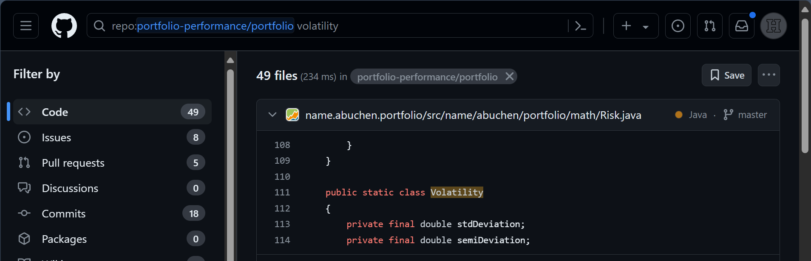

While using the PP program, you may sometimes encounter results that you don't fully understand. PP already goes a long way to explain its calculations and results by offering intermediate results, popovers with detailed information, and possibilities to export the data in various forms to further analyze with other tools, such as Excel.

Another possibility is to inspect the source code. The beauty of open-source software like PP is that the source code is readily available. Inspecting the code offers a unique insight into how things are measured and calculated.

# Example 1: How is the volatility indicator calculated?

The performance dashboard (View > Reports > Performance) displays several indices of performance and risk, including the volatility indicator. From other sources, such as [Investopedia's How Do You Calculate Volatility in Excel?](https://www.investopedia.com/ask/answers/021015/how-can-you-calculate-volatility-excel.asp), you know that volatility is often measured by the standard deviation between returns of an investment. A typical Excel formula looks like: `= STDEV.S(A1:A100) * SQRT(100)`, assuming that the daily returns are within the range A1:A100 in Excel.

Upon trying this on your portfolio, you get different results. So, you decide to inspect the source code.

1. Navigate to the GitHub source code: https://github.com/portfolio-performance/portfolio. The software is written in Java and structured in several modules.
2. Use the search bar at the very top of the window to search in the repository: `portfolio-performance/portfolio`. Enter a relevant search term, such as "volatility," to find the source code where this term is mentioned. Scroll through the different modules to get the feeling. It will be rather evident why `volatility` appears in these modules.

    Figure: Result of the Saerch 'Volatility' in the github repo of PP. {class=pp-figure}

    

3. The first module (name.abuchen.portfolio/src/name/abuchen/portfolio/math/Risk.java) is most relevant. It is about "Risk" within a folder named "portfolio/math". Click within the box to see the code.
4. Immediately, you are taken to line 111, where the Java class "Volatility" starts. A few lines further, something named "averageLogReturn" is calculated. Inspecting the code of that function reveals that it calculates the arithmetic average of the returns, but apparently, it uses the natural logarithm of (1 + return). Because a logarithm cannot be calculated from a negative number, one is added. 
5. This average is then used to calculate the standard deviation, again with the values of (natural) log(1 + return). Since the standard deviation is independent of the actual average, adding 1 doesn't matter.
6. At this point, it becomes obvious that your own Excel calculation uses the wrong input. Going back to the original formula and changing it to `= STDEV.S(B1:B100) * SQRT(100)` where the column B contains the logarithmic values of the returns such as `=LN(1 + A1)` will provide the exact same volatility from PP.
7. Of course, you could also have read the docs. An explanation of volatility and why natural logarithms are used, could be found at Basic concepts > Risk. 

