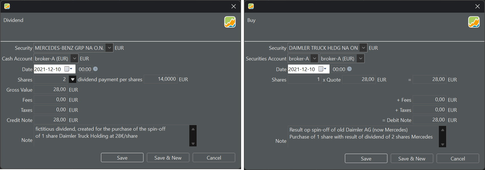

In the context of stock markets, a spin-off refers to the process by which a company separates or "spins off" a portion of its business into a new, independent entity. This new entity becomes a distinct, standalone company with its own management, operations, and often its own publicly traded stock.

The shareholders of the original company may receive shares in the new entity in proportion to their holdings in the parent company. A distribution ratio determines how many shares of the new entity each shareholder receives for every share held in the original company.

On December 10, 2021, Daimler AG successfully executed a spin-off, resulting in the establishment of a new entity known as [Daimler Truck Holding AG](https://group.mercedes-benz.com/documents/investors/annual-meeting/daimler-ir-egm-2021-spinoffhivedownreport.pdf). Simultaneously, the former Daimler AG underwent a name change to become Mercedes-Benz Group AG. Consequently, the XETRA stock exchange market now encompasses two distinct securities: ISIN DE0007100000 for Mercedes-Benz (formerly Daimler AG) and ISIN DE000DTR0CK8 for Daimler Truck Holding AG. The distribution ratio for this spin-off was 2:1, signifying that for every two shares of Daimler AG, shareholders received one share of Daimler Truck Holding AG.

Figure: Quote evolution of the Daimler Truck Holding and Mercedes-Benz Group. {class=pp-figure}

To record a spin-off in Portfolio Performance (PP), a suggested workflow, deduced from an [in-depth discussion](https://forum.portfolio-performance.info/t/wie-bilde-ich-korrekt-einen-spin-off-ab/4677/20) on the Portfolio Performance forum, involves the following steps:

1. Change the name of the security Daimler AG into Mercedes-Benz AG and create a new security Daimler Truck Holding AG in your portfolio.

2. Create a dividend transaction for the Mercedes security on December 10, 2021. The dividend price is set to € 14/share (see below for an explanation).

3. Create a buy transaction of n shares of Daimler Truck Holding AG, where n is 1/2 of the number of shares of the old Daimler AG. According to XETRA, the [opening price](https://www.boerse-frankfurt.de/equity/daimler-truck-holding-ag/price-history/historical-prices-and-volumes) of Daimler Truck Holding AG on December 10, 2021 was 28€/share (no fees or taxes).

4. Use the same deposit account for the dividend and buy transaction. This way the result of the fictitious dividend transaction will be cancelled out by the real purchase transaction. The dividend of n shares x 14€/share = purchase of n/2 shares x 28€/share.

Figure: Recording the spin-off of Daimler AG.{class=pp-figure}

This workflow solves the spin-off problem by simulating a dividend transaction followed by an equivalent purchase for the same amount. However, a drawback is that there is no *real* dividend, compromising the precision of the dividend overview.  Conversely, from a performance standpoint, treating the spin-off as a dividend makes sense. For example, there was a noticeable decline in the share price of the old Daimler AG, dropping from approximately €90 in mid-November 2021 to €74 on December 10, 2021, suggesting market anticipation of the impending spin-off.
