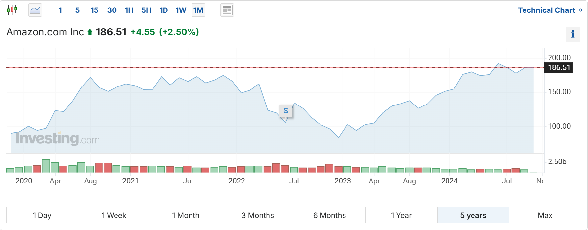
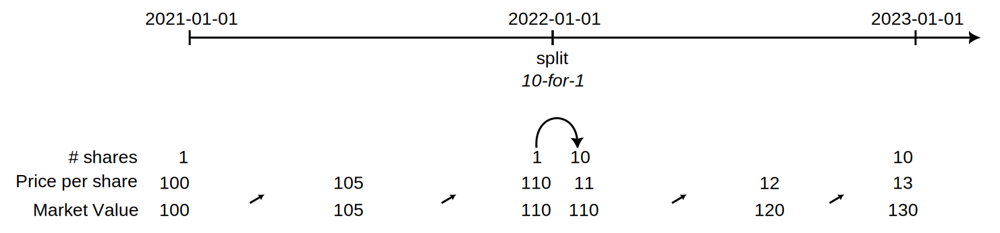

A stock split increases the number of shares in a company. For instance, following a 2-for-1 split, each investor will possess double the number of shares, and each share will be valued at half its previous price. A stock split leads to a reduction in the market price of individual shares but does not alter the total market capitalization of the company. Stock splits are frequently executed to make shares more accessible to a broader range of investors and enhance market liquidity. Conversely, a reverse stock split (1-for-5) entails fewer stock shares but at a higher price.

There are essentially two methods for recording a stock split in PP: using the built-in function or a sell-buy-back operation. Each method has its own set of advantages and disadvantages.

## Use of the built-in Stock split-function

PP currently supports stock splits via work-around; see the [discussion on the forum](https://forum.portfolio-performance.info/t/aktiensplit-buchen/11758). Essentially, it retroactively assumes that the shares have *always* been split. This ensures the correct number of securities in the portfolio *after* the split and maintains historically consistent cash flows and valuations, thereby preserving the security's performance. However, the number of shares *before* the split may not align with the real historical situation, potentially complicating the understanding of the security's history.

This change is destructive. It is not easily undone. If necessary, an improperly executed split can be corrected by executing a split with an inverse ratio. But perhaps a better approach is to create a backup copy of the portfolio file.

In the description of the Stock Split process in the Reference Manual, the example of the Amazon 20-for-1 stock split on June 6, 2022 is used. Please review this section first for details about [how to use the built-in stock split function](../reference/view/securities/context-menu.md#stock-split) of PP.

In Figure 1, the share price evolution over the last five years is depicted. Very noticeable, there is a massive drop between June 3 and 6, 2022. On those dates, the closing prices were `$ 2447` and `$ 124.79`, respectively (but remember, you own 20 times more shares).

Figure: Historical Quotes chart of Amazon (unadjusted prices - chart from PP). {class=pp-figure}

Quite some confusion arises when you compare this chart with those from most other financial websites; for example, the 5-year chart from [investing.com](https://www.investing.com/equities/amazon-com-inc) looks very different.

Figure: Historical Quotes chart of Amazon (adjusted prices - chart from investing.com). {class=pp-figure}

Both charts span a five-year period. But, while your purchase price around January 2022 was `$ 3408` (Figure 1), it appears to be priced around `$ 150` (Figure 2), according to [investing.com](https://www.investing.com/equities/amazon-com-inc). This discrepancy arises because financial websites typically "adjust" all historical prices after a stock split. This adjustment involves recalculating the historical prices before the split, just as the PP's Stock Split function does.

Figure: Historical Quotes chart of Amazon (adjusted prices after stock split - chart from PP). {class=pp-figure}

!!! Important

    The *regular* Yahoo Finance Close Price is already adjusted for splits. The *Adjusted close* price is en surplus adjusted for splits and dividend and/or capital gain distributions.

**Some considerations**

- The built-in stock split function perfectly mirrors the approach adopted by most financial websites. This results in the Adjusted prices chart (Figure 3) being identical to those displayed on other platforms like investing.com or Yahoo Finance (Figure 2).

- It's crucial to recognize that the historical transactions *and* prices are permanently altered. This means that PP's records of past transactions will no longer accurately reflect the actual transactions as documented in your paper files. Over time, this may complicate the reconstruction of a security's history.

- A notable challenge arises when a split results in fractional shares, as seen in the case of Prosus' split announcement on September 14, 2023, with a ratio of 2.1796-for-1. In this scenario, 10 existing shares would be split into 21.796 shares. While PP can handle fractional shares, most brokers or banks cannot. Typically, they would adapt to this particular situation by issuing 21 new shares and providing compensation for the fractional share (0.796 shares in this case). Consequently, after the split, you'll need to record this compensation, which essentially involves executing a sell transaction of the fraction.

## Use of sell-buy-back operation

An alternative method that keeps the historical prices and transactions intact is the following sell-buy-back procedure. At the split date (ex-date)

- Sell all the shares at the closing price of the day preceding the split. Don't record any fees or taxes as this is an  internal operation. Leave the historical prices intact.
- Simultaneously, on the same date, acquire a new quantity of shares equivalent to the theoretical outcome of the split (old quantity x split ratio). Ensure that the total purchase amount matches the selling value determined earlier.
- Round down the new share quantity to the nearest whole number. If there is a remainder, sell it at the same price as described in step 2.

Let's apply this workflow to a simplified example (see Figure 4). On 1 January 2021, you owned one share priced at 100 EUR. This price remained essentially unchanged until 31 December 2021. On 1 January 2022, a 10-for-1 stock split occured, resulting in 10 shares. The price at the end of the day was 11 EUR. By the end of the year, the price had increased to 13 EUR per share, giving your portfolio a market value of 130 EUR.

Figure: Simplified example of sell-back-back stock split. {class=pp-figure}

The performance calculation for the built-in stock split function is quite straightforward. Due to the retroactive nature of the split function, the original purchase of 1 share at 100 EUR/share (MVB) is adjusted to reflect the purchase of 10 shares at 10 EUR/share. At the end of the two-year reporting period, you still own 10 shares, but their total value has increased to 130 EUR (MVE). Using the formulas from the [money-weighted (IRR)](../concepts/performance/money-weighted.md) and [time-weighted (TTWROR)](../concepts/performance/time-weighted.md) section:

- IRR: `130 = 100 * (1 + IRR)^2` or `IRR = SQRT(130/100) - 1` = 14.0157%.
- TTWROR: `= (130/100) - 1` or TTWROR = 30%

When using the sell-buy-back method, you need to include supplementary transactions after the initial purchase. At the split date (2022-01-01), you sell 1 share at the price of 110 EUR/share and buy 10 shares at the price of 11 EUR/share. 

- IRR: `130 = 100 * (1 + IRR)^(730/365) - 100 * (1 + IRR)^(365/365) + 100 * (1 + IRR)^(365/365)`. Because the last two terms cancel each other out, the formula simplifies to that of the built-in split, and `IRR = SQRT(130/100) - 1` or 14.0157%. It is crucial that the buy and sell transactions occur on the same day;  otherwise the second and third term are not equal. Suppose that you sell the 1 share on December 31 instead of January 1. The formula from above becomes `130 = 100 x (1+IRR)^(730/365) - 100 x (1+IRR)^(366/365) + 100 x (1+IRR)^(365/365)` or `IRR = 14.0355%` slightly higher than the result of the built-in function. Note that the negative second term has a slightly larger exponent, which means the IRR must be marginally higher to yield the MVE of 130 EUR.
- TTWROR `= ((110/100) x (130/110)) - 1` or `(1.1 x 1.1818) - 1 = 30%`. The exact selling date is unimportant for the TTWROR calculation.

!!! note
    For the buy and sell transactions, we used the share price immediately before the split.  However, according to the IRR and TWROR formulas mentioned earlier, the specific price used is not crucial, as long as the same price is applied for both the sell and buy transactions. The advantage of using the price from just before the split is that the closed trade (from the sell transaction) accurately reflects the share’s real performance up to the split.

    Please note that in the [View > Reports > Performance > Trades](../reference/view/reports/performance/trades.md) view, all reported performances are independent of the reporting period, but reflect the real holding periods of the trades. For example, the end date of the holding period is today; not the ending date of the reporting period.