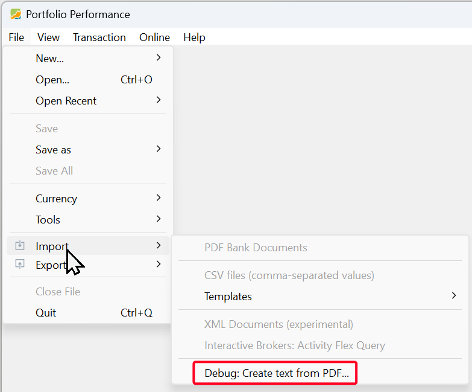

If Portfolio Performance doesn't have a PDF importer for your bank or broker, or for the specific type of transaction you need, you can request the development of this importer. Since Portfolio Performance developers don't have access to every bank or broker, you — as a user — must provide some sample PDF documents with **real** but **anonymised** examples of transactions with that specific bank or broker. The following text outlines all the necessary steps. You can also watch the [accompanying video](./requesting-new-importer.md#video-request-importer) at the bottom.

1. **Collect a PDF document** of each transaction that you would like to import into your PP portfolio. Probably, you should provide an example of a buy, sell, and dividend transaction. Don't use PDFs that are converted to PDF from a browser or self-scanned paper notes but only the original documents from the bank or broker.

2. **Convert these PDFs to text documents, one by one.** Use the parser from PP, which can be found at `File > Import > Debug: Extract Text from PDF` (see Figure 1).

    Figure: Menu File > Import.{class=pp-figure}

    

    You can use [this sample (fictitious) PDF document](../assets/SelfwealthBuy01.pdf) for testing. The extracted text will appear in the textbox below the instructions (see Figure 2).

3. **Replace (anonymise) personal information** in the extracted text, such as your name, address, and account number. You can do this by double-clicking on a word, e.g., your name. The text will be selected and replaced with random characters.

    Personal info can occur at multiple places within the document. 

    Leave all other information intact, especially amounts, dates, and security names. The following strings cannot be anonymised automatically: currencies (EUR, etc.), ISIN, and text groups containing the following characters: hyphen(-), period(.), comma(,), colon(:), apostrophe('), and slash(/). Do not delete or add anything manually.

    Figure: Extracted text from testPDF. {class=pp-figure}

    
     
4. **Copy the extracted and anonymised text** to the clipboard or save the file. You will need it later in the request form of the PP forum.
5. If there isn't already an importer for your needs, **create a new thread** in the [forum](https://forum.portfolio-performance.info/c/english/16) with the name `PDF Import from [your bank or broker]`. Otherwise, post a reply in an existing thread, for example [PDF import from SelfWealth](https://forum.portfolio-performance.info/t/pdf-import-from-selfwealth/17399). Add the extracted text for all transactions, one by one. Ensure that these text fragments are within ```triple quotes```, so that it is formatted as code. If your transaction is in a foreign language, please provide some guidance about the translation of the used terms.
6. **Wait for a reply** from the developer. When the importer is finished, it will be added to the next update of PP.

<a name = "video-request-importer"></a>

<video width="100%"  controls>
  <source src="../../assets/videos/request-importer/PP-request-importer.mp4" type="video/mp4">
</video>
