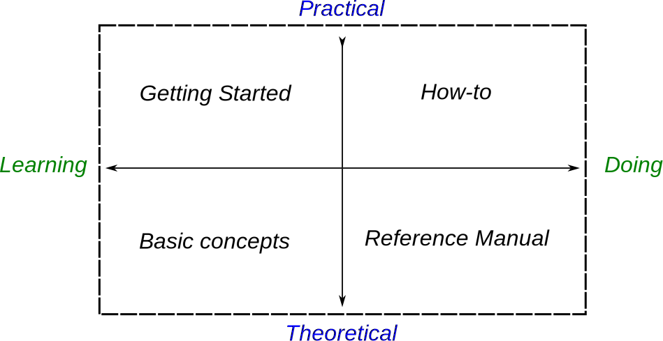

The *Portfolio Performance (PP)* manual consists of four chapters which are derived from a popular [documentation authoring framework](https://diataxis.fr/). The documentation is structured along two axes: practical versus theoretical knowledge and learning versus doing.

- [Getting Started](getting-started/index.md): If you're new to PP, this chapter will help you get started. It covers everything from installation to creating a new portfolio, importing securities and transaction data, and evaluating your entire portfolio.
- [Basic Concepts](concepts/index.md): Although PP is a highly intuitive and user-friendly program, the underlying financial concepts can be complex. This chapter provides a concise yet clear understanding of key Portfolio Performance concepts, such as accounts, transactions, reporting periods, IRR, and more.
- [How-to](how-to/index.md): In this chapter, you'll find step-by-step descriptions of common procedures, including data import, dividend booking, finding historical quotes, and more. A few tips & tricks and special cases are also described.
- The [Reference Manual](./reference/index.md) is a detailed and technical description of all functions and user-interface elements of the program. 

# About Portfolio Performance

PP is an Eclipse-based desktop application written in Java. This open-source project started in 2012 and has been [updated](https://github.com/portfolio-performance/portfolio/releases) numerous times. With PP, you can:

- Monitor the composition and development of your securities portfolio with meaningful overviews, key figures, and charts.
- Track the historical price development of securities and your purchases and sales.
- Classify the securities in your portfolio according to your needs and visualize the composition, such as by asset classes and regions.
- Define and track the portfolio strategy with your planned asset allocation and ensure it in the rebalancing process.
- Create an overview across multiple securities accounts and clearing accounts.
- Import statements from online banks and brokers quickly and conveniently.

Why choose yet another application? While you can simulate some of these calculations with Excel or rely on your broker for information, they often provide incorrect results. They are typically based solely on absolute figures at the beginning and end of a reporting period and do not properly include purchases and sales or variable reporting periods. PP calculates performance accurately using True-Time Weighted Rate of Return and Internal Rate of Return, taking into account the purchases and sales at their respective execution date.

# Other Information Sources

The source code is hosted on [GitHub](https://github.com/portfolio-performance/portfolio). Examining this code will give you direct access to the inner workings of the program.

There is also an active [discussion forum](https://forum.portfolio-performance.info/) available in both English and German, with an extensive [Frequently Asked Questions (FAQ)](https://forum.portfolio-performance.info/t/faq-haeufig-gestellte-fragen/1721) section.

# License

This manual is licensed under a [Creative Commons Attribution-NonCommercial-ShareAlike 4.0 International License](http://creativecommons.org/licenses/by-nc-sa/4.0/). The [source code](https://github.com/portfolio-performance/portfolio) of [Portfolio Performance](https://www.portfolio-performance.info) is licensed under the [Eclipse Public License 1.0](https://github.com/portfolio-performance/portfolio/blob/master/LICENSE).

Thanks to all [contributors](https://github.com/portfolio-performance/portfolio-help/graphs/contributors)!

## Imprint

For more information, please see the [Imprint and Privacy Policy](https://www.portfolio-performance.info/portfolio/impressum.html).