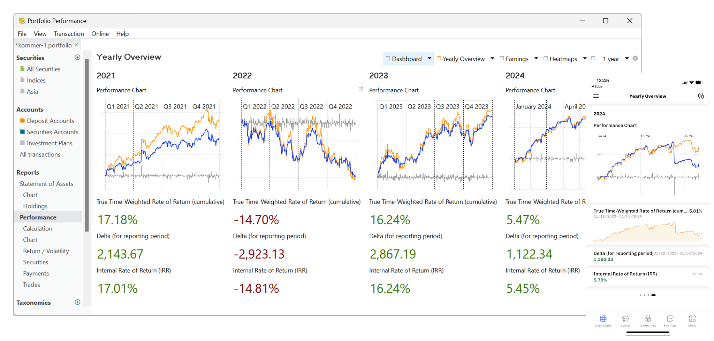

#

The **Portfolio Performance** (PP) manual consists of four chapters which are derived from a popular [documentation authoring framework](https://diataxis.fr/). The documentation is structured along two axes: practical versus theoretical knowledge and learning versus doing.

- [Getting Started](getting-started/index.md): If you're new to PP, this chapter will help you get started. It covers everything from installation to creating a new portfolio, importing securities and transaction data, and evaluating your entire portfolio.
- [Basic Concepts](concepts/index.md): Although PP is a highly intuitive and user-friendly program, the underlying financial concepts can be complex. This chapter provides a concise yet clear understanding of key Portfolio Performance concepts, such as accounts, transactions, reporting periods, IRR, and more.
- [How-to](how-to/index.md): In this chapter, you'll find step-by-step descriptions of common procedures, including data import, dividend booking, finding historical quotes, and more. A few tips & tricks and special cases are also described.
- The [Reference Manual](./reference/index.md) is a detailed and technical description of all functions and user-interface elements of the program.
