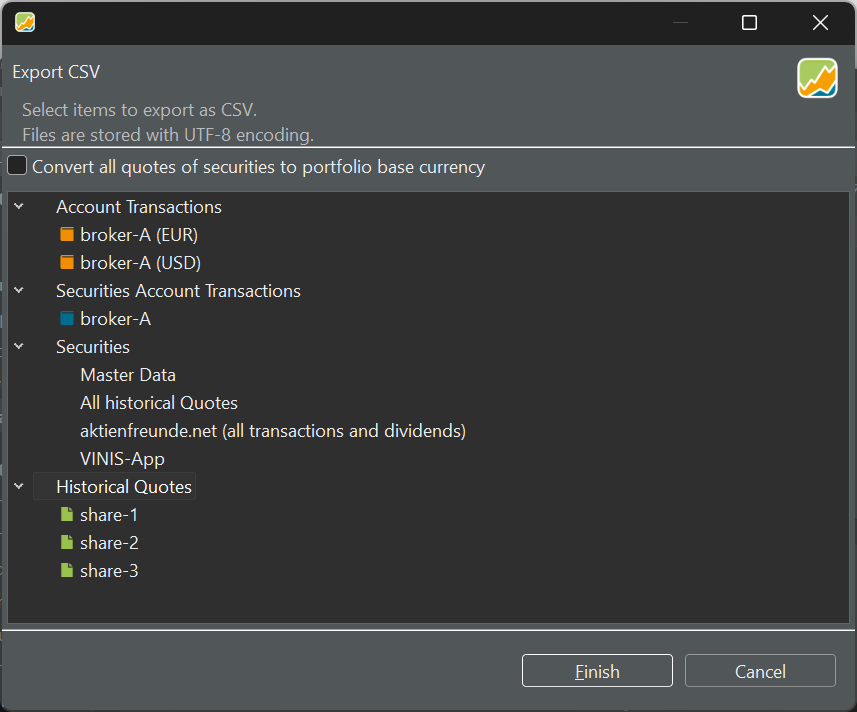

The menu `File > Export` has only three options: `CSV files (comma-separated values)`, `Portfolio Performance XML`, and `Export taxonomy`.

## CSV files (comma-separated values)

Selecting the `CSV Files` option will reveal an additional panel for specifying the type of information to be exported. The exported CSV file utilizes the UTF-8 encoding, a universal and widely used method for converting text to bytes. This encoding can represent any character in the Unicode standard, encompassing over 140,000 characters from various languages and scripts. The importance of the encoding becomes apparent when importing the CSV file. Most programs, such as Excel, can accurately recognize the encoding. However, for PP's Import function, it's crucial to choose the correct encoding.


Figure: Export CSV file dialog from demo-portfolio-04.xml.{pp-figure}




As you can see in Figure 1, there are two deposit accounts (EUR and USD) and one security account (broker-A). The USD deposit account is used for share-3, which is expressed in USD.

If you have securities in a different currency than the portfolio base currency such as in Figure 1, you can convert the historical quotes to the base currency by checking `Convert all quotes of securities to portfolio base currency`. Please note that this option does not convert the purchase prices, fees, ... that might be expressed in another currency.

### Account Transactions

For each *Deposit* account, you can export all transactions (buy, sell, deposit, ...).  For each transaction the following fields are exported: `Date, Type, Value, Transaction Currency, Taxes, Shares, ISIN, WKN, Ticker Symbol, Security Name`, and `Note`.

It's *not* possible to select multiple accounts.

### Securities Account Transactions

Only the Buy and Sell transactions are exported from the securities account; *not* dividends. The following fields are exported: `Date, Type, Value, Transaction Currency, Gross Amount	Currency, Gross Amount, Exchange Rate, Fees, Taxes, Shares, ISIN, WKN, Ticker Symbol, Security Name`, and `Note.` Unfortunately, the date contains the time of day of the transaction (e.g. 2021-01-15T00:00), which makes it a text field in Excel. You can create a custom date format in Excel to handle this kind of dates.

### Securities

- Master Data: For each security in the portfolio, the following fields are exported: `ISIN, WKN, Ticker Symbol, Security Name, Currency`, and `Note`.

- All historical quotes are organized with a dedicated column for each security, using the ticker symbol as the column heading. Each date containing a historical quote corresponds to a row with the respective price added in the relevant column. In cases where a security has no recorded price for a particular date, the corresponding cell is left empty.

- All transactions and dividends: with this option, you can export all buy, sell, and dividend transactions. The exported fields are (in German): Datum, ISIN, Name, Typ, Transaktion, Preis, Anzahl, Kommission, and Steuern. The date format does not contain time of day info.

- VINIS-App: The VINIS app is a mobile application for iPhone and Apple Watch that helps users set, track, and achieve their financial goals. The app allows users to create custom goals and key figures, and to link them to external data sources such as Google Sheets, Excel, or Numbers documents. The app also provides visualization, prediction, and reminder features to help users monitor their progress. The following fields are exported: Funds sum, Securities purchase price, Securities market price, Total assets purchase price, Total assets market price, Earnings current year, Earnings last year, Earnings total, Capital gains current year, Capital gains last year, Capital gains total, Realized capital gains current year, Realized capital gains last year, Realized capital gains total.

### Historical Quotes

Similar to the previous description of "All historical quotes," the export includes all available prices for the selected security. The exported data comprises two fields: `Date` (without the time of day) and `Quote`.


## Portfolio Performance XML

This command is identical to the [File > Save](save.md) command or the `File > Save as` menu command with option XML.

## Export taxonomy

With this command, you can export all taxonomies that are available in your portfolio to a JSON-file. This JSON file defines how financial instruments are grouped and categorised. In this example from [demo-project-04.xml](../../assets/portfolios/demo-portfolio-04.xml), the taxonomy is called `My Taxonomy` and it divides holdings into two categories: `EUR` and `Non-EUR`. Each investment or account (like `share-1`, `share-3`, or `broker-A`) is listed and placed into one of these categories. Some investments also include a ticker symbol, so they can be clearly identified. The percentages (100% here) show that the entire investment belongs to that category.

``` json
    [
        {
            "name": "My Taxonomy",
            "color": "#8de0c2",
            "categories": [
            {
                "name": "EUR",
                "color": "#ada2b4"
            },
            {
                "name": "Non-EUR",
                "color": "#95c387"
            }
            ],
            "instruments": [
            {
                "identifiers": {
                "name": "share-1",
                "ticker": "DTE.DE"
                },
                "categories": [
                {
                    "path": [
                    "EUR"
                    ],
                    "weight": 100.0
                }
                ]
            },
            {
                "identifiers": {
                "name": "share-2",
                "ticker": "TMV.DE"
                },
                "categories": [
                {
                    "path": [
                    "EUR"
                    ],
                    "weight": 100.0
                }
                ]
            },
            {
                "identifiers": {
                "name": "broker-A (EUR)"
                },
                "categories": [
                {
                    "path": [
                    "EUR"
                    ],
                    "weight": 100.0
                }
                ]
            },
            {
                "identifiers": {
                "name": "share-3",
                "ticker": "ADBE"
                },
                "categories": [
                {
                    "path": [
                    "Non-EUR"
                    ],
                    "weight": 100.0
                }
                ]
            },
            {
                "identifiers": {
                "name": "broker-A (USD)"
                },
                "categories": [
                {
                    "path": [
                    "Non-EUR"
                    ],
                    "weight": 100.0
                }
                ]
            }
            ]
        }
    ]
```
