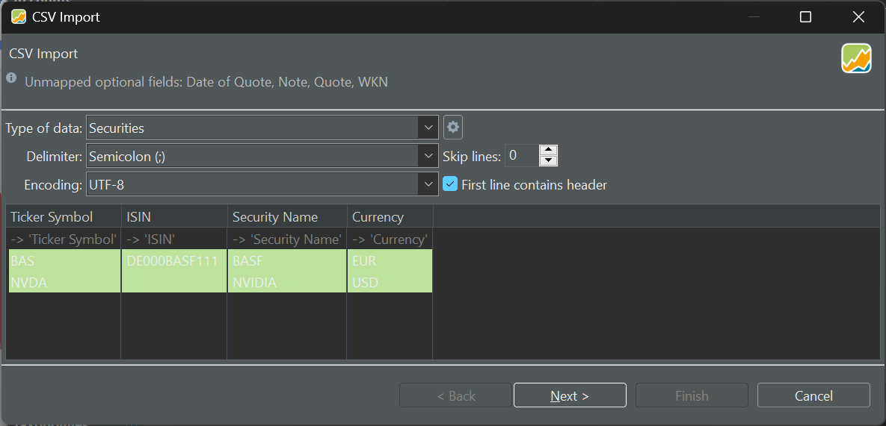
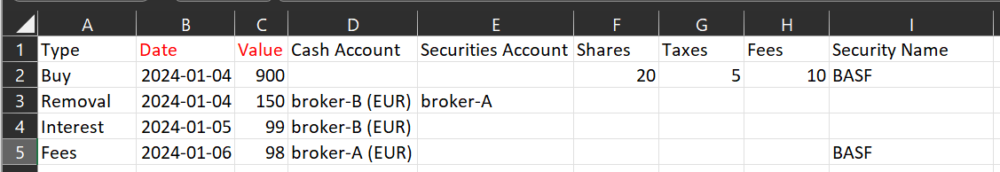
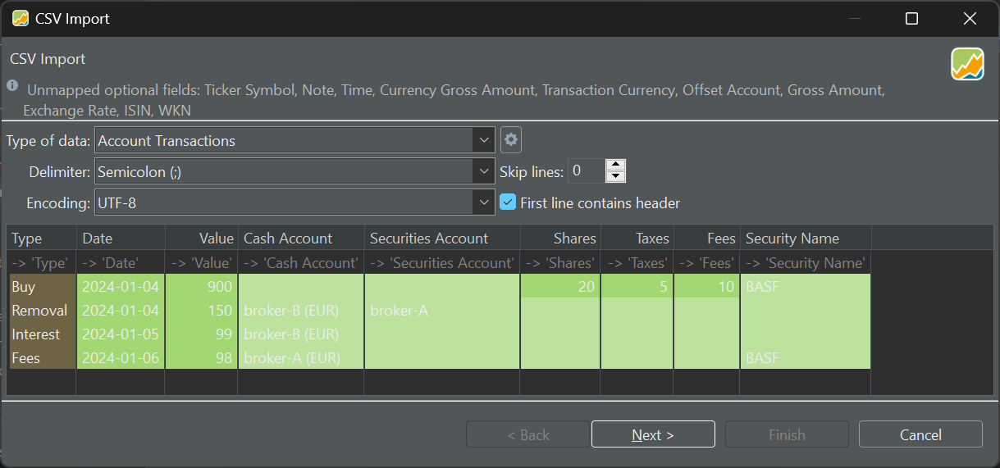

In PP you can enter your data (buy, sell, dividends, historical quotes, … ) manually but you can also *import* this info from a CSV file (comma-separated values) or from a PDF document. Figure 1 displays the expanded `File > Import` menu.

Figure: Menu File > Import.{class=pp-figure}


There are two primary data sources: PDF documents and CSV files. Some brokers or banks may present this information in a proprietary format. Templates for major banks or brokers are available.

## PDF Bank Documents

## CSV files (comma-separated values)

PP employs a wizard to lead you through the import process, consisting of three steps. At each step, you are required to furnish additional information.

**Step 1**. Start with the menu `File > Import > CSV files (comma-separated values)`, navigate to the correct folder and select the appropriate CSV file. Only files with the extension `CSV` are displayed (step 1).

A CSV file is simply a text file. The first line contains the names of the fields (columns); separated by a marker such as a comma. The second and following lines contain the data, also separated by a marker. The number and type of fields the file should contain, depend on the type of import. The names in the heading can be freely chosen, although it is preferable for them to match PP's internal usage, as it simplifies the mapping process (associating each column with its corresponding field in PP). The printout of a CSV file in Table 1 (see below) comprises two fields or columns and four lines of data that could be utilized for importing historical prices.

In **step 2** of the wizard, you need to select the appropriate import type or template by clicking on the drop down box (see Figure 3). PP distinguishes between 5 types of import: `Account Transactions`, `Portfolio Transactions`, `Securities`, `Historical Quotes`, and `Securities Account`. These templates are discussed in detail below. You also need to decide about the following options.

- *Delimiter*: PP will probably choose the correct delimiter; in this case a semicolon. Other possibilities include comma and the tab symbol.
- *Encoding*: 'strange' characters in the output table indicate a mismatch between the chosen encoding and the source file encoding. There are numerous possibilities, and the correct choice depends on the application used to create the file.
- *First line contains header*: enable this option if the first line of your CSV contains field  labels.
- *Skip lines*: sometimes the CSV-file contains irrelevant information in the first few lines. You can skip them with this option.
- *Mapping fields*: PP needs to determine the corresponding columns for its internal fields. If PP recognizes a field, it will be indicated by a message `-> 'Field'` in the second row of the output; otherwise, a message `Double click here` will appear (see Figure 3). To associate a column with an internal PP field, double-click on the second line. You can then choose from the available fields. If you don't want to associate a field, select the `---` option. PP will then ignore this column. To change the format of a column, e.g. Date format of a date, double-click on the name in the second line.

Figure: Saving the mapping configuration.{class=align-right style="width:50%"}


- *Save Configuration* (Gear icon): To save the current mapping, click on the gear icon to the right of "Type of data." A list of `Built-in configurations` will be displayed, such as comDirect, Consorsbank, etc. (see Figure 3). Using the option `Save current configuration` will save your current mapping configuration as a custom template. This template will be available under `User-specific Configurations`, for example, `test (Account Transactions)` (see Figure 2). You can delete, export, and import configurations. The export function uses a JSON format.

**Step 3**: set additional info, depending on the import type such as accounts and check the preview of the import process.
Step 3 differs depending on the selected type of import. For the historical quotes import type, only the share name should be additional selected. For the other types, you need to set the security and cash account.

!!! Note
    The cash and security account could be set globally for all import rows of the CSV file through the top panel; see for example Figure 6.  You can also provide this information as part of the CSV file (include a column Cash account and Securities account). Or you can set the accounts through the context menu. Right-click on a row in the table preview and choose the appropriate account.

### Historical Quotes import

To import the historical quotes of a security, only two columns in the CSV file are required: a date and the corresponding quote. There are no optional fields.

*Table 1: Source data for the import of Historical Quotes.*
```
Date; Price
2024-01-09;	22,51
2024-01-08;	22,54
2024-01-05;	22,43
2024-01-04;	22,46
```
Please note that the date in Table 1 is in the format `YYYY-MM-DD`. By double-clicking on the second row of the output panel; e.g. `-> 'Date'`, you can set the correct date format. January 7th and 6th are not included as these are weekend days (although they could be). In this case, the price information uses a comma as a decimal separator, which is standard in Europe. Therefore, a semicolon (;) is used to separate the fields. The file is saved in Excel with UTF-8 encoding. The heading labels are Date and Price.

Figure: Importing Historical Quotes (step 2).{class=pp-figure}


In Figure 3, the `Next` and `Finish` buttons are greyed out because not all necessary information is available. The message at the top, "Unmapped required field(s): Quote," provides a clue. For this type of import, two fields are required: `Date` and `Quote`. However, the CSV file uses the headings `Date` and `Price`. The field `Price` should be mapped to the internal `Quote` field. Double-click on the column and select the appropriate mapping field, e.g. `Quote`. The `Next` and `Finish` buttons will then become available.

In step 3 of the wizard, you can select the security that the prices will be added to. If the chosen security already has some historical prices, the quotes will be added (no duplicates).

Figure: Importing Historical Quotes (step 3).{class=pp-figure}


### Securities import

Use this type to create new securities from a CSV file. There are no required fields. The optional fields include `Ticker Symbol`, `Security Name`, `WKN`, `ISIN`, `Currency`, `Date of Quote`, `Note`, and `Quote`. It is evident that at least one of the first four fields should be mapped. Refer to the [File > New](./new.md) section for the meaning of these terms. See Table 2 for an example of the CSV-file.

*Table 1: Source data for the import of Historical Prices.*
```
Ticker Symbol; ISIN; Security Name ;Currency
BAS; DE000BASF111; BASF; EUR
NVDA; ; NVIDIA; USD
```
Two securities will be added to the portfolio; e.g. BASF and NVIDIA. The ISIN code for the second security (traded on NASDAQ) is unavailable. Also note that the NVIDIA stock is traded in USD. Importing this CSV file will display the dialogs of Figure 5 and 6.

Figure: Importing securities (Step 2).{class=pp-figure}



The field `Currency` is apparently not recognized by PP. You should map it manually.

Figure: Importing securities (Step 3).{class=pp-figure}


The securities are now created and appear in the `All Securities list`. It does not make sense to add or change the cash or security account because there is no associated buy or sell transaction. The security is only created in the `All Securities` list. Please note that several other fields such as Calendar, Additional Attributes, and Taxonomies cannot be added through CSV-import. The Quote Feed for the Historical Prices could partially be added in the following step (see Figure 7).

After the securities are created, an additional step allows you to search for a suitable quote feed. This can also be performed manually by right-clicking on a security and choosing `Quotes > Search for providers of historical prices...`

Figure: Importing securities (Step 4).{class=pp-figure}


Only securities listed on XETRA (Deutsche Börse) and analyzed by the Portfolio Report are eligible for an automatic Quote Feed. The BASF security in Figure 7 meets these criteria and can therefore receive an automatic quote feed. However, the NVIDIA security is not listed on XETRA in USD, so automatic quotes should be obtained through another candidate provider e.g. Yahoo Finance.

### Securities Account import

With this import type, you can create a new security (see above) and at the same time the first Buy transaction. The required fields are Shares, and Value. The optional fields are Ticker Symbol, ISIN, WKN, Time, Currency, Note, Date of Quote, Securities Account, Cash Account, Quote, Date of Value, and Security Name. This works well as long as the securities have the same currency. The following CSV file will be imported in Figure 8.
```
Ticker Symbol; ISIN; Security Name; Currency; shares; value
BAS; DE000BASF111; BASF; EUR; 20; 900
NVDA; ; NVIDIA; USD; 10; 5450
```
Two securities will be created and at the same time a Buy transaction will also be recorded (20 shares of BASF for a total value of 900 EUR and 10 shares of NVIDIA for a total value of 5450 USD). Note that the status of the Buy transaction of the BASF share is OK.
There is however a problem with the NVIDIA share. The error message (bottom) explains that the transaction currency, which is USD does not match the currency of the cash account broker-A (EUR) that is set at the top. It is possible by right-clicking the second row to set the cash account for that specific transaction to another account. This is of course not feasible for a large amount of shares.

If multiple currencies in the same Buy transaction are involved, then another type of import should be chosen (see below).


Figure: Importing securities (Step 4).{class=pp-figure}


### Account Transactions import

The Account Transactions and Portfolio Transactions import are much a like. They only differ in the number of required fields (2 versus 3) and one optional field (see below).

The Transactions import type will be used to register simple transactions within one security account. It is equivalent with manual recording a transaction with the menu Transactions. The required fields are `Date`, and `Value`. Optional fields are `Type`, `Transaction Currency`, `Security Name`, `Shares`, `Securities Account`, `Exchange Rate`, `Gross Amount`, `Currency Gross Amount`, `Ticker Symbol`, `Taxes`, `Note`, `Cash Account`, `Fees`, `ISIN`, `WKN`, `Offset Account`, and `Time`.

Acceptable values for the field `Type` are `Deposit`, `Removal`, `Buy`, `Sell`, `Dividend`, `Interest`, `Interest Charge`, `Fees`, `Fees Refund`, `Taxes`, `Tax Refund`, `Transfer (Inbound)`, `Transfer (Outbound)`, `Delivery (Inbound)`, and `Delivery (Outbound)`.

The default value for `Type` is `Deposit`. If the Cash and Securities account is not provided in the CSV file, the value from the top panel is used. It's important to note that Fees and Taxes can be included as part of the Buy or Sell transaction through a dedicated column in the CSV file. In this case, the taxes and fees are subtracted from the total value field (Value = Gross Amount + Taxes + Fees). Alternatively, a separate transaction with the type Fees or Taxes can be created, and the amount is then specified in the Value column. In this case, the fees and taxes are added to the value.

Figure: Importing account transactions - content CSV file{class=pp-figure}



Figure 8 displays the content of a sample CSV file. Four transactions are described. Note that the Cash account of the first transaction is not provided. The default account from the top panel is taken in that case.

Figure: Importing account transactions - content CSV file{class=pp-figure}



Figure: Importing account transactions - content CSV file{class=pp-figure}


### Portfolio Transactions import

This type of import requires three fields: Shares, Date, Value. The optional fields are the same as above; except that the optional Offset Account field is replaced with Offset Securities Account.

Because the number of shares is a required field, one would assume that simple deposit of removal transactions are not allowed; but they are. The number of shares is ignored.

The acceptable values for the field `Type` are: Deposit, Removal, Interest, Interest Charge, Dividend, Fees, Fees Refund, Taxes, Tax Refund, Buy, Sell, Transfer (Inbound), and Transfer (Outbound). The default value of Type is Sell.

