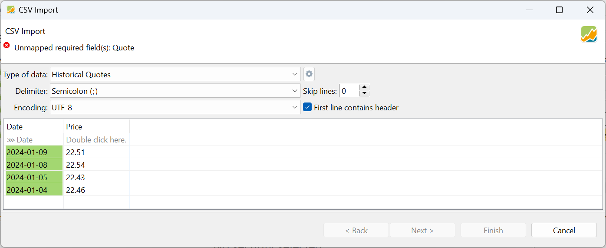
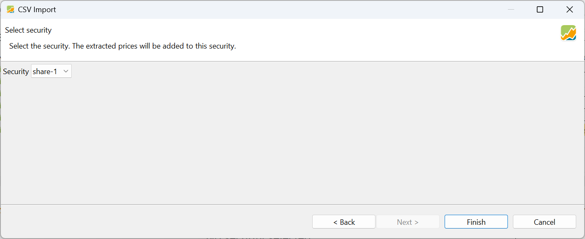
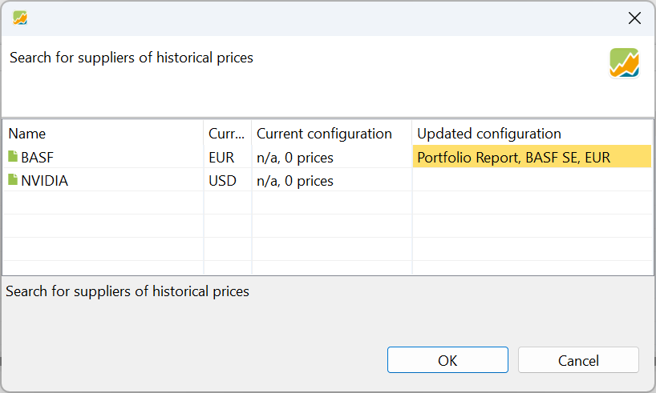
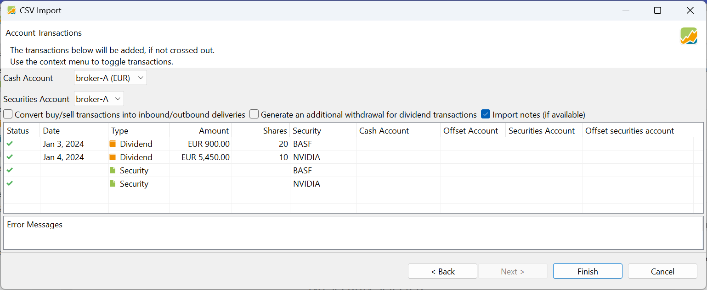
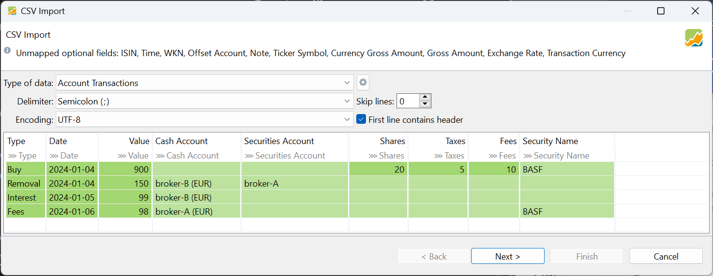
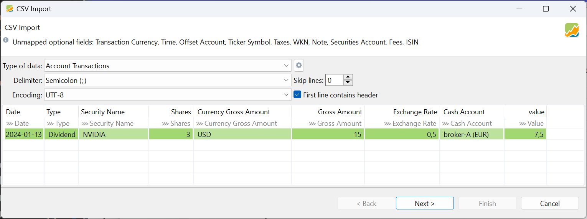
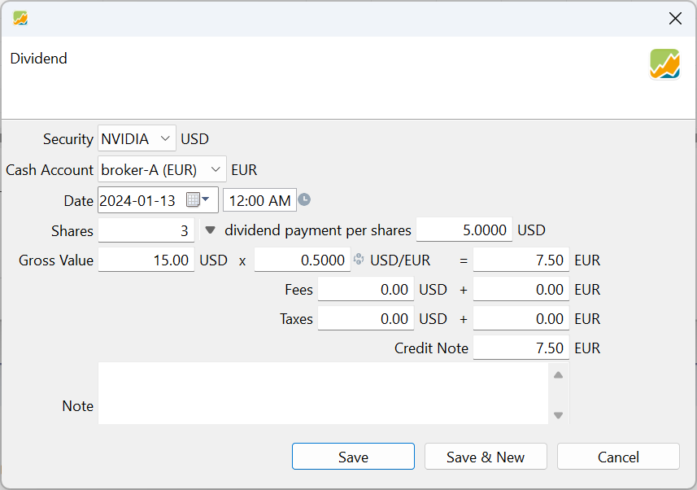
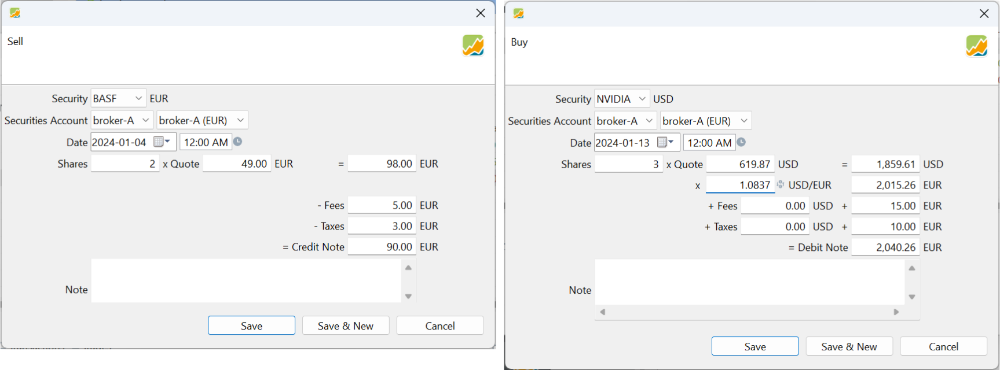
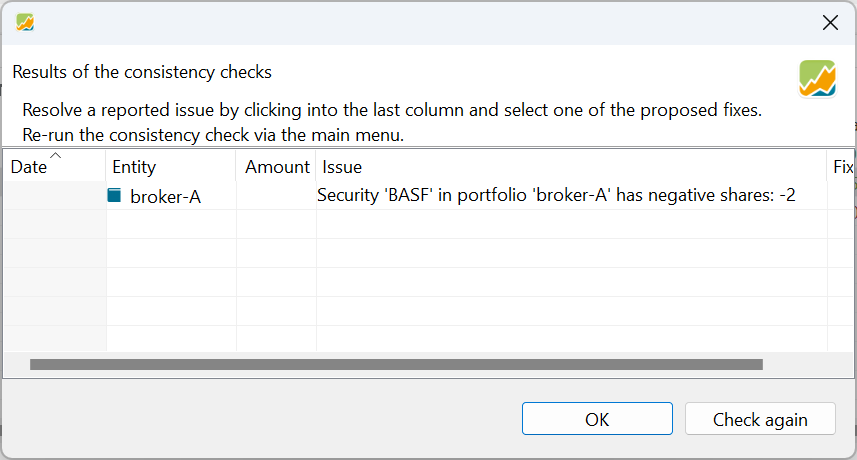

# Importing a CSV file

PP employs a wizard to lead you through the import process, consisting of three steps. At each step, you are required to furnish additional information.

**Step 1**. Start with the menu `File > Import > CSV files (comma-separated values)`, navigate to the correct folder and select the appropriate CSV file. Only files with the extension `CSV` are displayed.

A CSV file is simply a text file. The first line contains the names of the fields (columns); separated by a marker such as a comma. The second and following lines contain the data, also separated by a marker. The number and type of fields the file should contain, depend on the type of import. The names in the heading can be freely chosen, although they should match PP's internal usage, as it simplifies the mapping process (associating each column with its corresponding field in PP). The printout of a CSV file in Table 1 (see below) comprises two fields or columns and four lines of data that could be utilized for importing historical prices.

Figure: Import types. {class=align-right}


In **step 2** of the wizard, you need to select the appropriate import type or template by clicking on the drop down box (see Figure 3). PP distinguishes between 5 types of import: `Account Transactions`, `Portfolio Transactions`, `Securities`, `Historical Quotes`, and `Securities Account` (see Figure 1). These templates are discussed in detail below. You also need to decide about the following options.

- *Delimiter*: PP will probably choose the correct delimiter; in this case a semicolon. Other possibilities include comma and the tab symbol.
- *Encoding*: "strange" characters in the output table indicate a mismatch between the chosen encoding and the source file encoding. There are numerous possibilities, and the correct choice depends on the application used to create the file. A good choice is likely `UTF-8` or `Windows-1250`. 
- *First line contains header*: enable this option if the first line of your CSV contains field  labels.
- *Skip lines*: sometimes the CSV-file contains irrelevant information in the first few lines. You can skip them with this option.
- *Mapping fields*: PP needs to determine the corresponding columns for its internal fields. If PP recognizes a field, it will be indicated by a message `-> 'Field'` in the second row of the output; otherwise, a message `Double click here` will appear (see Figure 3). To associate a column with an internal PP field, double-click on the second line. You can then choose from the available fields. If you don't want to associate a field, select the `---` option. PP will then ignore this column. To change the format of a column, e.g. Date format of a date, double-click on the name in the second line.

Figure: Saving the mapping configuration.{class=align-right style="width:50%"}


- *Save Configuration* (Gear icon): To save the current mapping, click on the gear icon to the right of "Type of data." A list of `Built-in configurations` will be displayed, such as comDirect, Consorsbank, etc. (see Figure 3). Using the option `Save current configuration` will save your current mapping configuration as a custom template. This template will be available under `User-specific Configurations`, for example, `test (Account Transactions)` (see Figure 2). You can delete, export, and import configurations. The export function uses a JSON format.

**Step 3**: set additional info, depending on the import type such as accounts and check the preview of the import process.
Step 3 differs depending on the selected type of import. For the historical quotes import type, only the share name should be additional selected. For the other types, you need to set the security and cash account.

!!! Note
    The cash and security account could be set globally for all import rows of the CSV file through the top panel; see for example Figure 6.  You can also provide this information as part of the CSV file (include a column Cash account and Securities account). Or you can set the accounts through the context menu. Right-click on a row in the table preview and choose the appropriate account.

### 1. Historical Quotes import

To import historical quotes for a security, you only need two columns in the CSV file: one for the date and another for the corresponding quote. These are *required* fields.  No *optional* fields are allowed. The security's name must be provided in a separate step. You cannot proceed to the next step if any of the required fields are missing.

*Table 1: Source data for the import of Historical Quotes.*
```
Date; Price
2024-01-09;	22,51
2024-01-08;	22,54
2024-01-05;	22,43
2024-01-04;	22,46
```
Please note that the date in Table 1 is in the format `YYYY-MM-DD`. By double-clicking on the second row of the output panel; e.g. `-> 'Date'`, you can set the correct date format. January 7th and 6th are not included as these are weekend days (although they could be). In this case, the price information uses a comma as a decimal separator, which is standard in Europe. Therefore, a semicolon (;) is used to separate the fields. The file is saved in Excel with UTF-8 encoding. The heading labels are Date and Price.

Figure: Importing Historical Quotes (step 2).{class=pp-figure}



In Figure 3, the `Next` and `Finish` buttons are greyed out because not all necessary information is available. The message at the top, "Unmapped required field(s): Quote," provides a clue. For this type of import, two fields are required: `Date` and `Quote`. However, the CSV file uses the headings `Date` and `Price`. The field `Price` should be mapped to the internal `Quote` field. Double-click on the column and select the appropriate mapping field, e.g. `Quote`. The `Next` and `Finish` buttons will then become available.

In step 3 of the wizard, you can select the security that the prices will be added to. If the chosen security already has some historical prices, the quotes will be added (no duplicates).

Figure: Importing Historical Quotes (step 3).{class=pp-figure}



### 2. Securities import

Use this type to create new securities from a CSV file. There are no required fields. The optional fields include `Ticker Symbol`, `Security Name`, `WKN`, `ISIN`, `Currency`, `Date of Quote`, `Note`, and `Quote`. It is evident that at least one of the first four fields should be mapped. Refer to the [glossary](../../../concepts/PP-terminology.md) for the meaning of these terms. See Table 2 for an example of the CSV-file.

*Table 2: Source data for the import of Securities.*
```
Ticker Symbol; ISIN; Security Name ;Currency
BAS; DE000BASF111; BASF; EUR
NVDA; ; NVIDIA; USD
```
Two securities will be added to the portfolio; e.g. BASF and NVIDIA. The ISIN code for the second security (traded on NASDAQ) is unavailable. Note that the NVIDIA stock is traded in USD. Importing this CSV file will display the dialogs of Figure 5 and 6.

Figure: Importing securities (Step 2).{class=pp-figure}


In step 3 (below), you can observe that the status of both securities contains a green check mark, indicating that the import will be successful. If the securities already exist, nothing will appear. Click Finish.

Figure: Importing securities (Step 3).{class=pp-figure}


The securities are now created and appear in the `All Securities` list. Although the cash and security account options are provided in Figure 6, it does not make sense to add or change the cash or security account here. The securities are only created in the `All Securities` list, no transactions are yet in place. Please note that several other fields such as Calendar, Additional Attributes, and Taxonomies cannot be added through CSV-import. The Quote Feed for the Historical Prices could partially be added in the following step (see Figure 7).

Figure: Importing securities (Step 4).{class=align-right style = "width:30%"}



After the securities are created, an additional step allows you to search for a suitable quote feed. This can also be performed manually by right-clicking on a security and choosing `Quotes > Search for providers of historical prices...`

Only securities listed on XETRA (Deutsche Börse) and analyzed by the Portfolio Report are eligible for an automatic Quote Feed. The BASF security in Figure 7 meets these criteria and can therefore receive an automatic quote feed. However, the NVIDIA security is not listed on XETRA in USD, so automatic quotes should be obtained through another candidate provider e.g. Yahoo Finance.

### 3. Securities Account import

With this import type, you can create a new security (see above), while adding at the same time the first Buy transaction. The required fields are `Shares`, and `Value`. The optional fields are `Ticker`, `Symbol`, `ISIN`, `WKN`, `Time`, `Currency`, `Note`, `Date of Quote`, `Securities Account`, `Cash Account`, `Quote`, `Date of Value`, and `Security Name`. The following CSV file will be imported in Figure 8.
```
Ticker Symbol; ISIN; Security Name; Currency; shares; value
BAS; DE000BASF111; BASF; EUR; 20; 900
NVDA; ; NVIDIA; USD; 10; 5450
```
Two securities will be created and at the same time a Buy transaction will also be recorded (20 shares of BASF for a total value of 900 EUR and 10 shares of NVIDIA for a total value of 5450 USD). Four operations are performed.

Figure: Importing securities (Step 4).{class=pp-figure}




### 4. Account Transactions import

The Account Transactions import type will be used to register transactions on a deposit or cash account such as deposit, removal, interest, ... It is equivalent with manual recording a transaction with the menu Transaction (third group). The required fields are `Date`, and `Value`.

!!! Important
    The Account Transactions and Portfolio Transactions import types are quite similar. Internally, an account transaction is reserved to work with cash accounts and their transactions such as deposits. A portfolio transaction works with instruments and their transactions: buy, sell, delivery, ... A buy/sell transaction however has both components: something is added/removed from the securities account and some money is deducted/added to the cash account. In most cases, both types could be used interchangeably.

    :warning: 
    <span style="color:orange">Use Account Transactions type for deposit, removal, ... and Portfolio Transactions type for buy, sell, ...</span>

The required fields are `Date`, and `Value`. Optional fields are `Type`, `Transaction Currency`, `Security Name`, `Shares`, `Securities Account`, `Exchange Rate`, `Gross Amount`, `Currency Gross Amount`, `Ticker Symbol`, `Taxes`, `Note`, `Cash Account`, `Fees`, `ISIN`, `WKN`, `Offset Account`, and `Time`.

Acceptable values for the field `Type` are `Deposit`, `Removal`, `Buy`, `Sell`, `Dividend`, `Interest`, `Interest Charge`, `Fees`, `Fees Refund`, `Taxes`, `Tax Refund`, `Transfer (Inbound)`, `Transfer (Outbound)`, `Delivery (Inbound)`, and `Delivery (Outbound)`. The default value for `Type` is `Deposit`.

If the Cash and Securities account are not provided in the CSV file, the value from the top panel is used. It's important to note that Fees and Taxes can be included as part of the Buy or Sell transaction through a dedicated column in the CSV file. In this case, the taxes and fees are subtracted from the total value field (Value = Gross Amount + Taxes + Fees). Alternatively, a separate transaction with the type Fees or Taxes can be created, and the amount is then specified in the Value column. In this case, the fees and taxes are added to the value.

Figure: Importing account transactions - content CSV file{class=pp-figure}


Figure 9 displays the content of a sample CSV file. Four transactions are described. Note that the Cash account of the first transaction is not provided. The default account from the top panel is taken in that case.

Figure: Importing account transactions - step 2. {class=pp-figure}



Figure: Importing account transactions - step 3. {class=pp-figure}


#### Dividend transaction

It is noteworthy to address the dividend transaction separately, as it presents unique challenges, particularly when dealing with foreign dividends. For instance, complications may arise when dividends are paid in USD but deposited into a cash account denominated in EUR.

To illustrate, let us assume that a USD dividend of 5 USD is paid for three shares, with a hypothetical exchange rate of 0.5 EUR-for-1-USD. For this example, we will use the cash account `Broker-A (EUR)` denominated in EUR for the deposit.


| Date       | Type     | Security Name | Shares | Currency | Gross Amount | Exchange Rate | Cash Account | Value (EUR) |
| ---------- | -------- | ------------- | ------ | -------- | ------------ | ------------- | ------------ | ---------- |
| 2024-01-13 | Dividend | NVIDIA        | 3      | USD      | 15           | 0.5           | broker-A (EUR) | 7.5        |

In this example, the CSV file contains columns for the date, type of transaction (in this case, a dividend), the security name (NVIDIA), the number of shares, the currency in which the dividend was paid (USD), the gross amount of the dividend, the applicable exchange rate, the cash account into which the dividend was deposited `broker-A (EUR)`, and the converted value of the total dividend in EUR.

The raw CSV-file looks like:

```
Date;Type;Security Name;Shares; Currency Gross Amount; Gross Amount; Exchange Rate; Cash Account;  Value
2024-01-13; Dividend; NVIDIA; 3; USD; 15; 0,5; broker-A (EUR);  7,5
```

Figure 12 illustrates the initial step in the import wizard process. As the CSV file incorporates the accurately spelled field names, no mapping adjustments are required. It is crucial to take note of number formatting of the various fields, particularly the exchange rate field, which will likely always contain a decimal separator (comma or point). Also check the date format; `YYYY-MM-DD`, or `DD/MM/YY`, or ....

In this instance, we are receiving a dividend payment for three shares, with a `Gross Amount` of 15 USD. Consequently, the dividend value should be 5 USD per share (see Figure 13). Given the `Exchange Rate` of 0.5 EUR-for-1-USD, the net `Value` of the dividend, once deposited into the `broker-A (EUR)` account, should amount to 7.5 EUR.

Figure: Step 1 of the Import wizard: type dividends. {class=pp-figure}



The necessity of the `Gross Amount` field is not apparent, particularly as it is not utilized in the subsequent section. However, the Portfolio Performance (PP) software verifies the values within this field, ensuring that the following calculation holds true: `Gross Amount` multiplied by the `Exchange Rate` equals the `Value`. If the numbers do not correspond, an error message will be displayed, preventing progression to the next step.

Upon importing the CSV file detailed above and selecting the `Account Transactions` type, the dividend transaction will be generated as depicted in Figure 13.

!!! Important
    Regrettably, the software does not currently support the inclusion of Fees and Taxes, either in the foreign or domestic currency. 

Figure: Result of import from above. {class=pp-figure}




### 5. Portfolio Transactions import

!!! Important
    If you have transactions with securities in different currencies, it is good practice to explicitly add the `Security Account` and `Cash Account` to the CSV-file. As the `Date` is a required field, pay attention to the default date format (YYYY-MM-DD). 

This type of import requires three fields: Shares, Date, Value. The optional fields are the same as above; except that the optional Offset Account field is replaced with Offset Securities Account. The selection of required fields may seem somewhat arbitrary. For transactions like buy and sell, a security identification is essential (such as name, ISIN, etc.). However, for an interest payment, the 'Shares' field is not necessary.

Because the number of shares is a required field, one would assume that simple deposit of removal transactions are not allowed; but they are. The number of shares is then ignored.

The acceptable values for the field `Type` are: `Deposit`, `Removal`, `Interest`, `Interest Charge`, `Dividend`, `Fees`, `Fees Refund`, `Taxes`, `Tax Refund`, `Buy`, `Sell`, `Transfer (Inbound)`, and `Transfer (Outbound)`. The default value of Type is `Sell`.

Suppose that you wish to import two portfolio transactions: a sell of 2 shares of BASF in EUR and a buy of 3 shares NVIDIA in USD. Since we are using the EUR cash account in both cases, the transaction in USD must be converted into EUR. In this case, PP will handle this automatically because the NVIDIA security is listed in USD and the security account in EUR. Alternatively, you can designate the `Currency Gross Amount` column as `USD`. However, a more efficient workflow may involve defining the `Cash Account`, and eventually the `Securities Account`. This prevents the import from defaulting to standard accounts, such as `broker-A` and `broker-A (EUR)` in this case.

Figure 15 displays the `Mapped to Field` dialog box is shown (accessible via double-clicking the Value column). It's advisable to confirm that the selected format aligns with your language settings, especially if you use a comma as the decimal point as in this example.

The CSV file should look as follows.

```
Date;Type;Shares;Security Name;Value;Exchange rate;fees;taxes;Securities Account;Cash Account
2024-01-04; Sell; 2; BASF; 90; ;5; 3; broker-A; broker-A (EUR)
2024-01-13; Buy; 3; NVIDIA; 1740,98; 1,0837; 15; 10; broker-A; broker-A (EUR)
```
Because the `(Net) Value` field is required, it makes no sense to add the `Gross Value`, which will be overwritten anyway (Gross Value = Value + Fees + Taxes). Please note that the `Exchange Rate` field is empty (or zero) in case of the BASF transaction. Figure 14 displays the result of this import transaction.


Figure: Result of import from above. {class=pp-figure}



Figure 13 displays the first step of the Import wizard. Be sure that the type Portfolio Transactions is selected in step 1; otherwise an error will occur in step 2.  

Figure: Result of import from above. {class=pp-figure}


A consistency check is made, for example, to ensure that you don't sell more securities than are available in your portfolio (see Figure 16).

Figure: Consitency check. {class=pp-figure}




