# Importing a CSV file

PortfolioPerformance employs a wizard to guide you through the import process, consisting of three steps. At each step, you are required to provide additional information.

**Step 1**. To begin, navigate to the menu `File > Import > CSV files (comma-separated values)`. Browse to the appropriate folder and select the desired CSV file. By default, the file type filter displays only files with the `.csv` extension. To view all file types, select `All Files (*.*)` from the dropdown menu. Alternatively, you can use the shortcut `Cmd + I` (or `Ctrl + I` on Windows), followed by the letter `C`.

A CSV file is essentially a plain text file. The first line typically contains the names of the fields (columns), separated by a delimiter such as a comma. Subsequent lines contain the data, also separated by the same delimiter. The required fields and their format depend on the type of import being performed. While the column headings can be freely chosen, it is recommended to align them with PortfolioPerformance's field names to simplify the mapping process (i.e., associating each column with its corresponding field in PortfolioPerformance).

The example CSV file shown in Table 1 contains five fields (columns) and three rows of data, which can be used for importing securities into your portfolio.

*Table 1: Example source data for importing securities.*
```
Ticker Symbol; ISIN; Security Name; Currency; Info
BAS; DE000BASF111; BASF; EUR; XETRA
NVDA; ; NVIDIA; USD; NASDAQ
```

In this example, a semicolon (`;`) is used as the field delimiter. In Europe, numbers are typically written with a comma as the decimal separator; hence, a semicolon is used as the marker in this CSV file. Please note that the ISIN is not provided for the NVIDIA share. This file was created in Excel and saved with UTF-8 encoding. However, any spreadsheet or text editing program can be used to create such a file. It is worth noting that the `.csv` extension is not mandatory. PortfolioPerformance can also read plain text files, provided the file type filter is set to `All Files (*.*)` and the layout adheres to the structure shown in Table 1.

In **step 2** of the wizard, you need to provide additional information, so that the csv-file could be read correctly (see Figure 1). 

Figure: Providing additional information about the CSV-file.{class=pp-figure"}

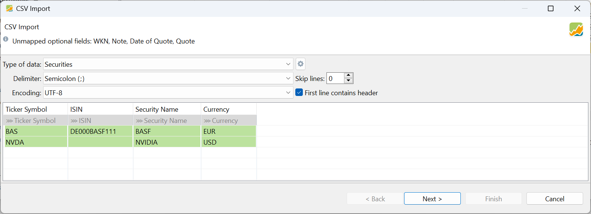

- *Message Bar*: Additional info is displayed in the message bar at the top. For instance, it may list optional fields that are not provided in the CSV file.

!!! Note
    Although the field `Currency' is provided in the CSV-file, it seems not to be recognized by PortfolioPerformance.

- *Type of data*: PortfolioPerformance distinguishes between 5 types of import: `Account Transactions`, `Portfolio Transactions`, `Securities`, `Historical Quotes`, and `Securities Account` (see Figure 1). These templates are discussed in detail below. Select the appropriate type by clicking the dropdown.

- *Delimiter*: PortfolioPerformance will probably choose the correct delimiter; a semicolon in case of Table 1. But, you can manually set for another delimiter, e.g. comma, semicolon or tab symbol.

- *Encoding*: Sometimes, "strange" characters can appear in the output table, indicating a mismatch between the chosen encoding and the source file encoding. There are numerous possibilities, and the correct choice depends on the application used to create the file. A good choice is likely `UTF-8` or `Windows-1250`. 

- *Skip lines*: Your CSV file may contain irrelevant information in the initial lines, such as additional titles or metadata. Use this option to specify the number of lines to skip at the beginning of the file.

- *First line contains header*: Enable this option if the first line of your CSV contains the field labels, as in table 1.

- *Preview table with Mapping fields*: PortfolioPerformance needs to determine the corresponding columns from the csv for its internal fields. If PortfolioPerformance recognizes a field, it will be indicated by a message `>>> 'Field'` in the second row of the preview table; otherwise, a message `Double click here` will appear (see Figure 1). To associate a column with an internal PortfolioPerformance field, double-click on the second line. You can then choose from the available fields. If you don't want to associate a field, select the `---` option. PortfolioPerformance will then ignore this column. To change the format of a column, e.g. Date format of a date, double-click on the name in the second line.

- *Save Configuration* (Gear icon): To save the current mapping, click on the gear icon to the right of "Type of data." A list of `Built-in configurations` will be displayed, such as comDirect, Consorsbank, etc. Using the option `Save current configuration` will save your current mapping configuration as a custom template. This template will be available under `User-specific Configurations`. You can delete, export, and import configurations. The export function uses a JSON format.

**Step 3** varies depending on the selected import type, and could involve multiple sub-steps. For example, when importing historical quotes, there is only one additional step (providing the security name to associate the historical prices). For all other import types, you must specify multiple additional details, such as the security account and the cash account.

### 1. Securities import

Use this type to create new securities from a CSV file. There are no required fields. The optional fields include `Ticker Symbol`, `Security Name`, `WKN`, `ISIN`, `Currency`, `Date of Quote`, `Note`, and `Quote`. It is evident that at least one of the first four fields should be mapped. Refer to the [glossary](../../../concepts/portfolio-performance-terminology.md) for the meaning of these terms. See Table 2 for an example of the CSV-file.

*Table 2: Source data for the import of Securities.*
```
Ticker Symbol; ISIN; Security Name ;Currency
BAS; DE000BASF111; BASF; EUR
NVDA; ; NVIDIA; USD
```
Two securities will be added to the portfolio; e.g. BASF and NVIDIA. The first three columns are correctly recognized. The fields `Currency`and `Info`are not recognized and should be matched by double clicking the second row and selecting the correct label (e.g. `Currency` (sic!) and `Note`). While the BASF security is traded on XETRA, the ticker symbol does not reflect that (BAS.DE). The ISIN code for the second security (NVIDIA traded on NASDAQ) is unavailable and skipped in the CSV-file. Note also that the NVIDIA stock is traded in USD. Importing this CSV file will display the dialogs of Figure 2 and 3.

Figure: Importing securities (Step 3-1).{class=pp-figure}


In **step 3-2** (below), you can observe that the status of both securities is marked with a green check mark, indicating that the import process is ready to proceed successfully. If a security already exist in the portfolio, the green check mark will not appear. In this step, you can also specify the Cash and Securities account, the security is associated with. Click **Finish** to finalise the import process.

!!! Note
    The cash account and security account could be set globally for all import rows of the CSV file through the top panel; see Figure 3. You can also provide this information as part of the CSV file (include a column Account and Securities account). Or you can set the accounts through the context menu. Right-click on a row in the table preview and choose the appropriate account.

Figure: Importing securities (Step 3-2).{class=pp-figure}

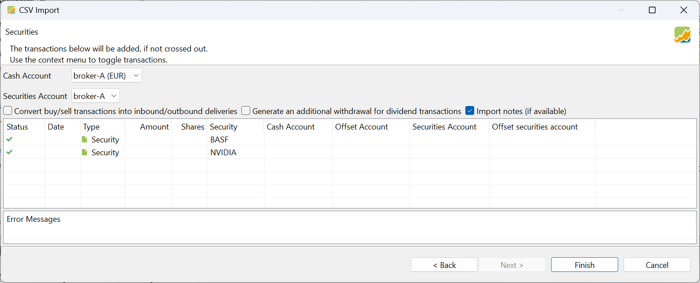

The securities are now created and appear in the `All Securities` list. Please note that several other fields such as Calendar, Additional Attributes, and Taxonomies cannot be added through CSV-import. The Quote Feed for the Historical Prices could partially be added in the following step (see Figure 4).

Figure: Importing securities (Step 3-3).{class=pp-figure}

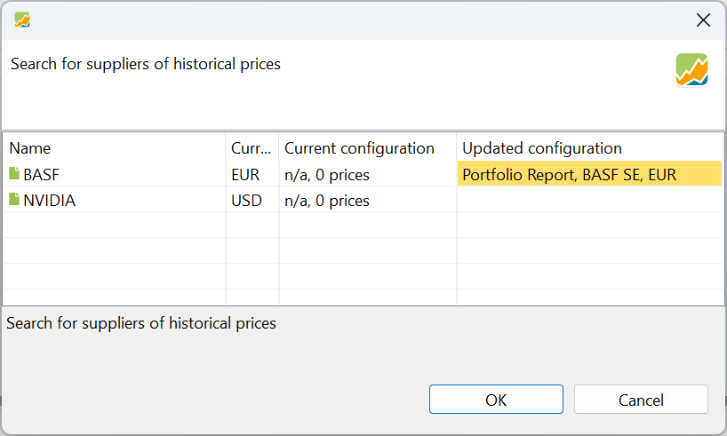

After the securities are created, an additional step allows you to search for a suitable quote feed. Both [Yahoo Finance](../../../how-to/downloading-historical-prices/yahoo-finance.md) and the [built-in PortfolioPerformance provider](../../../how-to/downloading-historical-prices/portfolioperformance.md) are searched. The updated and yellow coloured configuration is the one that will be applied, unless you click the button `Do not change configuration`. You must be logged in (see [built-in provider](../../../how-to/downloading-historical-prices/portfolioperformance.md)) to effectively read the historical quotes from the built-in provider. Clicking `Cancel`will skip this step, and `OK`will read the historical prices. Please note that. the ISIN of the NVIDIA share is filled in and that the ticker symbol is adjusted to the correct `BAS.DE`.

### 1. Historical Quotes import
The historical prices of most securities are covered by the built-in quote provider or other sources (see above). However, sometimes you may need to import historical prices via a hand-made CSV-file. For this, you only need two columns in the CSV file: one for the date and another for the corresponding quote. These are *required* fields.  No *optional* fields are provided. The security's name for those historical prices must be provided in a second step. You cannot proceed to the next step if any of the required fields are missing or misspelled.

Please note that the date in Figure 5 is in the format `YYYY-MM-DD`. By double-clicking on the second row of the output panel; e.g. `>>> 'Date'`, you can set the correct date format.  

Figure: Importing Historical Quotes (step 2).{class=pp-figure}

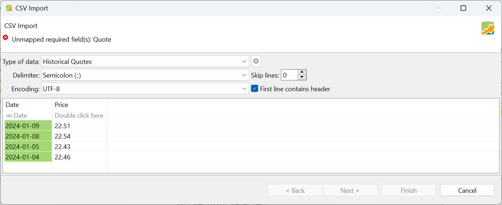

In Figure 5, the `Next` and `Finish` buttons are greyed out because not all necessary information is available. The message at the top, "Unmapped required field(s): Quote," provides a clue. For this type of import, two fields are required: `Date` and `Quote`. However, the CSV file uses the headings `Date` and `Price`. The field `Price` should be mapped to the internal `Quote` field. Double-click on the column and select the appropriate mapping field, e.g. `Quote`. The `Next` and `Finish` buttons will then become available.

In a further step of the wizard, you can select the security to which prices will be added. If the chosen security already has historical prices, new quotes will be appended, rather than overwriting existing data.


Figure: Importing Historical Quotes (step 3).{class=pp-figure}

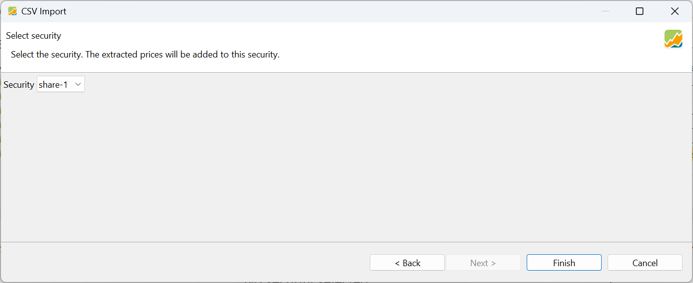


### 3. Securities Account import

With this import type, you can create a new security (see above), while adding at the same time the first Buy transaction. The required fields are `Shares`, and `Value`. The optional fields are `Ticker`, `Symbol`, `ISIN`, `WKN`, `Time`, `Currency`, `Note`, `Date of Quote`, `Securities Account`, `Account`, `Quote`, `Date of Value`, and `Security Name`. The following CSV file will be imported in Figure 7.

*Table 3: Source data for the import + buy of Securities.*
```
Date;Ticker Symbol;ISIN;Security Name;Currency;Shares;Value
2026-04-05;BAS;DE000BASF111 ;BASF;EUR;20;900
2026-04-06;NVDA;;NVIDIA;USD;5;750
```
Two securities will be created and at the same time a Buy transaction will also be recorded (20 shares of BASF for a total value of 900 EUR and 5 shares of NVIDIA for a total value of 750 USD). It is not possible to include Fees or Taxes. For that, you need the Account Transaction or Portfolio Transaction Import types.

Figure: Importing securities account.{class=pp-figure}

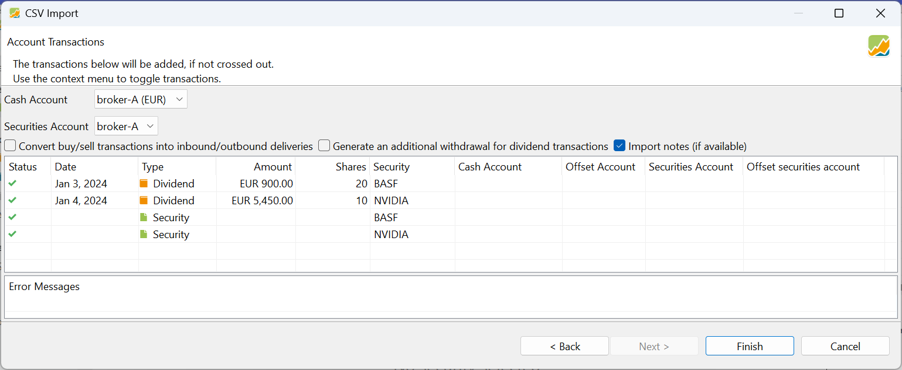

Please note that, because the `Currency` of the security is set to `EUR`or `USD`, the correct deposit account could be selected automatically.

### 4. Account Transactions import

The Account Transactions import type will be used to register transactions on a deposit or cash account such as deposit, withdrawal, interest, ... It is equivalent with manual recording a transaction with the menu Transaction (third group). The required fields are `Date`, and `Value`.

!!! Important
    The Account Transactions and Portfolio Transactions import types are quite similar. Internally, an account transaction is reserved to work with cash accounts and their transactions such as deposits. A portfolio transaction works with instruments and their transactions: buy, sell, delivery, ... A buy/sell transaction however has both components: something is added/removed from the securities account and some money is deducted/added to the cash account. In this case, both import types could be used.

    :warning:
    <span style="color:orange">Good practice!!! <br/></br>Use Account Transactions type for deposit, withdrawal, ... and Portfolio Transactions type for buy, sell, ...</span>

The required fields for the `Account Transactions` type are `Date`, and `Value`. Optional fields are `Type`, `Transaction Currency`, `Security Name`, `Shares`, `Securities Account`, `Exchange Rate`, `Gross Amount`, `Currency Gross Amount`, `Ticker Symbol`, `Taxes`, `Note`, `Account`, `Fees`, `ISIN`, `WKN`, `Offset Account`, and `Time`.

Acceptable values for the field `Type` are `Deposit`, `Withdrawal (or removal)`, `Dividend`, `Interest`, `Interest Charge`, `Fees`, `Fees Refund`, `Taxes`, `Tax Refund`, `Transfer (Inbound)`, `Transfer (Outbound)`. `Buy` and `Sell` are also possible, but as mentioned before, it is good practice to use the Portfolio Transactions type for this. The default value for `Type` is `Deposit`.

Table 4 represents the CSV-file to import four transactions

- A withdrawal of 150 EUR from deposit account `broker-B (EUR)` on 2026-03-04
- A deposit of 150 EUR to deposit account `broker-A (EUR)` on 2026-03-04
- A transfer of 100 EUR from deposit account `broker-A (EUR)` to deposit account `broker-A (USD)`. Because the target account is set in USD (= Currency Gross Amount), the CSV-file also specifies the `Gross Amount` (= 110 USD). This comes down to an `Exchange Rate` of 0,9091 USD/EUR. Currently, it is not possible to specify the Exchange Rate and let PortfolioPerformance calculate the `Gross Amount`. 
- A fee of 2 EUR, payable by `broker-A (EUR)`account for the currency exchange.

*Table 4: Source data for the import of transactions (deposit, withdrawal, transfer, & fees.*
````
Type; Date; Value; Cash Account; Offset Account; Gross Amount; Currency Gross Amount
Withdrawal;2026-03-04;150;broker-B (EUR); ; ; 
Deposit;2026-03-04;150;broker-A (EUR); ; ;
Transfer (Outbound);2026-03-04;100;broker-A (EUR);broker-A (USD);110;USD
Fees;2026-04-06;2;broker-A (EUR); ; ;
````

Figure 9 displays the result of this import. Please note that the fields `Gross Amount`and `Currency Gross Amount` are not displayed in this preview but they certainly are registered.

Figure: Importing account transactions - step 2. {class=pp-figure}

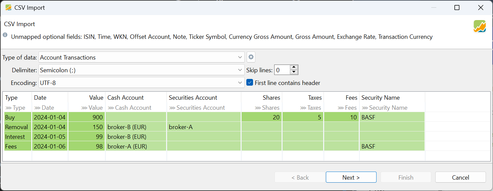


#### Dividend transaction

It is noteworthy to address the dividend transaction separately, as it presents unique challenges, particularly when dealing with foreign dividends. For instance, complications may arise when dividends are paid in one currency but deposited into a cash account denominated in another currency.

To illustrate, let us assume that a USD dividend of 5 USD is paid for three shares, resulting in a Gross Amount of 15 USD. This dividend is converted to EUR and deposited in the `broker-A (EUR) deposit account for a value of 14 EUR (implicitly as a result of an exchange rate of 0,9333 EUR/USD).

The raw CSV-file looks like:
```
Date; Type; Security Name; Shares; Value; Cash Account; Gross Amount; Currency Gross Amount;
2024-01-13; Dividend; NVIDIA; 3; 14; broker-A (EUR); 15; USD;
```
The CSV file contains columns for the date, type of transaction (in this case, a dividend), the security name (NVIDIA), and the number of shares. Because we are depositing the dividend in EUR, the Cash Account is `broker-A (EUR)` and the Value = 14 (EUR). This comes from a Gross Amount of 15 USD. Because the transaction is a dividend, the cash is generated by the security; which must exist (!) in the portfolio and have a currency equal to the `Currency Gross Amount`.

Figure: Result of import of a dividend. {class=pp-figure}

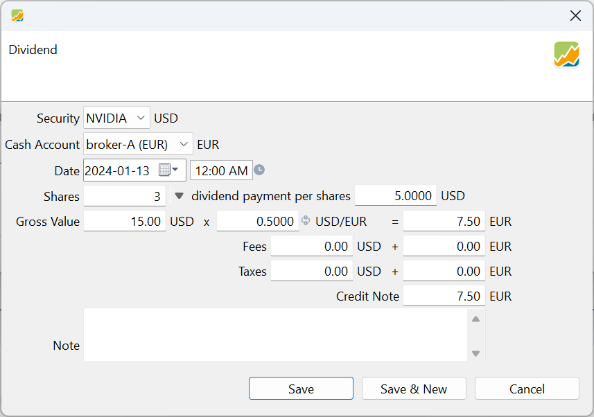

!!! Important
    Regrettably, the software does not currently support the inclusion of Fees and Taxes, either in the foreign or domestic currency. 

### 5. Portfolio Transactions import

It's important to note that Fees and Taxes can be included as part of the `Buy` or `Sell` transaction through a dedicated column in the CSV file. In this case, the taxes and fees are subtracted from the total value field (Value = Gross Amount + Taxes + Fees). Alternatively, a separate transaction with the type Fees or Taxes can be created, and the amount is then specified in the Value column. In this case, the fees and taxes are added to the value.

!!! Important
    If you have transactions with securities in different currencies, it is good practice to explicitly add the `Security Account` and `Cash Account` to the CSV-file. As the `Date` is a required field, pay attention to the default date format (YYYY-MM-DD). 

This type of import requires three fields: Shares, Date, Value. The optional fields are the same as above; except that the optional Offset Account field is replaced with Offset Securities Account. The selection of required fields may seem somewhat arbitrary. For transactions like buy and sell, a security identification is essential (such as name, ISIN, etc.). However, for an interest payment, the 'Shares' field is not necessary.

Because the number of shares is a required field, one would assume that simple deposit or withdrawal transactions are not allowed; but they are. The number of shares is then ignored.

The acceptable values for the field `Type` are: `Deposit`, `Withdrawal`, `Interest`, `Interest Charge`, `Dividend`, `Fees`, `Fees Refund`, `Taxes`, `Tax Refund`, `Buy`, `Sell`, `Transfer (Inbound)`, and `Transfer (Outbound)`. The default value of Type is `Sell`.

Suppose that you wish to import two portfolio transactions: a sell of 2 shares of BASF in EUR and a buy of 3 shares NVIDIA in USD. Since we are using the EUR cash account in both cases, the transaction in USD must be converted into EUR. In this case, PortfolioPerformance will handle this automatically because the NVIDIA security is listed in USD and the security account in EUR. Alternatively, you can designate the `Currency Gross Amount` column as `USD`. However, a more efficient workflow may involve defining the `Cash Account`, and possibly also the `Securities Account`. This prevents the import from defaulting to standard accounts, such as `broker-A` and `broker-A (EUR)` in this case.

Figure 15 displays the `Mapped to Field` dialog box is shown (accessible via double-clicking the Value column). It's advisable to confirm that the selected format aligns with your language settings, especially if you use a comma as the decimal point as in this example.

The CSV file should look as follows.

```
Date;Type;Shares;Security Name;Value;Exchange rate;fees;taxes;Securities Account;Cash Account
2024-01-04; Sell; 2; BASF; 90; ;5; 3; broker-A; broker-A (EUR)
2024-01-13; Buy; 3; NVIDIA; 1740,98; 1,0837; 15; 10; broker-A; broker-A (EUR)
```
Because the `(Net) Value` field is required, it makes no sense to add the `Gross Value`, which will be overwritten anyway (Gross Value = Value + Fees + Taxes). Therefore, we use the `Exchange Rate` field in this case. Please note that this field is empty (or zero) in case of the BASF transaction. Figure 14 displays the result of this import transaction.


Figure: Result of import from above. {class=pp-figure}

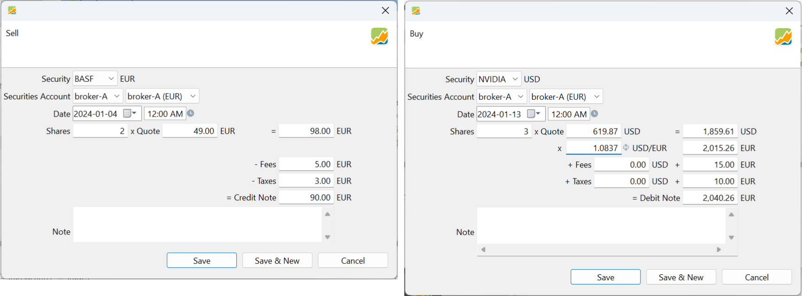

Figure 13 displays the first step of the Import wizard. Be sure that the type Portfolio Transactions is selected in step 1; otherwise an error will occur in step 2.  

Figure: Result of import from above. {class=pp-figure}

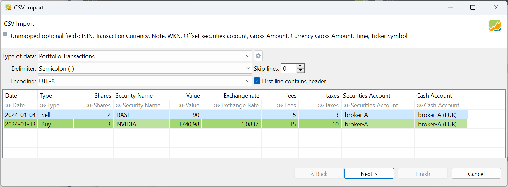

A consistency check is made, for example, to ensure that you don't sell more securities than are available in your portfolio (see Figure 16).

Figure: Consistency check. {class=pp-figure}

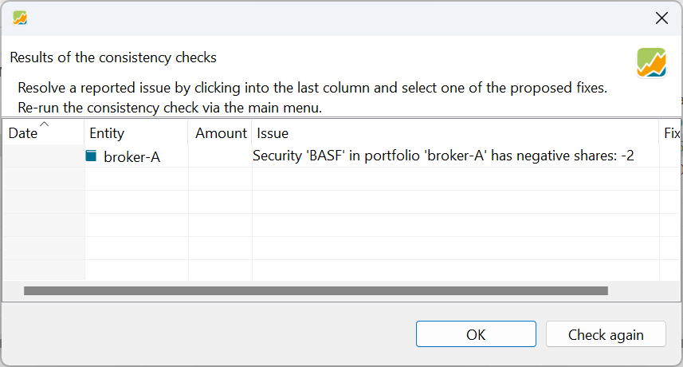
