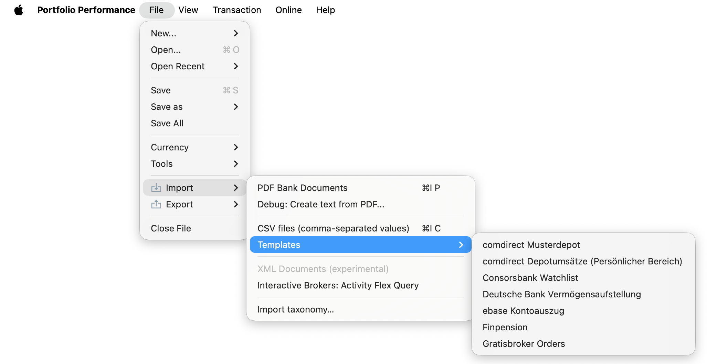

# Importing documents

In Portfolio Performance you can enter your data (buy, sell, dividends, historical quotes, … ) manually but you can also *import* this info from a CSV file (comma-separated values) or from a PDF document. Figure 1 displays the expanded `File > Import` menu.

There are two primary data sources: [PDF documents](pdf-import.md) and [CSV files](csv-import.md) (comma-separated values). Some brokers or banks may present this information in a proprietary format. Templates for major banks or brokers are available.

Figure: Menu File > Import.{class=pp-figure}

Bulk import (and export) of classifications ([taxonomies](../../view/taxonomies/index.md)) is supported using a JSON-file, which provides a structured definition of how your financial instruments are grouped and categorised.
