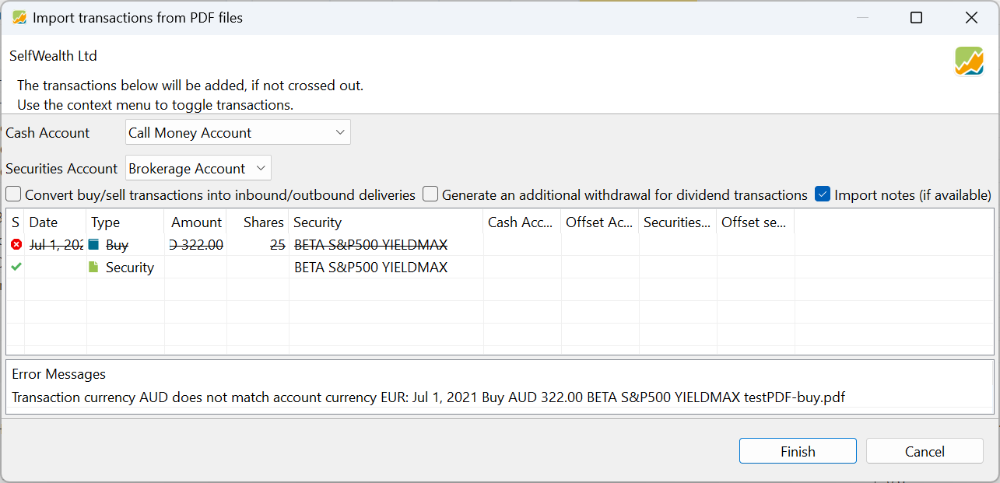

Banks and brokers often provide transaction statements (buy, sell, dividend, etc.) for your convenience on paper or in PDF format. Portfolio Performance can read PDF documents from more than 90 banks and brokers and import the described transactions. The PDF in Figure 1 describes a (fictitious) buy transaction from an Australian broker. If you want to follow along with the example, you can [download](../../../assets/SelfwealthBuy01.pdf) the PDF document.

Figure: Buy statement from SelfWealth of 25 pcs of Beta SP500 YieldMax. {class=pp-figure}

## Checking the Existence of the Importer

Portfolio Performance must "know" some details about the PDF document from your bank or broker. For example, the type of transaction in Figure 1 is identified by the title "Buy Confirmation," and the ticker symbol (UMAX) is indicated under the column header "Security Code." Portfolio Performance must recognise these details for each transaction to extract the necessary content from the PDF. Therefore, for each supported bank or broker, Portfolio Performance has developed a specific importer (parser) with knowledge of the different [transaction types](../../transaction/index.md). To develop these importers, Portfolio Performance relies on information provided by its users (see [Requesting a New Importer](pdf-import.md#requesting-a-new-importer)).

To verify if your bank or broker is supported, try to import a PDF document (see next section). The import wizard will either recognise it automatically or display an error message listing all the banks/brokers it has tried. You can also search the [forum](https://forum.portfolio-performance.info/c/english/) using the term `PDF import` or `PDF import [name-of-your-bank-or-broker]` to see if an importer for your institution is available or if there are any issues with it. If the importer exists, you can move on to the next section. Otherwise, you need to first request a new importer (see [Requesting a New Importer](pdf-import.md#requesting-a-new-importer)).

## Importing a PDF

Use the menu `File > Import > Import PDF Bank Documents` or the shortcut key `CTRL+I, P`, and navigate to the PDF document on your local system. You can select *more than one* PDF document. If a document is recognised by Portfolio Performance (i.e., an importer exists for the bank or broker of this document), an `Import Transaction` dialog box, such as in Figure 2, is displayed.

In this particular case, there is a small problem and the import operation could not be fully executed. The error message at the bottom provides an indication: the cash account `Call Money Account` from the demo Kommer portfolio is used for the cash handling of the transaction, but this deposit account is in EUR while the transaction currency is AUD. Selecting (or creating) an AUD deposit account will fix the problem. Please note that in Figure 2, two operations are scheduled: (1) the buy transaction, and (2) the creation of the security `Beta S&P500 Yieldmax`. If this security already exists in the portfolio, then the import wizard will use the existing security.

Figure: Imported transaction from PDF of Figure 1. {class=pp-figure}

Figure: Search for suppliers of historical prices (example available at Portfolio Report). {class=align-right style="width:60%"}

In case of a new security, a `Search for suppliers of historical prices` box is displayed. If the security is listed on [Portfolio Performance (built-in)](../../../how-to/downloading-historical-prices/portfolioperformance.md), then the historical prices could be automatically added. Otherwise, the security is created, but you will need to manually edit the data source to [download the historical prices](../../../how-to/downloading-historical-prices/index.md).

 

## Requesting a New Importer

If Portfolio Performance doesn't have a PDF importer for your bank/broker or for the specific type of transaction you need, you can request the development of this importer. More info can be found at [How-to > Requesting a new PDF Importer](../../../how-to/requesting-new-importer.md).