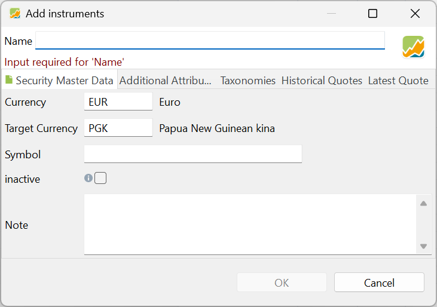

# File &#10095; New

With the `File > New` menu you can create the different assets PP can manage.

Figure: File > New submenu.{class=pp-figure}

## Portfolio (File)

The option `File > New > File` initiates a wizard for creating a new portfolio. Within the wizard, you need to set the base currency of the portfolio, create a security and deposit account (mandatory), add additional deposit accounts, and include securities and taxonomies (optional). A detailed explanation of the wizard can be found in [Getting Started > Creating a Portfolio File](../../getting-started/create-portfolio.md).

## Security

The menu option `File > New > Security` is self-explaining: it allows you to create a new security. This can also be done at other locations within the UI; for example as part of the portfolio creation wizard (see above), or with the little green icon next to Securities in the sidebar or in the `All Securities`view.

Figure: File > New > Security menu.{class=pp-figure}

You can either choose to create a new empty instrument (e.g. security) or to search for an existing one.  You can type (part of) the security name in the search box. Choosing from the drop-down box `All`, you can search for shares or bonds or both. After clicking the Search button, the list below will be populated with possible target instruments. The following fields are displayed for each instrument and will be used upon selecting the security: `Name`, `Symbol`, `ISIN`, `WKN`, `Type`, `Exchange`, `Currency`, and `Source` (see [Basic concepts > PP-terminology](../../concepts/PP-terminology.md) for a definition of each term).

 Once the correct security has been selected, proceed to the next step by clicking on the Apply button. Some information such as name, symbol and historical quotes will already be filled in, based on the selected data source. You should always check the info, especially the stock market. All the info can be changed; even the name. Alternatively, one may initiate the process with an empty security (see Figure 3) and manually input the required information.

 Figure: Input panel for the creation of a security.{class=pp-figure}

 

 While only the `name` is obligatory, there are several other fields that need attention. They are grouped into 5 sub panels, marked with a yellow line in Figure 3.
 
 - ### **Security Master Data**
    
This panel is entirely visible in Figure 3. The `currency` field must correspond to the currency in which the security is traded. Once transactions are recorded with this security, the currency cannot be changed. Clicking the currency box will reveal a drop-down with all available currencies.

The fields `ISIN`, `Symbol`, and `WKN` have been explained earlier. The symbol field is particularly crucial as it is utilized in the Quote Feed for Historical Quotes (further details below).

The `Calendar` dropdown enables you to choose a specific stock market calendar, such as Euronext, London Stock Exchange, New York Stock Exchange, etc. These calendars contain information about trading days, (bank) holidays, affecting some calculations, the display of price gaps, and the execution of savings plans. A more detailed description is available in the `Help > Preferences > Calendar` menu.

A security can be set to active or `inactive`. If set to inactive, the security will not appear in buy or sell dialogs, and historical prices will not be updated automatically.

At the bottom of Figure 3, you can add a personal `note` for this security.

- ### **Additional Attributes**

    Besides the attributes from the Security Master Data, you can use other attributes; for example a logo. These additional attributes can be added to tables such as `Reports > Performance > Securities`. The values of these attributes must be entered manually and cannot be used in calculations.

    Additional attributes are defined in `(left) Sidebar > General Data > Settings > Attributes : Securities` (at the bottom). [More info here.](../view/general-data/settings.md#attributes-securities)

- ### **Taxonomies**

    A taxonomy serves as a classification system for your securities. Taxonomies typically group securities based on shared characteristics such as industry, sector, geographical region, market capitalization, or asset class. For instance, the existing `Asset Classes` taxonomy allows you to classify your securities into categories such as *Cash*, *Equity*, *Debt*, *Real Estate*, or *Commodity*.

    When you first open the Taxonomies panel (shown in Figure 4) in a new portfolio, it will be empty. To start using taxonomies, you'll need to create one or more for your portfolio. In Figure 4, four taxonomies are visible: Asset Classes, Asset Allocation, Industries (GICS, Sectors), and Regions. These taxonomies also appear under the View menu.

    Figure: Taxonomies panel. {class=pp-figure}

    
    
    To assign a security to a taxonomy category, click the `New Category` button below the taxonomy. A drop-down menu will appear, listing all possible categories along with a weight input box. You can assign a security to multiple taxonomies. It's also possible to assign multiple categories of one taxonomy, as long as the combined weight doesn't exceed 100%. If the weight is not displayed next to the category (see Figure 4), then it is set to 100%. Click the minus button (-) next to the category to remove it from the taxonomy assignment. The above actions can also be done (more easily) in the Taxonomies View.

    For detailed instructions on how to create, manage, and use taxonomies, see section [Reference > View > Taxonomies](../view/taxonomies/index.md) in the manual.

- ### **Historical Quotes**

    For evaluating your portfolio, you need the current & historical prices of the security. In this panel (see Figure 4) you can set the data source of the `Quote Feed`. As `Provider`, you can choose between several alternatives: Yahoo Finance, Alpha Vantage, Quandl, ... (see Figure 5). You can even refer to a webpage (e.g. from an investor site) that contains these historical data; an example is given in [Import fund data from Morningstar](../../how-to/downloading-historical-prices/morningstar.md). Or you can create them yourself and import the quotes from a csv-file. 
    
    Figure: Historical quotes panel.{class=pp-figure}

    
    
    Depending upon the chosen provider, you may need to input additional information. If the provider is a website, you need to specify a URL. If the provider covers more than one `Exchange`, you need to select the correct one.

    Figure: Historical quotes panel.{class=pp-figure}

    

    Downloading historical prices for large-cap (big companies) stocks is relatively straightforward. However, obtaining data for less common stocks, mutual funds, bonds, bitcoin, etc., can sometimes be more challenging. We explore these topics in depth in [Downloading Historical Prices](../../how-to/downloading-historical-prices/index.md) in the how-to section.   

    !!! Note
        An alternative, but convenient method for securities listed on XETRA is to utilize the Portfolio Report website. See [how-to > Using Portfolio Report](../../how-to/downloading-historical-prices/portfolioreport.md) for more info.

- ### **Latest Quote**

    The Latest Quote panel is very similar to the Historical Quotes panel. Here, you can configure values for **real-time values** such as Latest Price, Latest Trade, Day's High, Day's Low, and Volume. 
 
## Cryptocurrency

Figure: Create new crypotocurrency.{class=align-right style="width:30%"}

 A cryptocurrency is a digital asset based on a blockchain system. There are thousands of different cryptocurrencies on the market, the best known of which is Bitcoin. Unlike traditional assets, there is no tangible or intangible value backing a cryptocurrency. Instead, its value is determined solely by market demand and what investors are willing to pay for it.

In PP, cryptocurrencies are treated like any other security, such as stocks. You can buy and sell cryptocurrencies, but you cannot have a deposit account denominated in a cryptocurrency.

The popular [CoinGecko website](https://www.coingecko.com/) is the source of the cryptocurrencies, listed in Figure 7. You can use the Search box to look-up a specific cryptocurrency in this very long list. If the crypto you need is not listed, you should create a new [empty security](#security); remember cryptos are no different from securities in PP. However, you will need to find a way to retrieve historical price data for this new crypto security.

## Exchange Rate

Figure: Create new exchange rate. {class=align-right style="width:30%"}

PP uses exchange rates from the [European Central Bank](https://www.ecb.europa.eu/stats/policy_and_exchange_rates/euro_reference_exchange_rates/html/index.en.html). You can find the list of about 40 available exchange rates under the [View > Currencies menu](../view/general-data/currencies.md). In some rare cases, you may require an exchange rate that is not included in the available list.

To create a custom exchange rate, use the `File > New > Exchange rate` menu. You will need to provide a quote provider, such as a JSON source or webpage, for the currency you want to add. Once you've created the custom exchange rate, it will be added to the currencies list with the name `Security based exchange rate provider` in the `Provider` column.

## Consumer Price Index

Figure: Create new consumer price index.{class=align-right style="width:30%"}

The Harmonised Indices of Consumer Prices (HICP) are retrieved from the [Eurostat website](https://ec.europa.eu/eurostat/databrowser/view/teicp000/default/table?lang=en) and represent the monthly inflation rate of consumer goods and services purchased by households in the euro area. The HICP is "harmonised" because all countries in the European Union use the same methodology to calculate it. The baseline of 100 is set for the year 2015.

After selecting the country, a security named [name of country] (HICP) is created with a [First of month](../help/preferences.md#calendar) calendar and the `Eurostat - Harmonised Indices of Consumer Prices (HICP)` as the Quote Feed provider. 

Being an index, however, these data series aren't normally used as a regular security (buy or sell). They can serve as a [benchmark](../../how-to/benchmarking.md) for your other investments. 

## Taxonomy

To create a new taxonomy, select `File > New > Taxonomy` from the menu. This will open the `New Taxonomy` input box, where you can name the taxonomy and choose whether to create a new empty structure or use a predefined template, such as Asset Classes or Industries (GICS). For more information on creating and managing taxonomies, see the section on [Taxonomies](../view/taxonomies/index.md) in the Reference manual.

## Watchlist

Figure: Two watchlists.{class=align-right style="width:50%"}

A watchlist is a manual grouping of securities. To create a new list, navigate to `File > New > Watchlist` in the menu. Once created, it will appear under the `All Securities` heading. For example, Figure 10 shows two watchlists named `Indices` and `Asia`, with the first containing four securities indices such as the DAX and Dow Jones. You can create an unlimited number of watchlists in PP.

Using the context menu of a watchlist (right-click on a list), you can rename, delete, or move the watchlist within the sidebar. Deleting a watchlist does not actually delete the securities in it; only the list is removed from the sidebar.

Adding securities to a watchlist is a manual process; simply drag one or more securities from the `All Securities` view and drop them onto the watchlist.  To remove a security from the watchlist, right-click the security and choose 'Remove from *Your_Watchlist*'. This action does not delete the security; it only removes it from the watchlist. The security will remain available in the `All Securities` view. For the other menu options, see [Context Menu](../view/securities/context-menu.md).

Watchlists inherit the view settings from `All Securities`, sharing the same columns and their configurations, such as width, column names, and sorting order. Changes made to the view in one watchlist will apply to all other watchlists, including `All Securities`. However, filtering settings such as `Shares held = 0` are remembered individually for each watchlist.