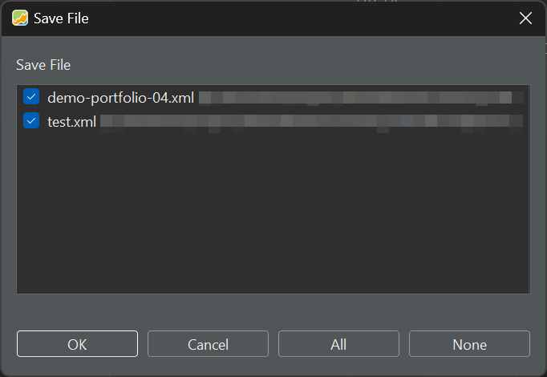
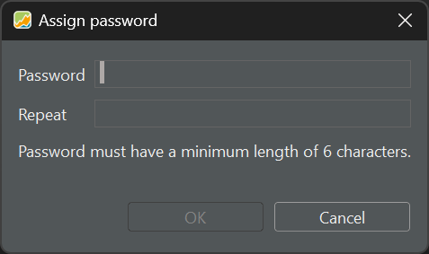

# File &#10095; Save - Save As - Save All

With the menu `File > Save`, you can save your portfolio in an XML-file (eXtensible Markup Language) format using the existing name. It's equivalent to choosing `File > Save As`, with the latter having the added flexibility to change the name and file type. Six file formats are available. `File > Save All` will of course save all open projects.

Figure: Dialog after closing app with two updated portfolios.{class=pp-figure}



Closing a portfolio that has been modified since opening will trigger a dialog `'xxx.xml is modified. Do you want to save the changes?`. Closing the application with multiple updated project will prompt the dialog from Figure 1.

## XML format

All data of your portfolio is stored in one XML-file (eXtensible Markup Language). This is a human-readable file format. For example, the following xml-file [test.xml](../../assets/test.xml) is a very simple portfolio with one security (`share-1`) and two transactions (one deposit and one buy). You can view the xml-content by opening this file with a text editor (e.g. Notepad++). Here's a brief description of the main elements:

- `<securities>`: Contains information about securities, including details such as UUID, name, currency code, ticker symbol, feed, historical prices, and attributes.
    `<prices>`: Contains historical price information for a security.
    `<latest>`: Provides the latest details for a security, including high, low, and volume.

- `<accounts>`: Contains details about client accounts, including UUID, name, currency code, and transactions.

- `<transactions>`: Represents financial transactions within an account, including details such as UUID, date, currency code, amount, and type.

- `<portfolios>`: Contains references to portfolios associated with accounts.

- `<dashboards>`: Contains information about client dashboards, including name, configuration, columns, and widgets.

- `<properties>`: Holds client-specific properties, such as security chart details.
- `<settings>`: Contains various settings, including bookmarks and attribute types.
- `<configurationSets>`: Stores configuration sets with specific data.

Below you can see the xml code for the buying transaction in Figure 2.

Figure: Example of a buying transaction.{class=pp-figure}


This single buying transaction is represented with the following XML code.

``` xml
<transactions>
   <portfolio-transaction>
      <uuid>72bf2b32-60a5-4c99-ba6d-d3ab695624e5</uuid>
      <date>2023-09-10T00:00</date>
      <currencyCode>USD</currencyCode>
      <amount>174635</amount>
      <security reference="../../../../../../../../../securities/security"/>
      <crossEntry class="buysell" reference="../../../.."/>
      <shares>500000000</shares>
      <note>First buy on advice of ...</note>
      <units>
         <unit type="FEE">
            <amount currency="USD" amount="3000"/>
          </unit>
         <unit type="TAX">
            <amount currency="USD" amount="4500"/>
         </unit>
      </units>
      <updatedAt>2023-09-10T18:43:28.135529700Z</updatedAt>
         <type>BUY</type>
   </portfolio-transaction>
</transactions>

```
As you can see, there is nearly a one-to-one relationship between the input form of the buy transaction and the XML. Please note that -internally- PP works with nano units (10^9) for the number of shares and hecto units (10^2) for the price.

## XML compressed format

With this option the XML file is compressed and stored as a ZIP file.The compression ratio is quite high (around 1:10). Subsequently, you can directly open the ZIP file in PP without the need to extract the XML from the ZIP archive beforehand.

## XML AES-128/256 Encrypted

Saving the project in the AES-128 format (Advanced Encryption Standard) will use a key of 128 bits (= 16 bytes or characters) to encrypt your data. In order to generate this key, PP needs a password that is at least 6 characters. However, a password that is longer and more complex will have more entropy, which means it is harder to guess. A password with at least 128 bits of entropy will produce a key that is as secure as AES-128 encryption. However, most passwords do not have that much entropy, because they are based on words, names, dates, or personal information that can be easily guessed or found out. Therefore, you should use a password that is as long and as random as possible, and avoid using common or simple passwords.

Since AES-256 uses a key of 256 bits, it's more secure.

Figure: Saving a portfolio with AES-128 encryption needs a password.{class=pp-figure}



Distinguishing an encrypted file from a regular one is possible by examining the file extension. Encrypted files have the extension .portfolio, while other formats are represented by XML or ZIP extensions.

## Binary & Binary password protected

An XML file is a human-readable file format (see above for an example). A binary format is more compact and efficient. More info is available in [Issue #2363](https://github.com/portfolio-performance/portfolio/issues/2363); watch for example the comparison in opening speed of a 720 securities & 1.3 MB historical prices project.