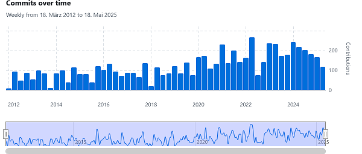

# Help > About Portfolio Performance

Detailed information about the **Portfolio Performance** program is available under the menu:  
`Help > About Portfolio Performance`.

---

## About Panel Overview

Figure: About Portfolio Performance Panel {class="pp-figure"}

---

### Top Section

- **Version:** 0.76.2 (May 2025)
- **Platform:** Windows (win32, x86*64), Linux, or macOS  
  See [Installation](../../getting-started/installation.md) for details.
- **Java Version:** Version of the Java Runtime Environment (JRE) or Java Development Kit (JDK) used  
  Portfolio Performance is developed in **Java**. It is recommended to use the latest **Long-Term Support (LTS)** OpenJDK version, available from [Azul Zulu](https://www.azul.com/downloads/?package=jdk#zulu).
- The project was started in 2012 by **Andreas Buchen**.

---

### Bottom Section

- **Software** used by the program
- **Code contributors**
- **[Translators](../../help/join-translation-teams.md)**
- Documentation **Writers**
- **[Installation Details](../../getting-started/installation.md)**  
  Detailed information about the environment Portfolio Performance runs in (operating system, Java and Eclipse components, log file paths, etc.)

---

## Key Software Components & Libraries

Portfolio Performance leverages a robust set of open-source libraries and frameworks to deliver its features, ensure cross-platform compatibility, and provide a native user experience:

- **[Eclipse Foundation](https://www.eclipse.org/)**  
  The backbone development platform for Portfolio Performance. Eclipse provides the **Integrated Development Environment (IDE)** and the **Standard Widget Toolkit (SWT)**, a GUI toolkit used to create native-looking graphical interfaces across platforms. SWT enables rendering components that feel consistent on Windows, Linux, and macOS by using the underlying OS widgets.

- **[Apache Software Foundation](https://apache.org/)**  
  Provides multiple foundational libraries. For example:

  - PDF parsing and metadata extraction (allowing Portfolio Performance to handle PDFs for reports or document processing).
  - HTTP client libraries that manage network communication, including requests to online price data providers and Portfolio Report services.

- **[SWT Chart Project](https://github.com/eclipse/swtchart/wiki)**  
  Extends SWT with rich charting capabilities. Portfolio Performance uses it to render line charts, pie charts, and other visual financial data representations, ensuring interactive and high-quality graphics.

- **[Tree Map Library](https://github.com/smurf667/treemaplib)**  
  Implements treemap visualizations, a space-efficient way to represent hierarchical data with nested rectangles. Used notably in the Taxonomies menu to visualize portfolio asset distribution and classifications.

- **[jsoup Java HTML Parser](https://jsoup.org/)**  
  A powerful, user-friendly HTML and XML parser library. Portfolio Performance uses jsoup to scrape historical price data and other relevant information from financial websites by parsing real-world web pages, even if they are poorly formatted.

- **[JSON.simple](https://github.com/fangyidong/json-simple)**  
  A lightweight Java toolkit to encode and decode JSON text. Essential for handling data downloads from JSON APIs, such as retrieving historical price feeds and other online data sources.

- **[Protocol Buffers (Protobuf)](https://github.com/protocolbuffers/protobuf)**  
  Google's efficient, language- and platform-neutral serialization mechanism. Portfolio Performance uses protobuf to convert the portfolio’s XML-based data structures into optimized Java objects for faster access and manipulation.

- **[Guava](https://github.com/google/guava)**  
  Google's core Java libraries extension. Guava provides immutable collections, caching utilities, advanced concurrency libraries, and other utilities that make the codebase more robust and developer-friendly.

- **[JsonPath](https://github.com/json-path/JsonPath)**  
  A query language for JSON, inspired by XPath for XML. Portfolio Performance uses JsonPath to extract specific pieces of information efficiently from large JSON documents.

- **[D3.js](https://d3js.org/)**  
  Although primarily a JavaScript library for creating dynamic, interactive data visualizations on the web, D3.js is used within Portfolio Performance's reporting components (e.g., Portfolio Report) to generate rich, web-based charts and graphs embedded in the app.

- **[XStream](https://github.com/x-stream/xstream)**  
  Serializes and deserializes Java objects to XML and JSON formats. This library helps Portfolio Performance persist and load complex portfolio data structures seamlessly.

- **[OpenJDK](https://openjdk.org/)**  
  The open-source Java Development Kit required to run Portfolio Performance. The recommended builds come from [Azul Zulu](https://www.azul.com/downloads/?package=jdk#zulu), ensuring stability and long-term support across platforms.

---

## Contributors

Portfolio Performance is developed and maintained by a large, worldwide community of contributors. Hundreds of developers from around the globe continuously improve the software.  
A full overview of contributors and their activity since 2012 is available on the [GitHub contributors graph](https://github.com/portfolio-performance/portfolio/graphs/contributors).

Figure: Contributors {class="pp-figure"}

---

## Translations

Portfolio Performance is localized into many languages including but not limited to:  
Spanish, Dutch, Portuguese, Brazilian Portuguese, French, Italian, Czech, Russian, Slovak, Polish, Simplified Chinese, Traditional Chinese, Danish, and many more.

You can contribute or join the translation effort via [Join the POEditor Project](https://poeditor.com/join/project?hash=4lYKLpEWOY).

---

## Documentation Authors

The primary sources of documentation are:

- **Forum:** [German](https://forum.portfolio-performance.info/c/deutsch/10) | [English](https://forum.portfolio-performance.info/c/english/16)
- **Handbook:** [German](https://help.portfolio-performance.info/de/) | [English](https://help.portfolio-performance.info/en/)

---

## Installation Details

The **Installation Details** tab provides a comprehensive report about the environment Portfolio Performance is running in, including:  
Operating system details, Java and Eclipse components versions, configuration paths, and locations of log files.

---
