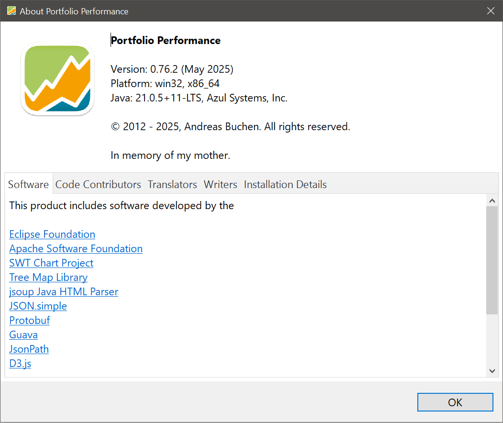

Detailed information about the Portfolio Performance program could be found in the menu `Help > About Portfolio Performance`. The top panel contains the version, e.g. 0.67.0 from december 2023, the platform and the Java version it runs on. The platform could be Windows (win32, x86_64), Linux, or macOS; see [Installation](../../getting-started/installation.md). The Portfolio Performance program is built with the Java programming language. The most recent Long Term Support (LTS) version of the OpenJDK (Java Development Kit) is obtained through [Azul.com](https://www.azul.com/downloads/?package=jdk#zulu). From the copyright info, you learn that the author `Andreas Buchen` started development back in 2012.

Figure: The About Portfolio Performance panel.{class=pp-figure}

The bottom panel contains links to the used (open source) software, code contributors, translators, and Writers. There is also a section about Installation Details.

## Software

[Eclipse Foundation](https://www.eclipse.org/): Eclipse is a free and open source software development environment that supports various languages, platforms and plugins. It is a very popular and widely used IDE (Integrated Development Environment). Eclipse allows developers to create, test, debug, and deploy applications using a common framework and a rich set of tools. From a user perspective, the choice of a specific IDE is not important. The development platform e.g. Java SDK however is very much.

[Apache Software Foundation](https://apache.org/): Several libraries are used; for example to extract text and metadata from PDF documents, and to perform HTTP requests and handle responses (e.g. communicate with Portfolio Report). 

[SWT Chart Project](https://github.com/eclipse/swtchart/wiki): The Eclipse SWTChart software is used to create the line and pie charts in the app. Portfolio Performance uses the Standard Widget Toolkit (SWT) which is a graphical user interface (GUI) library that allows Java developers to create native-looking applications for different platforms. You enable this library in `Help > Preferences > General`.

[Tree Map Library](https://github.com/smurf667/treemaplib): Treemaps represent a distinct visualization technique for illustrating hierarchical data by using a series of nested rectangles. This kind of map is used in the Taxonomies menu.

[jsoup Java HTML Parser](https://jsoup.org/): jsoup is a Java library that simplifies working with real-world HTML and XML. It offers an easy-to-use API for URL fetching, data parsing, extraction, and manipulation using DOM API methods, CSS, and xpath selectors. The library is used for example to fetch the historical prices from a table on a financial website.

[JSON.simple](https://github.com/fangyidong/json-simple): JSON.simple is a simple Java toolkit for JSON. You can use JSON.simple to encode or decode JSON text. This tool is used in the app for downloading historical prices from a JSON data source.

[Protobuf](https://github.com/protocolbuffers/protobuf): Protocol Buffers (a.k.a., protobuf) are Google's language-neutral, platform-neutral, extensible mechanism for serializing structured data. The software is used to convert the XML-datastructures of the portfolio file into Java usable data structures.  

[Guava](https://github.com/google/guava): The Guava libraries are intended to complement the core java libraries and make working in the Java language more pleasant and more productive.

[JsonPath](https://github.com/json-path/JsonPath): JsonPath is a query language for JSON. It allows to select and extract a sub-section from a JSON document using a simple syntax that is similar to XPath for XML.

[D3.js](https://d3js.org/): D3.js is an abbreviation for Data-Driven Documents and is a JavaScript library to work on data visualization e.g. graphs. 

[XStream](https://github.com/x-stream/xstream): A Java library that allows you to serialize and deserialize Java objects to and from XML or JSON.

[OpenJDK](https://openjdk.org/): Running a Java program on for example a Windows machine requires that the Java Development Kit (JDK) is installed on that computer. Portfolio Performance uses the JDK provided by Azul.com.

## Code Contributors

A link to the Github pages of each of the 159 contributors is given. A graphical overview of all contributions from 2012 till today can be found at [Github](https://github.com/portfolio-performance/portfolio/graphs/contributors). 

## Translators

Portfolio Performance has been translated into Spanish, Dutch, Portuguese, Brazilian Portuguese, French, Italian, Czech, Russian, Slovak, Polish, Chinese (simplified), Chinese (traditional), and Danish.

## Writers
The two main sources of documentation for the program are the Forum ([German](https://forum.portfolio-performance.info/c/deutsch/10) - [English](https://forum.portfolio-performance.info/c/english/10)) and the Handbook ([German](https://help.portfolio-performance.info/de/) - [English](https://help.portfolio-performance.info/en/)).

## Installation Details

Clicking on this tab will generate a very long and detailed description of the environment Portfolio Performance is running in (OS, Java and Eclipse components, paths to log-files, ...).

