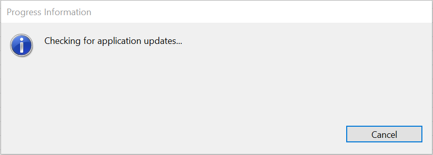
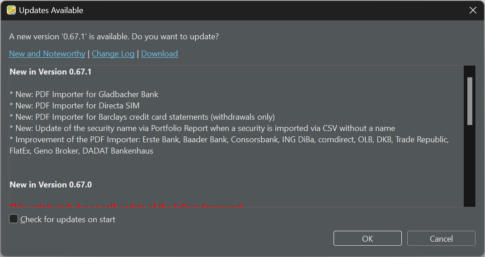
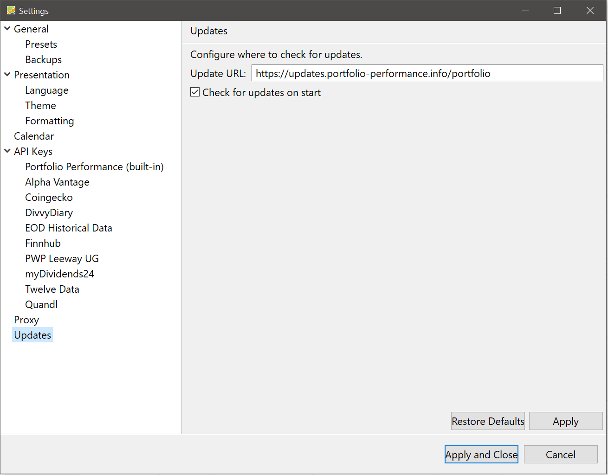

After the first installation, you can either check manually for updates or allow the program    to check each time it starts.

## Manual check for updates

To manually check for updates, navigate to the menu `Help > Check for Updates ...`. Figure 1 will briefly appear.

Figure: Checking for updates.{class=pp-figure}

Either no updates are available; indicating that your version is up-to-date or figure 2 will be shown; the correct version will of course be different in the future.

Figure: Checking for updates.{class=pp-figure}

To install the most recent version, click `OK`. To cancel the update and stay with the old version, click `Cancel`.

There are three links at the top of the panel. [New & Noteworthy](https://forum.portfolio-performance.info/t/new-noteworthy/17945/52) provides detailed information about the changes in the latest version but also about *all* previous releases. The [Change Log](https://github.com/portfolio-performance/portfolio/releases) link leads to the Github page of the project where all (previous) releases are described. The [download link](https://www.portfolio-performance.info/) takes you to the homepage; where you can download the program for the different operating systems (Linux, Windows, macOS); see [Getting Started > Installation](../../getting-started/installation.md).

Below the links, you can find an overview of the changes in the last two releases. At the bottom right, you can enable the automatic check for updates (see below).

## Automatic check for updates

Automatic checking for updates is enabled by default. You can change this setting in the menu `Help > Settings > Updates > Check for updates on start` (see figure 3).

Figure: Setting for automatic check for updates.{class=pp-figure}

