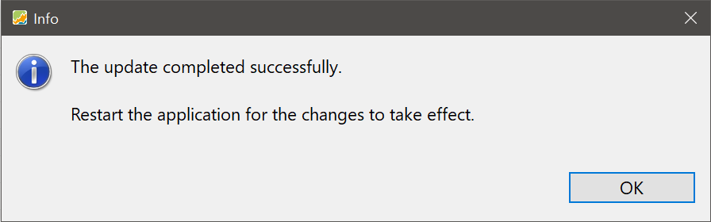

After installation, you can check for updates manually or let the program check automatically on startup.

## Manual Check for Updates

To check manually, select `Help > Check for Updates ...`. A dialog like the one below will briefly appear:

Figure: Checking for updates {class="pp-figure"}

If no updates are available, you will see a confirmation that your version is current. Otherwise, an update dialog will appear (the version shown will vary):

Figure: Update available {class="pp-figure"}

Click `OK` to install the latest version, or `Cancel` to keep your current version.

At the top of the update panel, there are three useful links:

- [App for iPhone and Android](https://www.portfolio-performance.app): Information about the mobile companion app and links to the App Store and Google Play.
- [New & Noteworthy](https://forum.portfolio-performance.info/t/new-noteworthy/17945/last): Detailed info about the latest and previous releases.
- [Change Log](https://github.com/portfolio-performance/portfolio/releases): GitHub page listing all releases.
- [Download](https://www.portfolio-performance.info/): Official homepage with installers for Linux, Windows, and macOS (see [Getting Started > Installation](../../getting-started/installation.md)).

Below the links, you’ll find a summary of changes from the last two releases. At the bottom right, you can enable or disable automatic update checks (see next section).

If the update is accepted and installed successfully, a confirmation will appear:

Figure: Install update successful {class="pp-figure"}

!!! Tip
    If the update process fails (e.g. due to missing permissions or network issues), you can always download and install the latest version manually from the [official website](https://www.portfolio-performance.info/).

## Automatic Check for Updates

Automatic update checks are enabled by default. To change this, go to `Help > Settings > Updates` and toggle `Check for updates on start`:

Figure: Automatic update check setting {class="pp-figure"}

!!! Note
    The automatic check is performed only when the application starts. There is no background download or silent installation.

!!! Info "Technical Info"
    The update check fetches data from [https://updates.portfolio-performance.info/portfolio](https://updates.portfolio-performance.info/portfolio). If the update check fails, check your internet connection or firewall/proxy settings. Manual updates are always possible via the [download page](https://www.portfolio-performance.info/).
