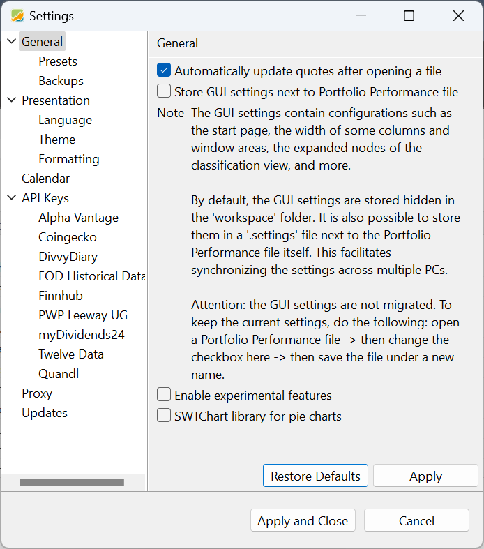
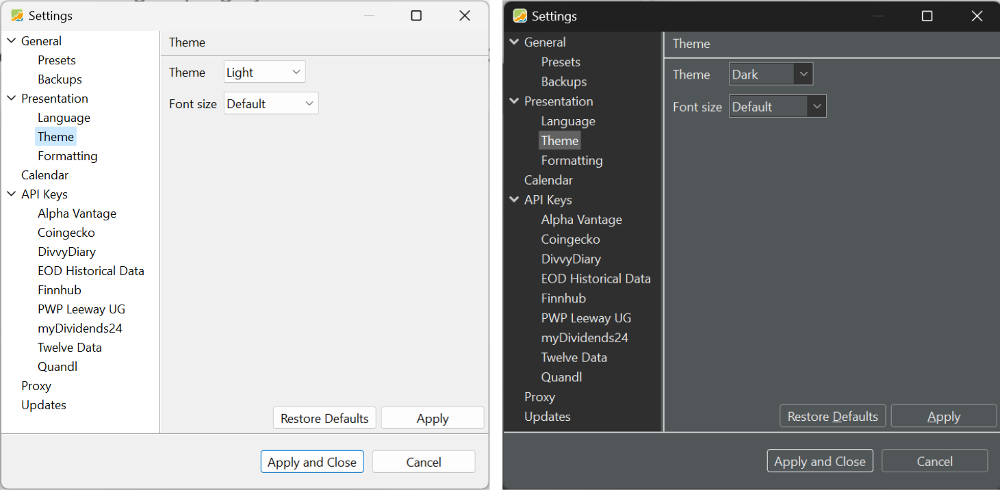

---
Preferences
---

There are two distinct sections within the PP software where you can customize the User Interface (UI) and the overall behavior of the program: the `View > Settings` menu and the `Help > Preferences` menu.

Figure: The General option of the menu of View > Settings. {class=align-right style="width:50%"}

 The preference settings have system-wide implications and will be applied to all portfolios managed by PP. The Preferences window features a sidebar, as illustrated in Figure 1, which is further divided into six submenus. 

## General

By selecting the `General` menu item in the sidebar of the `Preferences dialog box` (see Figure 1),  you will be presented with four options: 

- `Automatically update quotes after opening a file`: Each security can have an external data source assigned for [downloading historical quotes](../../how-to/downloading-historical-prices/). You can start the download process manually through the [Online menu](../online.md) or enable the option to automatically download historical quotes upon opening the portfolio.

 

- `Store Gui settings next to Portfolio Performance file`: The Graphical User Interface (GUI) settings influence several aspects of the look and feel of the PP program such as the width of columns or size of windows (e.g. main pane vs information pane) and others. These settings are stored in a separate file, that can be located:

    - In the same folder as the portfolio file (option is checked). The name of the file is [name-of-portfolio].settings; e.g. `demo-portfolio-03.settings`.
    
    - In a subfolder of the workspace folder of the PP application (option is unchecked). The name is a unique random string with the extension "txt", e.g.`prf_c4c742f0f7312d48355beadb57dc4a09.txt`. This file is invisible by default. The location of the workspace folder is:

        - macOS: `~/Library/Application Support/name.abuchen.portfolio.product/workspace`
        - Windows: `%LOCALAPPDATA%\PortfolioPerformance\workspace`
        - Linux: `~/. PortfolioPerformance/workspace`

    You need to search in the subfolder: `.metadata\.plugins\name.abuchen.portfolio.ui`.

    The location of your settings file is critical when transferring your portfolio to another computer. If the settings file is stored adjacent to the portfolio, the process is simplified; you only need to copy both files to the new location. However, if the settings file is stored within the workspace folder, it will not be automatically regenerated when installing the PP application on the new computer. In this case, you must manually copy the file from the old computer and paste it into the corresponding location on the new computer to ensure proper configuration.
    
- `Enable experimental features`: This feature is only intended for developers or "bold" users who wish to test out new experimental features, such as a new file format

- `SWTChart library for pie charts`: In certain operating systems, such as Linux, enabling this option is required to accurately display pie charts.

### Presets

There is only one preset to configure, which is determining the time value for newly entered data, such as the time of a buying transaction. The default setting is `Start of day` (= `00:00`). Alternatively, you can select `Current time`, which will use the time from your computer clock for new entries.

### Backups

Figure: Settings for the backup of the data files. {class=align-right style="width:30%"}

The first option enables an automatic backup of your portfolio, creating a copy just before the previous version is overwritten (saved) with the current one. This serves as a safeguard in case you unintentionally modify elements within your portfolio and need to revert to its previous state.

You have three choices for the backup location:

 

- `Next to data file`: The backup is saved in the same folder as the original portfolio with the text `.backup`, appended to the name; for example `myPortfolio.backup.xml`.
- `Selected directory`: The backup is saved in the folder location specified below. This could be a completely different directory or drive.
- `Directory Next to data file`: The backup is saved in a folder at the same level as the portfolio file. The name of the folder is specified below (e.g. `backups`, as shown in Figure 2).

!!! Note
    In fact, turning on the backup option will create a file such as `myPortfolio.backup-after-open.xml` right after opening your portfolio. This file will contain the state of your original portfolio.

- `Autosave copy every X minutes`: You can specify the number of minutes in the provided text field. With this option enabled, the current state of the portfolio file will be saved automatically every X minutes. Any existing autosave file will be overwritten. To disable this feature, enter zero (0) minutes. The autosave file will be named `[name-of-portfolio].autosave.[extension]` and stored in the same folder as the original portfolio.

## Presentation

- `Use indirect quotation for exchange rates`: Each portfolio has a single base currency, which is set during the [creation of the portfolio](../../getting-started/create-portfolio.md) and can be modified later in the [Statements of Assets](../view/reports/statement/index.md) view. When conducting a transaction involving a foreign currency (foreign relative to the base currency), an exchange rate must be applied. With indirect quotation, the exchange rate indicates how much of the foreign currency is required to purchase one unit of the base currency. On the other hand, direct quotation specifies how much of the base currency is needed to acquire one unit of the foreign currency.

    For instance, if your base currency is EUR, the exchange rate with USD would be represented as follows:

    - **Indirect quotation**: 0.9321 USD/EUR (one unit of the base currency requires 0.9321 units of the foreign currency)
        
    - **Direct quotation**: 1.0729 EUR/USD (1.0729 units of the base currency are needed for one unit of the foreign currency)

- `Always display currency code for monetary values`:  If this option is unchecked, PP will show the currency code (e.g., USD) only when the currency differs from the base currency, resulting in a cleaner and less cluttered view.
- `Add "p.a." to annualized return rates`: The Internal Rate of Return (IRR) is, by definition, an annualized return rate. The True-Time Weighted Rate of Return (TTWROR) is calculated per reporting period (and thus, possibly unannualized). Enabling this option will consistently append the suffix "p.a." to indicate when the return rate is annualized.

### Language

Figure: Settings for the language, country, and Java Locale. {class=align-right style="width:30%"}

Using the language drop-down menu, you can modify the user-interface language of the PP software, such as the menus and dialogs.. 13 different languages are available: Deutsch (German), English, Español (Spanish), Français (French), Italiano (Italian), Nederlands (Dutch), Português (Portuguese), čeština (Czech), русский (Russian), Slovenská (Slovak), Polskie (Polish), 中文 (Chinese), and Dansk (Danish).

The selected language will also affect the available country options. For instance, the Dutch language is spoken in seven countries: Aruba, Belgium, Carribean Netherlands, Curraçao, Sint Maarten, and Suriname.

If English is selected as the UI language, several countries, including an option for Europe and World, can be chosen. The combination of language and country determines the Java Locale. For example, selecting the language "Dutch" and the country "Belgium" will result in the Java locale "nl_BE". Choosing "English" and "Europe" will produce the Java locale "en_150".

The Java Locale is responsible for formatting dates, currency, decimal and grouping separators, and the first day of the week. For example, the combination of English and Belgium produces the Java locale "en_BE", which in turn displays a date like "03 Oct 2024 15:49" (English language but Belgian notation) with Monday as the first day of the week, and a comma (,) as the decimal separator and a dot as the grouping symbol.

On the other hand, the combination of English and the United States (en_US) results in a date format like "Jul 3, 2024, 3:49 PM" with Sunday as the first day of the week and a number format like 12,345.67.

### Theme

Figure:  Theme Settings - example of Light vs Dark theme. {class=pp-figure}

In the `Settings > Theme` section, you can select either a Light or Dark theme (refer to Figure 4) or set it to automatic. If you choose the automatic option, your system clock will determine whether the light or dark theme will be applied.

The default font size is set to 9 pixels, but you can adjust it according to your preference, with options ranging from 8 pixels to 20 pixels.

### Formatting

In this section, you can adjust the display precision for the number of shares (default is rounded to 1 decimal place) and the display precision for calculated quotes (default=2). Keep in mind that the changes will only be visible with decimal numbers (which need to be rounded to the specified number of digits after the decimal point) in read-only views, such as the Statement of Assets view. On input forms, like a buy-input form, you can still enter a more precise number with additional decimal places.

## Calendar

A calendar specifies the holidays (of your stock exchange) or the non-trading days for a selected year.  Calendars play an essential role in calculations, certain chart views, and investment plans within PP. For instance, if the start date of a monthly [investment plan](../view/accounts/investment-plans.md) falls on a holiday, the transaction will be moved to the next working day.

PP offers 13 different stock exchange calendars. These include the Australian Stock Exchange (ASX), Euronext, German stock exchanges (DE), IBOV Sao Paulo Stock Exchange (Brazil), ISE Italian Stock Exchange (ISE), London Stock Exchange (LSE), Moscow Exchange (MICEX-RTS), New York Stock Exchange (NYSE), Swiss Exchange (SIX), Toronto Stock Exchange (TSE), and Vienna Stock Exchange (VSE). There are also 4 more generic calendars:

- (None): Every day of the year, from January 1 to December 31, is considered a trading day.
- Default Calendar: Specifies seven quasi-universal holidays, such as New Year's Day. 
- First of the Month: this calendar will mark every first of the month day, e.g. Jan 1, Feb 1, ... as a trading day, excluding all other days. This calendar can be used in combination with the [reporting period](../../concepts/reporting-period.md) to define a period starting from the first of the month.
- TARGET2 (Eurozone banking day): Holidays for the Trans-European Automated Real-time Gross settlement Express Transfer (TARGET):  a system that allows the European banks to transfer money between each other instantly. 

When you select a calendar from the drop-down list, it will display the corresponding holidays for the chosen calendar and year.

!!! Note
    Any changes made to the calendar settings will only take effect after restarting the PP program. 

## API keys

An API, or Application Programming Interface, is a set of rules and protocols that allows different software applications to communicate with each other. An API key is a unique identifier used to authenticate a user to an application programming interface (API). API keys are used to track and control how the API is being used, prevent abuse, and provide access to specific services or data; see [downloading historical prices](../../how-to/downloading-historical-prices/index.md) for a few examples.

For example, Alpha Vantage is a popular API that provides access to financial data. To use the Alpha Vantage API, you first need to sign up on their website and obtain an API key. Then, you can issue an HTTP request such as `https://www.alphavantage.co/query?function=TIME_SERIES_DAILY&symbol=AAPL&apikey=your_api_key`. To avoid having to enter your API key repeatedly, you can save it in the Settings section.

## Proxy

Downloading historical prices requires accessing an external web server such as Yahoo Finance. Using a proxy server can hide your IP address, making your online activity more anonymous. In a corporate environment, proxies are often used to enforce internet usage policies, monitor employee activity, and ensure compliance with regulatory requirements.  

## Updates

PP is regularly maintained and updated. To manually check for updates, you can visit the [homepage](https://www.portfolio-performance.info/en/). The version number (e.g., 0.69.0) is displayed above the download links. Additionally, you can find the [latest release](https://github.com/portfolio-performance/portfolio) on GitHub.

By enabling the `Check for updates on Start` option in the Settings section, PP will automatically check, download, and install the latest version (if necessary) upon launch. The update process is carried out from the URL `https://updates.portfolio-performance.info/portfolio`.