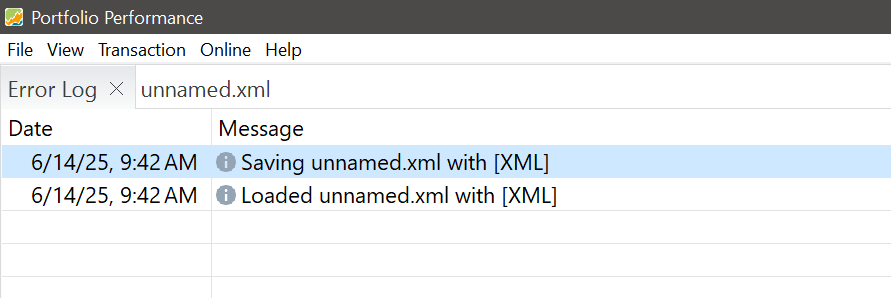
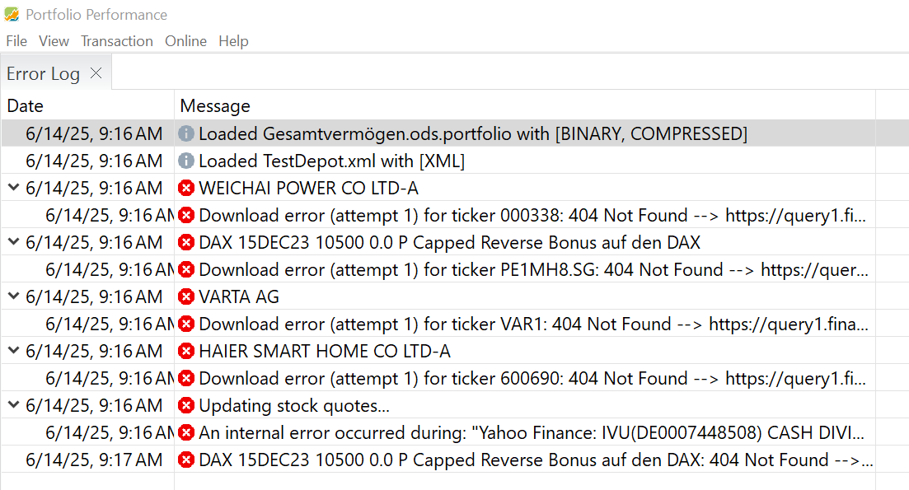
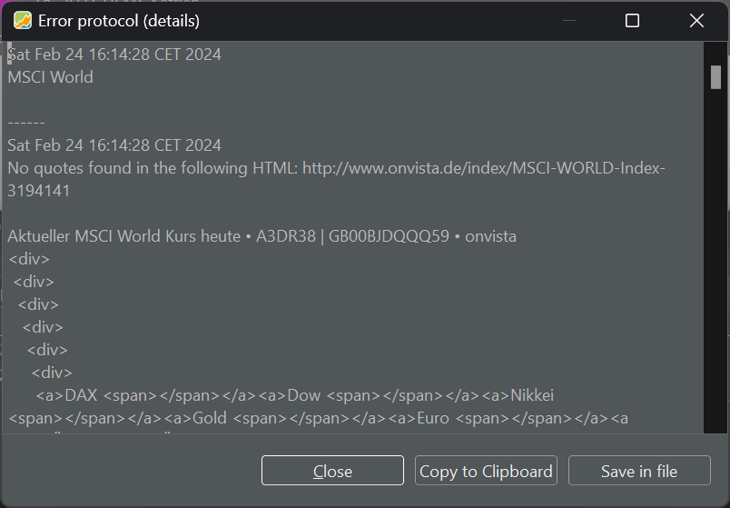
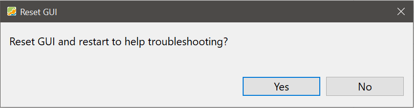
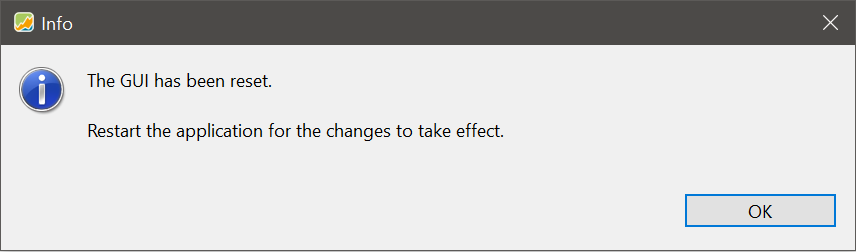
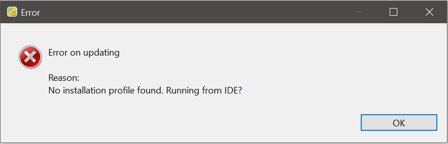

On rare occasions, the PP app may not function properly or even crash. Beneath the Help menu, three options can assist in such instances.


## Show Error Log

Every time the program starts, it creates a log-file. You can view this log file from within the PP app in a separate window with the command `Help > Show Error Log`. Double-clicking the message will display the entire text. If there were no errors, this will be a minimal log (see Figure 1).

Figure: Log after successful start-up. {class=pp-figure}



If an error is encountered, the log file will list them sequentially. Figure 2 hints at the error (No quotes found). You can double-click on the message to receive more detailed info.

Figure: Log after unsuccessful operation. {class=pp-figure}



A rather large text file will appear when double-clicking the message (see below). If you can open the portfolio, you need to fix the historical prices source of this security. Otherwise, you need to open the XML-file in a text editor and manually remove the offending data source.

Figure: Log after unsuccessful operation. {class=pp-figure}



You can copy this text to the clipboard, for example when seeking help on the [forum](https://forum.portfolio-performance.info/) or you can save the file.

## Save Error Log ...

As previously mentioned, each time the program starts, it generates a log file. This file is automatically saved in your user directory. For Windows users, it typically resides in: `C:\Users\Your-name\AppData\Local\PortfolioPerformance\workspace\.metadata\`.

To save the latest log to a text file with the extension `.log`, you should use this command. The text file provides more comprehensive information (see below) than the error window depicted in Figure 3, including details about the operating system, the current Java version, and other relevant data.


```
!SESSION 2024-02-19 11:47:29.300 -----------------------------------------------
eclipse.buildId=0.67.3.
java.version=17.0.5
java.vendor=Azul Systems, Inc.
BootLoader constants: OS=win32, ARCH=x86_64, WS=win32, NL=en_US
Command-line arguments:  -os win32 -ws win32 -arch x86_64

This is a continuation of log file C:\Users\your-name\AppData\Local\PortfolioPerformance\workspace\.metadata\.bak_0.log
Created Time: 2024-02-19 13:18:06.540

!ENTRY name.abuchen.portfolio 4 0 2024-02-19 13:18:06.540
!MESSAGE 404 Not Found --> https://query1.finance.yahoo.com/v8/finance/chart/TNET.BR?lang=en-US&region=US&corsDomain=finance.yahoo.com
!STACK 0
name.abuchen.portfolio.util.WebAccess$WebAccessException: 404 Not Found --> https://query1.finance.yahoo.com/v8/finance/chart/TNET.BR?lang=en-US&region=US&corsDomain=finance.yahoo.com
	at name.abuchen.portfolio.util.WebAccess.executeWith(WebAccess.java:222)
	at name.abuchen.portfolio.util.WebAccess.get(WebAccess.java:182)
	at name.abuchen.portfolio.online.impl.YahooFinanceQuoteFeed.rpcLatestQuote(YahooFinanceQuoteFeed.java:61)
	at name.abuchen.portfolio.online.impl.YahooFinanceQuoteFeed.getLatestQuote(YahooFinanceQuoteFeed.java:69)
	at name.abuchen.portfolio.ui.jobs.UpdateQuotesJob$1.run(UpdateQuotesJob.java:244)
	at org.eclipse.core.internal.jobs.Worker.run(Worker.java:63)


```
It is advisable to include this file when reporting the [issue on GitHub](https://github.com/portfolio-performance/portfolio/issues). Please refrain from using a portfolio containing sensitive information for this purpose.


## Debug: Reset UI ...
Choosing this option will simply display the dialog boxes of Figure 1 & 2. As you can see, you need to quit and restart the application after that.

Figure: Reset GUI dialog box. {class=pp-figure}



Figure: Successful reset of UI. {class=pp-figure}



The Reset UI function will NOT delete any created views or custom reporting periods, nor will it reset the Recent Files list, as these parameters are saved separately.

However, it does reset the position and size of the PP application window on your monitor and does not restore open files from the moment of closing. Additionally, it sets the main and information panes to their initial values. In essence, as the name implies, it resets the Graphical User Interface (GUI/UI).

In the event of unexpected errors, initiating a Reset UI could be your initial troubleshooting step, as it minimally disrupts your workflow.


## Updating error

If the program is corrupted or some files are missing, automatic updates are not feasible. An error message (see figure 4) is displayed, and the automatic update is no longer possible.

The simplest workaround is to delete the program and reinstall it.

Figure: Error message upon manual check for updates.{class=pp-figure}

