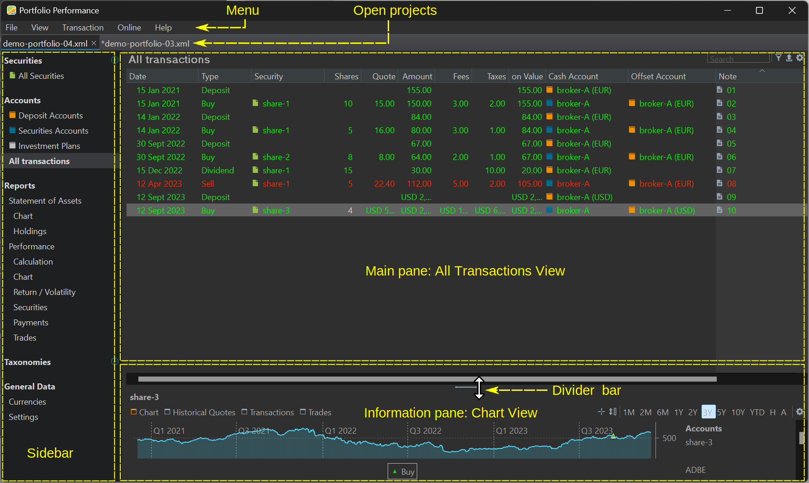

The Reference manual is structured around the User Interface (UI) of the program, probably the easiest and quickest way for users, developers, or contributors to find relevant information. Figure 1 shows a typical opening screen of a small portfolio, e.g. [demo-portfolio-04](../assets/demo-portfolio-04.xml). An overview of the menu and all sub menus is given [here](./menu.md).

Figure: Opening screen of the Portfolio Performance program.{class=pp-figure}

Figure 1 illustrates the outcome of selecting the `All Transactions` view, accessible either through the side panel or the menu `View > All Transactions`. The last Buy transaction for `share-3` is selected, prompting the display of a chart showing the historical quotes of `share-3` in the lower panel. The following UI elements can be distinguished:

- **Menu bar** containing five elements: File, View, Transaction, Online, Help. This menu bar is *not* context sensitive. An expanded image of all menus and submenus [[available here]](menu.md) will provide you with a comprehensive understanding of the program's functionalities.
- **Open projects**: you can open multiple projects simultaneously. The highlighted project is visible in the panels below. Projects marked with a star (*) preceding their name has been changed and should be saved before closing. It is possible to display two projects [side by side](../how-to/copy-securities.md) in the UI.
-  The **Side panel** serves as a convenient shortcut for accessing various views within the project. All available options can also be accessed through the `View` menu. It's important to note that the list in the side panel mirrors the options available in the `View` menu, providing a one-to-one translation of the available views. The chosen view dictates the content displayed in the adjacent top and bottom panels. Next to the options `Securities` and `Taxonomies`, a very small (green) icon will let you add new elements.
- **Top panel**: in the example of Figure 1, the top panel contains the `All Transactions` view. This is a list of all the transactions that you have made with your portfolio, such as deposits, withdrawals, buys, and sells. The default columns, such as `date`, `type`, `security`, ..., are initially visible. However, you have the flexibility to modify them using the Settings (cog) icon located in the top-right corner. Please, note that the icons in the top-right corner are specific to this view and may not necessarily appear in other views.
- The **Bottom panel** follows the selection of the top panel. For example, selecting `share-1` in the top panel will display the chart of this share in the bottom panel.
- **Divider bar**: the area occupied by the top and bottom panels can be adjusted using the divider bar. You can drag the divider bar all the way to the top or bottom. It is not possible to completely hide a panel; except for the `Currencies` and `Settings` options.