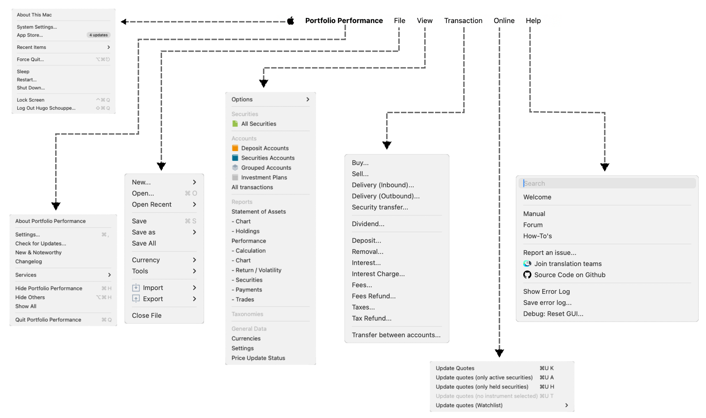

The `Reference Manual` is organized around the User Interface (`UI`) of the program, offering users, developers, and contributors an easy and efficient way to locate relevant information. Note that there are minor differences between the menu systems on Apple and Windows computers (see Figure 1 for Apple and Figure 2 for Windows).

=== "Apple menu"

    Figure: Top menu for Apple computers. {class=pp-figure}

    

    *Check [this video](../assets/videos/Menu-system-Portfolio-Performance.mp4) to see the menus in action.*

=== "Windows menu"

    Figure: Top menu for Windows computers. {class=pp-figure}

    

Several menus contain submenus, e.g. `File`  &rsaquo; `New`, `File`  &rsaquo; `Import`, `View` &rsaquo; `Options`, ... They are indicated with the **:material-greater-than:** symbol. A textual representation of all menus and submenus is provided below.

The structure of the `Reference` section of the manual mirrors the top-level menu and submenus of the program, with sections named `File`, `View`, `Transaction`, or `File` &rsaquo; `import`. See the sidebar of this page, or if you are reading this on a small/mobile screen, check the :material-menu: hamburger menu.

```
File
├── New
│   ├── File
│   ├── Security
│   ├── Cryptocurrency
│   ├── Exchange Rate
│   ├── Consumer Price Index
│   ├── Taxonomy
│   └── Watchlist
├── Open... Ctrl+O
├── Open Recent
│   ├── ...
│   ├── Clear List
├── Save Ctrl+S
├── Save as... Ctrl+S
│   ├── Password protected (AES-256)
│   ├── Binary
│   ├── XML
├── Save All
├── Currency >
│   ├── EUR (Euro)
│   ├── USD (United States dollar)
│   ├── A - D >
│   │   ├── AED (United Arab Emirates dirham)
│   │   ├── ...
│   │   ├── DZD (Algerian dinar)
│   └── E - I >
│   ├── ...
├── Tools
│   ├── Sanity Check...
│   ├── Fix: Restore ...
├── Import
│   ├── PDF Bank Documents
│   ├── CSV files (comma-separated values)
│   ├── Templates >
│   │   ├── comdirect Musterdepot
│   │   ├── ...
│   │   ├── custom templates
│   ├── XML Documents (experimental)
│   ├── Interactive Brokers: Activity Flex Query
│   └── Debug: Create text from PDF...
├── Export
│   ├── CSV files (comma-separated values) .. Ctrl+Shift+S
│   ├── Portfolio Performance XML
├── Close File
└── Quit Ctrl+Q
```

```
View
├── Options
│   ├── Always start with 'All transactions' in this part
│   ├── Always start with last view
│   ├── Hide sidebar ... Ctrl+K
│   ├── Hide information pane ... Ctrl+L
│   ├── Discreet Mode
├── Securities
├── ├── All Securities
├── Accounts
├── ├── Deposit Accounts
├── ├── Securities Accounts
├── ├── Investment Plans
├── ├──All transactions
├── Reports
│   ├── Statement of Assets
|   |   |── Chart
|   |   ├── Holdings
│   ├── Performance
│       ├── Calculation
│       ├── Chart
│       ├── Return / Volatility
│       ├── Securities
│       ├── Payments
│       └── Trades
├── Taxonomies
└── General Data
    ├── Currencies
    ├── Settings
    └── Price Update Status
```

```
Transaction
├── Buy ...
├── Sell ...
├── Delivery (Inbound) ...
├── Delivery (Outbound) ...
├── Security  transfer ...
├── Dividend ...
├── Deposit ...
├── Removal ...
├── Interest ...
├── Interest Charge ...
├── Fees ...
├── Fees Refund ...
├── Taxes ...
├── Taxes Refund ...
└── Transfer between accounts ...
```

```
Online
├── Update Quotes ... Ctrl+U, K
├── Update Quotes (only active securities) ... Ctrl+U, A
├── Update Quotes (only held securities) ... Ctrl+U, H
└── Update Quotes (selected security) ... Ctrl+U, T
```

```
Help
├── Welcome
├── About Portfolio Performance
├── Preferences ...
├── Check for Updates ...
├── New & Noteworthy
├── Changelog
├── Manual
├── Forum
├── How-To's
├── Report an issue...
├── Join translation teams
├── Source Code on Github
├── Show Error Log
├── Save Error Log ...
└── Debug: Reset GUI ...
```

 