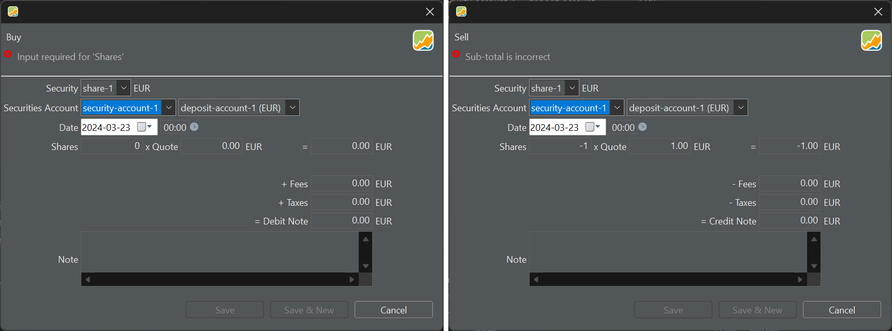
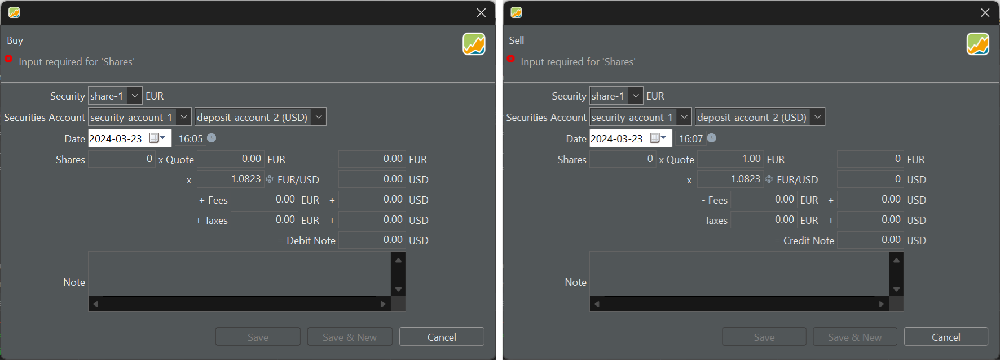

When buying or selling a security, there are two main scenarios to consider regarding the currency of the deposit account. 

In the first scenario, if the security is in the same currency as the deposit account, the transaction is straightforward. The buyer or seller simply pays or receives the equivalent amount corresponding to the value of the security, and the corresponding amount is debited or credited from or to their deposit account.

In the second scenario, if the security is not in the same currency as the deposit account, a currency conversion becomes necessary. This need for currency conversion can also arise if your broker or bank charges you taxes and fees in your local currency, while you're utilizing a deposit account denominated in the foreign currency of the security.

## One currency

Figure: Buy and Sell transaction with one currency. {class=pp-figure}

In Figure 1, both the security and the deposit account are denominated in EUR. Consequently, no currency conversion is required, given that fees and taxes are also in EUR for this particular broker. The fields `Security`, `Securities Account`, `Deposit Account`, `Shares`, and `Debit Note` are mandatory. An error message will be displayed at the top until all conditions are fulfilled, as depicted in Figure 1.

You can navigate through these fields using the Tab key on your keyboard or by using the mouse.

- **Security** : The field `Security` is normally pre-filled with the first or selected security from the `All securities` list. You can, of course, select another security from the drop-down. Please note that the currency is automatically set because each security has a reference currency, which is set during [creating the security](../../getting-started/create-portfolio.md).
- **Securities Account** : Choose from the drop-down menu. The reference deposit account next to it will be added automatically. 
- **Deposit Account**: Select from the drop-down menu or leave it pre-filled with the [account](../../reference/view/accounts/index.md) related to the security. If the currency of the chosen deposit account differs from the security currency, you'll need to convert the Gross Amount and Fees and Taxes, requiring an Exchange Rate. See below.
- **Date of transaction**: You can pick this date from a calendar or enter it manually (format = YYYY-MM-DD). On the right (00:00), you can input the transaction time. The choice between a 12-hour or 24-hour clock is determined by the menu setting `Help > Preferences > Language > Country`. For instance, the UK uses a 12-hour clock (with AM and PM), while Belgium uses a 24-hour clock. By default, the `Start of Day`, e.g. 00.00 is taken. You can change it to `Current time` with menu `Help > Preferences > General >Presets`. 
- **Shares**: the number of securities that you buy or sell. This can be a decimal number but is cannot be zero or negative. .
- **Quote** : This is the price you paid for one share. If the security includes historical prices (see [adding securities](../../getting-started/adding-securities.md)), the correct price for the given date will already be filled in. However, this historical price may not match what your bank provides, as it is based on end-of-day prices, whereas the bank uses real-time information.

The above six fields (+ the calculated Debit Note) are *mandatory* for completing the transaction. Most of these fields are pre-filled based on the selected security. The following fields are either calculated or optional.

- **Gross Value** : This is the result of multiplying Shares by Quote. If you later change the Gross Value, the Quote Price will be adjusted accordingly to maintain the equation Shares * Quote.

- **Fees** and **Taxes** : A purchase transaction typically incurs fees and taxes. These may be in the currency of the security and/or deposit account.

- **Debit Note** : This is the amount you need to pay as a result of this buying transaction. It is calculated as Shares * Quote + Fees + Taxes. Other terms for this are Value or Net Value.

- **Note** : You can add a textual note to each transaction.

The typical flow for entering this information is likely to be `Shares * Quote (price) >> Gross Value + Fees + Taxes >> Debit Note`. There are a few nuances if you make changes afterward (see Figure 3).

Figure: Calculation flow between Shares and Debit Note.

{.pp-figure}

- Changing the *Debit note* (afterward) will modify the Gross Value, and consequently, the Quote Price will be adjusted. The number of shares remains unchanged.
- Changing the *Gross Value* afterward will alter the Debit Note and the Quote Price. Fees, taxes, and the number of shares are unaffected.

Clicking the "Save" button will update the portfolio accordingly. If you select "Save & New," it will not only update the portfolio but also prompt a new buy/sell dialog box for further transactions.

## Two currencies

Sometimes, the currency of the security may differ from the currency of the deposit account being used. In such cases, an [exchange rate](../view/general-data/currencies.md) is automatically generated for the pre-filled date. This exchange rate is sourced daily from the ECB (European Central Bank) and does not consider the time of day. It's important to note that altering the date afterward will also result in a change in the exchange rate, regardless of whether the exchange rate was retrieved automatically or manually entered.

Figure: Buy and Sell transaction with two currencies. {class=pp-figure}

It's important to note that the Quote price and the (first) Gross Amount are always expressed in the currency of the traded security (for example, EUR in Figure 2). On the other hand, the debit note is always expressed in the currency of the deposit (as it represents the actual payment). Fees and taxes, however, can be entered in either the currency of the security (on the left side) or the currency of the deposit account (on the right side), or even in both currencies simultaneously.