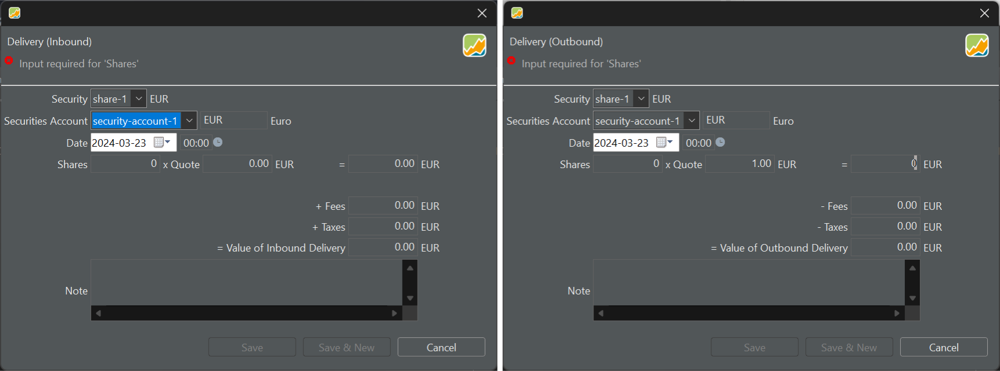

A delivery involves the addition or removal of securities from a securities account, without requiring a deposit transaction. Drawing a comparison between Inbound and Outbound deliveries and Deposit and Withdrawal (removal) transactions can provide clarity.

Both types of transactions involve the transfer of assets (money), but they impact different types of accounts. Deposit and withdrawal transactions only affect cash accounts. When a deposit is made, the cash account increases, and conversely, it decreases when a withdrawal is made. Similarly, Inbound and Outbound deliveries involve the addition or removal of securities from a securities account. In both cases, whether it's cash or securities, assets are either added to or withdrawn from an account.

Delivery transactions can be particularly useful in the following scenarios:

1. **Portfolio Reconstruction**: You're trying to reconstruct a portfolio based on historical data but lack specific transaction details such as prices, fees, or even dates.

2. **Inheritance and gifts**: If you inherit securities or receive them as a gift, you may not have all the historic details and probably only has info about the current market price. A delivery at the current date and price could be a solution.

3. **Currency Considerations**: If the security is in a currency for which no cash account exists in the portfolio, a delivery transaction can be used to add the security to the portfolio.

4. **Corporate Actions**: Certain corporate actions like stock splits, mergers, or acquisitions can sometimes be more easily implemented with deliveries vs buy/sell.

Figure: Delivery (Inbound) and Delivery (Outbound) transaction - one currency.{pp-figure}

## One currency

Each security account is paired with a corresponding cash account, which is automatically added upon creation. Since security-account-1 is linked to a cash account denominated in EUR, EUR is suggested as the default currency in Figure 1. The currency designation in the box (EUR) can be modified; the text to the right provides a description of the currency (Euro).

When the chosen currency for the transaction matches the currency of the security (share-1), no conversion is necessary. All other fields, such as date, shares, quote, etc., remain identical to those in the [buy-sell transaction](buy-sell.md).

## Two currencies

The transaction currency can be changed by choosing another security or security account. However, it's also possible to change the transaction currency directly with a given security and/or security account. To change the currency of the transaction, you can either:

- Click the textbox next to the security account. Use the scrollbar to find another currency and double click on it.
- Select the available currency (e.g. EUR) and type over it with the new currency (e.g. ZAR).
- Click the box and select the available currency (e.g. EUR). Then type the first letter of the desired currency (e.g. Z for ZAR). This action will reveal a list of all available currencies beginning with the letter Z to choose from.

An exchange rate from the ECB will be suggested. However, it's worth noting that fees and taxes are only applicable in the currency of the security, which is different from the setup in the buy-sell transaction.

!!! Important

    As depicted in Figure 2, you have the flexibility to select any currency from the [list of available currencies](../view/general-data/currencies.md) for conversion (more than 50 options). There's no requirement for a corresponding cash account in that currency. For instance, in Figure 2, the Chinese yuan is chosen, despite the absence of a cash account in CNY. Nor will a deposit account in that currency be created. It's important to remember that with a delivery transaction, a security seems to appear or disappear "magically".

Figure: Delivery (Inbound) and Delivery (Outbound) transaction - two currencies.{pp-figure}

