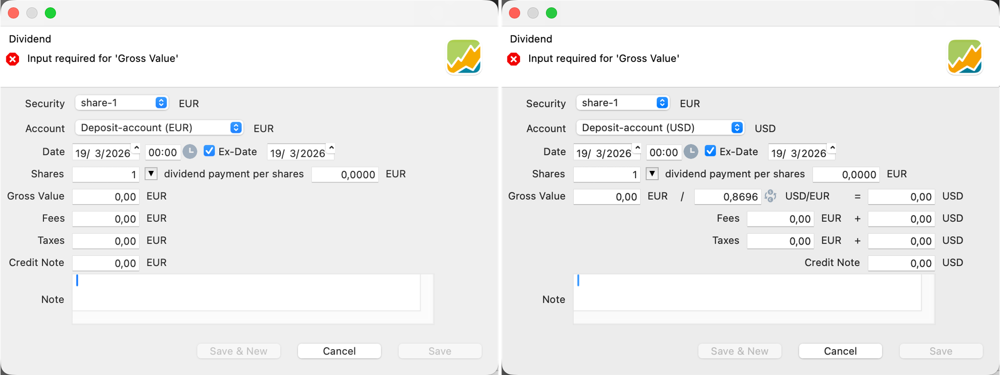

A dividend is a distribution of profits by a corporation to its shareholders. When the distribution is made in cash, you should use this transaction type. For a choice or stock dividend, refer to [Handling choice dividends](../../how-to/handling-choice-dividend.md) in the how-to section.

## Registering a dividend
With the `Transaction > Dividend` menu, you can record the dividend payment in your portfolio. You can also utilize the context menu by right-clicking. If a security was selected, the `security` field will be pre-filled for your convenience.

Figure: Dividend dialog box for same and different currency payments. {class=pp-figure}

- **Security**: A dividend is linked to a security, often a share in a company. However, dividends can also be used to record the [interest payment](../../getting-started/manage-portfolio/bonds.md#recording-the-interest-payment) on a bond. Use the drop-down to select the security from which the dividend originates.
- **Account**: Since the dividend is a cash payment, you need a deposit account to record it. Please note that if the currency of the security and deposit account do not match, additional fields are added to the dialog box (Figure 1; right panel).
- **Date**: there are four [dates](https://www.investopedia.com/terms/d/dividend.asp) relevant regarding dividends. Perhaps the payment date is the most obvious to use in PP. You can optionally record the ex-date for a dividend by clicking the checkbox and entering a date. The ex-date is the date on which the instrument is traded on the exchange without the dividend. Currently, this date is not used and is purely informational. It could be used to calculate performance more precisely (the price adjustment occurs on the ex-date) and to assign dividends to positions more accurately; see also below for an example of the performance calculation.
- **Shares**: a dividend is paid per share. The number of shares is automatically filled in upon selecting a date. You can change the number manually; reselecting another date will reset the number to the actual available at that time.
- **Dividend payment per share**: This is the amount agreed upon by the company to pay for each share.  Your broker will provide you with this information. The currency is determined by the share. Many financial websites, such as [Yahoo Finance](https://finance.yahoo.com/quote/MSFT/history?filter=div) or [investing.com](https://www.investing.com/dividends-calendar/), offer historical overviews of dividend payments.
- **Gross value**: The gross value is automatically calculated as shares multiplied by the dividend payment per share. You can modify this value, but doing so will consequently alter the dividend payment per share value.
- **Exchange rate**: This field appears if the currency of the security and the deposit account don't match. The [exchange rate](../view/general-data/currencies.md) is retrieved from the ECB for the entered date. The value can be changed manually. Selecting another date will retrieve a new value from the ECB. You can also use the `Invert` button to change the conversion direction, for example, from EUR to USD or vice versa. The gross value in the foreign currency is calculated, and additional fields for fees and taxes are included.
- **Fees and taxes**: Can be entered separately; also in the foreign currency.
- **Credit note**: This is the calculated net value, which is the Gross value minus fees and taxes. Modifying this value manually will affect the Gross value, and consequently, the dividend per share as well.
- **Note**: Additional textual info about this dividend payment.

## Effect on performance

**Taxes** are included in performance calculation at the portfolio level but excluded from the calculation at the security level performance. **Fees** are always included. The reason lies in what each metric is trying to measure: portfolio performance tracks how your wealth evolves, while security performance measures how well an instrument performs on its own merits.

At **portfolio level**, fees and taxes are treated identically. Both represent real money leaving the portfolio permanently — paid to a broker or withheld by the tax authorities. They reduce the deposit account and therefore the ending portfolio value. The more you pay in fees and taxes, the lower your return.

At **security level**, the focus shifts to the investment itself, independent of the investor. Fees are included because they are closely tied to the security: some securities are more expensive to trade than others. Taxes, however, depend more on the investor — in which country they live, when the income is taxed, and their broader financial situation. Because taxes are not a stable or comparable feature of the security, they are excluded from calculation, ensuring that the performance reflects the investment rather than the individual investor.

 An in-depth explanation of the performance calculation is given in [Concepts > Performance](../../concepts/performance/index.md).
