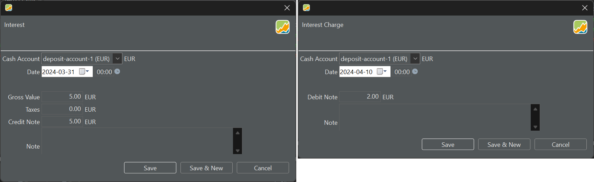

Interest is the compensation received for lending money, such as depositing funds into a cash account. It reflects a traditional bank arrangement where you may earn monthly or yearly interest on the funds held in the account. The transaction is initiated by the credit note from the bank. Taxes can be withheld from the interest payment. Conversely, an interest charge is a fee incurred for borrowing money. When your (physical) cash account becomes negative (indicating borrowing), you pay a fee, which constitutes a debit operation for the bank.

Figure: Interest and Interest Charge transaction. {class=pp-figure}

The result of the interest and interest charge transaction is an increase or decrease of the balance of the selected cash account (see Figure 2).

Figure: Result of interest and interest charge transaction on balance.{class=pp-figure}

There could also be an effect on the performance of the portfolio. The net result on both interest transactions of Figure 1 is an earning of 3 EUR. For a reporting period of 1 year (2024) and based on the data from Figure 2, this gives:

- TTWROR: `r = 603 / 600 = 0.50%`
- IRR: `603 = 600 x (1 + IRR)^(305/365) for IRR = 0.60%`

Please note that the 600 EUR deposit is considered by Portfolio Performance as a (performance neutral) cash inflow but the interest and interest charge transactions are not. They only affect the balance of the deposit account and therefore also the MVE of the portfolio.