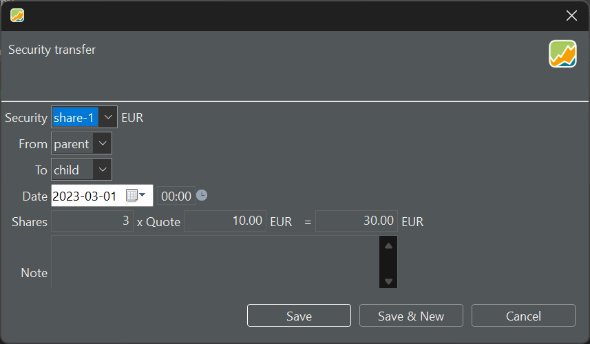
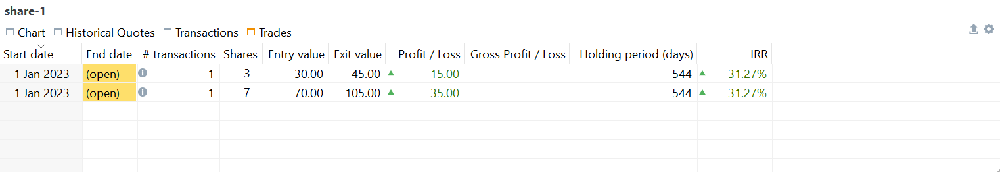
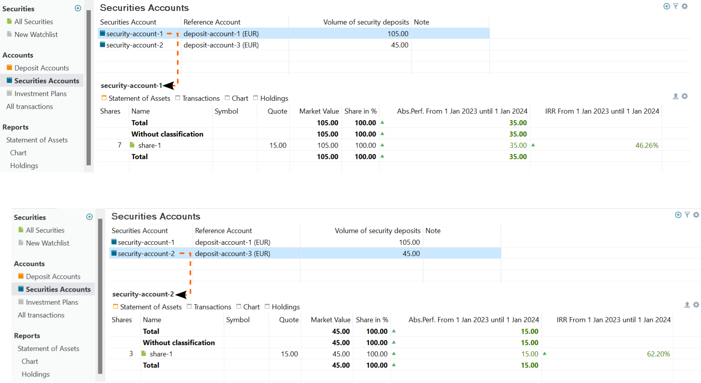

The `Security Transfer` and `Transfer between Accounts` menu options are only visible when there is more than one security account and/or deposit account present.

## Transfer between Accounts

You can transfer money between deposit accounts of the same currency or different currencies. In Figure 1, for example, 100 EUR is transferred from `deposit-account-1 (EUR)` to `deposit-account-2 (USD)`. Given the exchange rate of 1.0696 EUR/USD, this will result in a deposit of 106.96 USD in the latter account.

The exchange rate is automatically retrieved from the [ECB](../view/general-data/currencies.md) for the specified date, but it can be manually overridden if necessary.

Figure: Transfer between EUR- and USD-deposit account. {class=pp-figure}

 
## Security Transfer
 
As the name suggests, this transaction involves transferring a specified number of shares from one security account to another. It is only accessible in the menu when the portfolio includes more than one security account. The topic [Reference > View > Accounts > Securities Accounts](../view/accounts/security-account.md#one-or-more-security-accounts) summarizes some arguments for portfolios with only one security account or multiple accounts.

There are various scenarios where security transfers might be necessary. For instance, if you have multiple brokers each with their respective securities accounts, you might need to transfer a security between them, mirroring real-life scenarios where you move a security from one broker to another.

Another common scenario involves making provisions for the future, such as reserving some of your stocks for your children. While keeping the stocks in your portfolio, you may transfer a portion from the *parent* account to a *child* account. This segregation ensures that selling stocks from the parent account doesn't impact the performance of the child account, enabling separate performance tracking.

Figure: Security transfer dialog box.{class=pp-figure }

With three drop-down boxes, you can select the security (`share-1`), as well as the source (`security-account-1`)and target (`security-account-2`) security account; see Figure 2. Several checks are conducted; for instance, you cannot transfer a security that is unavailable or insufficiently available in the source account. You also need to provide the date of the transfer, the number of shares, and the quote price.

Although it's technically one transaction, behind the scenes, PP creates two "virtual" transactions (refer to Figure 3; information pane). The security transfer is divided into a Transfer (Outbound) of 3 shares from `security-account-1`, followed by a Transfer (Inbound) into `security-account-2`. However, both transactions are considered as a single entity. Editing one of them will trigger the Security Transfer dialog. Deleting one transaction will also remove the other.

Figure: Result of the Security Transfer transaction.{class=pp-figure}

A consequence of the Security Transfer transaction is the creation of two open trades, as depicted in Figure 4. The second trade covers the remaining 7 shares in `security-account-1`, while the first trade comprises the four transferred shares in `security-account-2`. Both trades are recorded as starting from the date of the original security purchase. While it could be argued that the second trade should start from the date of the transfer, this is not the case. Additionally, both trades share the same buying price, although an argument could be made to use the quote price of the transfer instead. It should be noted that the date and quote price entered with the Security Transfer do not appear to be utilized in this process.

Figure: Resulting trades from the Security Transfer transaction.{class=pp-figure}

## Setting the quote price

Why is a quote price required? What price should you enter: the purchase price, the historical price at the transfer date, zero? Why can't you *just* transfer the shares from one account to another? The short answer is performance tracking.

Considering the scenario from above, transferring 3 shares (see figure 2). The stock is purchased at 10 EUR per share on Jan 1, 2023. The historical price at the time of transfer was 12 EUR/share, although you transferred it at 10 EUR/share (see Figure 3). Today (2024-01-01), the price has risen to 15 EUR per share. What is the performance of both security accounts for the reporting period 2023-01-01 until 2024-01-01? Remember, the reporting period spans from the end of the first day (e.g. 2023-01-01) to the end of the last day.

Figure: Absolute performance and IRR of source and target accounts (quote price transfer = 10 EUR). {class=pp-figure}

The formula for [absolute performance](../view/reports/performance/index.md#absolute-change) is: **MVE - MVB + CFout - CFin**, where MVE = Market Value at the End (of the reporting period), MVB = Market Value at the Beginning, CFout = cash flows out of the account, and CFin = cash flows into the account. The absolute performance of an account is the difference between the beginning and end value of that account, but corrected for the in- and outflows.

1. If the quote price is set to the purchase price (10 EUR):

    * *Absolute Performance*
    
        - Source: `MVE (7 x 15) - MVB (10 x 10) + CFout (3 x 10) - CFin (0) = 35 EUR`.
        - Target: `MVE (3 x 15) - MVB (0) + CFout (0) - CFin (3 x 10) = 15 EUR`
        
    * *IRR* [[Equation](../view/reports/performance/index.md)]

        - Source: `(7 x 15 EUR) = (10  x 10 EUR) x (1+46%)^(365/365) - (3 x 10) x (1 + 46%)^(306/365)`
        - Target: `(7 x 15 EUR) = (0  x 10 EUR) x (1+62%)^(365/365) + (3 x 10) x (1 + 62%)^(306/365)`. The transfer is executed on March 1, 2023, with 306 remaining days until MVE.

2. If the quote price is set to the historical price at the moment (12 EUR):

    * *Parent* account: `(7 x 15) - (10 x 10) + (3 x 12) - 0 = 41 EUR`.
    * *Child* account: `(3 x 15) - 0 + 0 - (3 x 12) = 9 EUR`.

3. If the quote price is set to zero (which is actually not possible in PP; choose 0.1 for testing):

    * *Parent* account: `(7 x 15) - (10 x 10) + (3 x 0) - 0 = 5 EUR`.
    * *Child* account: `(3 x 15) - 0 + 0 - (3 x 0) = 45 EUR`.

As can be seen, the absolute performance varies a lot: from positive +41 EUR to 5 EUR for the source account. The bad performance is, of course, very understandable. Transferring 3 shares out of the source account for nothing will severely impact the performance.

The performance of the portfolio should be the sum of the account performances, which in all three cases is equal to 40 EUR. The MVE of the portfolio is (7 + 3) * 14 EUR = 140 EUR. The MVB = 10 * 10 EUR = 100 EUR. The absolute performance of the portfolio is thus indeed 40 EUR.