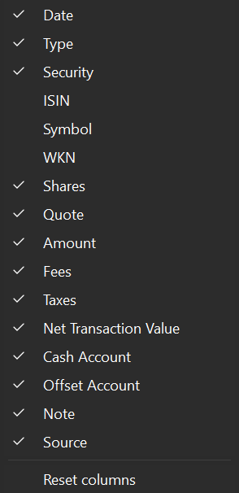

# View &rsaquo; Accounts &rsaquo; All Transactions

The `All Transactions` view displays a table with all the transactions of the portfolio in the main pane, sorted by the transaction's creation time in the portfolio (see Figure 1). The default view presents the columns `Date`, `Type`, `Security`, `Shares`, `Quote`, `Amount`, `Fees`, `Taxes`, `Net Transaction Value`, `Cash Account`, `Offset Account`, `Note`, and `Source` (see the [Glossary](../../../concepts/PP-terminology.md) for a definition of these terms).

Figure: The All Transactions View.{class=pp-figure}

Although it's less useful than in the `All Securities` view, the information pane at the bottom (not shown in Figure 1) can provide additional details about the security attached to the selected transaction in the main pane.

## Settings

Figure: The Show or Hide columns button (gear).{class=align-right style="width:30%"}

Click the column heading to sort the table in ascending (&and;) or descending (&or;) order based on that column. You can rearrange any column by dragging its header. Drag the divider line between two columns to adjust the with of the left column or double click to best fit. You can rename or hide a column with the context menu (right-click on the column header). Adding, deleting or resetting the columns to their original layout is done with the Show or hide columns icon (gear symbol top right). The default columns are shown in Figure 1; they are also checked in Figure 2. Figure 2 gives a list of all available columns.

As can be seen, all available columns are displayed except `ISIN`, `Symbol`, and ´WKN´, which are typically security related terms (see the [Glossary](../../../concepts/PP-terminology.md)).

## Search

In a typical portfolio, the transaction table can contain hundreds of rows. However, you can use the search function to narrow down the displayed rows. This function scans all cells in every column, and if the cell contains the search value, the corresponding transaction (row) will be displayed. For example, entering `share-3`in the Search box of Figure 1, will narrow the list down to the first row. Entering `share` (or for that matter `sh` is enough) will display all transactions with the security column (in fact every column) containing the word `share`. The function searches through all available columns, whether they are displayed or not. You can not use wildcards such as * or ?, nor limit the search function to one column only.

## Filter

Figure: The Filter Securities button.{class=align-right style="width:30%"}

Another method to limit the number of transactions is by using the "Filter Securities" button located in the top right corner of the interface. Figure 3 showcases all potential options available. By default, transactions from `All transaction types` of the `Entire portfolio` are displayed in the table.

There are two major Filter groups: `Filter data by transaction type` versus `Filter data by portfolio and reference account`. The first group selects transactions such as all Buys or Sells. The second group selects transactions from a specific security account. The various options are somewhat self-explanatory. The translation `Transactions with investment vehicle` for the German original `Buchungen mit Wertpapier` is somewhat unfortunate. A more appropriate term would be `Transactions with securities`.

The filter operates on an "either-or" basis. Choosing one option from a group will replace any previous selection in that group. For example, you can choose "Buys and Sells" or "Buys" only, or "Sells" only.

The Filter command and the search function work together and complement each other. For instance, searching for "USD" and filtering for "Deposits" will result in displaying only the second row of Figure 1: a USD deposit.

There are some limitations. For example, you can only filter on *reference* account, not on any cash account such as `broker-A (USD)`. However, with the `New` option, you can create a filter for whatever (cash) account. Please note, that it seems also not possible to filter for Transactions **without** taxes or fees.

With the `Manage`option, you can rename a (new) custom filter, add elements to it or delete the filter. The `Remove entries` option will reset the filter to the entire portfolio in the second group.

## Export

Figure: Export selected rows.{class=align-right style="width:30%"}

With the Export button located at the top right, you have the option to save the displayed transaction table as a CSV or JSON file. Only the columns and rows currently displayed, including the header row, will be saved.

If you made a selection in the table, the Export button will provide you with four options instead of two (see Figure 4), including the possibility to export only the selected transactions.

!!! Note
    
    The [File > Export](../../../reference/file/export.md#account-transactions) will always export **ALL** transactions. If you are only interested in a specific selection, use this option.
