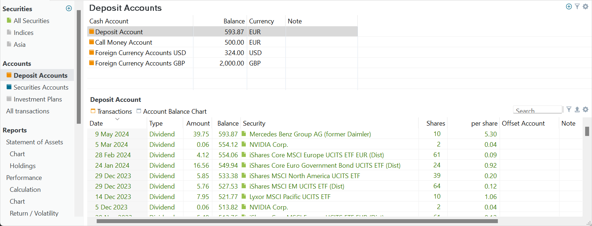
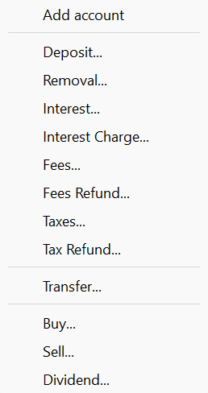
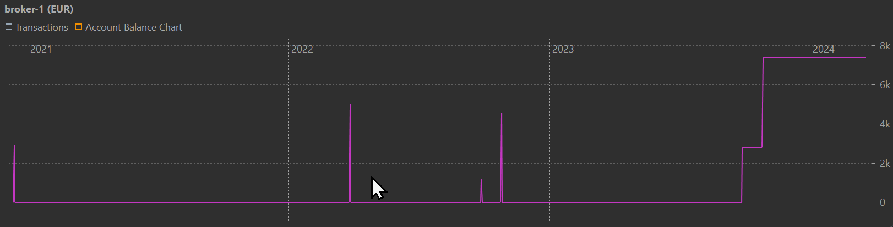

# View &rsaquo; Accounts &rsaquo; Deposit Accounts

A deposit account serves as a central hub for managing cash flow within the portfolio, allowing users to allocate funds for investment activities and track incoming and outgoing cash transactions. One can visualize it as a list, akin to a shopping list, where transactions such as withdrawals and deposits of digital money are recorded. There can be many deposit accounts within one portfolio, for example, for different currencies that are traded. As part of the installation process, at least one security account and one deposit account have already been created.

Figure: Example of Deposit Accounts. {class="pp-figure"}

In Figure 1 (main pane), there are three deposit accounts named `Broker-1 (EUR)`, `Broker-1 (USD)`, and `broker-2 (EUR)`. Based on their names, it can be inferred that these accounts likely represent two cash accounts held at `Broker-1` (in EUR & USD) and one cash account in EUR with `Broker-2`. It may appear somewhat redundant to add "EUR" and "USD" in the name of the account because you also need to specify the currency for each deposit account (see the third column in Figure 1). On the other hand, in many dialogs (for example when buying a security) you need to specify the deposit account. The added currency in the name of the deposit account will help you then choosing the correct one.

Of course, you can use other names depending on your needs. For example, if you want to keep all your dividends and taxes in a separate account, you could name it `Dividends` and `Taxes`. If you receive dividends in both EUR and USD, then you need also two deposit accounts.

Figure: Add account. {class=align-right style="width:20%"}

To create a new deposit account, click on the green + icon located at the top right (refer to Figure 2). Then, select the option `Add account`. Since you're in the Deposit Account view, a new deposit account named `No Name` will be created with the default currency of the portfolio. Remember to change the currency if needed by double-clicking on the currency field (e.g., EUR) and selecting another currency from the dropdown menu. While navigating the currency list, you can use the first letter of the desired currency for faster navigation. Initially, the balance of the newly created deposit account will be zero.

A deposit account can be negative. However, good practice requires that you first add a deposit of a large enough sum to cover the subsequent buy transactions, just as you would do with a real broker.

To deactivate an account, right-click on the account and choose `Deactivate account` from the context menu. The account name will appear greyed out and will no longer be visible in the list of deposit accounts when making a deposit transaction. With the Filter icon (top right), you an hide inactive accounts.

Using the Show or Hide columns option (accessible via the gear icon at the top right), you can customize the view by hiding or adding columns. Available columns include: Cash account (name), Balance, Currency, Notes, and Attributes. Additionally, you can hide or rename a column through the context menu.

The information pane at the bottom displays the transactions of the selected deposit account in the main pane. It consists of two tabs: Transactions and Account balance chart. The Transactions tab displays fields such as date, type, amount, and balance of each transaction. The Account Balance chart provides a graphical representation of the account balance. Due to fewer data points compared to a historical prices graph, the chart may appear more blocked. Figure 3 illustrates the balance of the `Broker-1 (EUR)` account, where the early spikes are the result from deposits followed by purchases on the next day.

Figure: Example of the Account Balance Chart. {class=pp-figure}

The context menu, accessed by right-clicking on the chart, offers the same options as many other charts; for example, you can refer to the [chart menu of the `All Securities` info pane](../../view/securities/all-securities.md#chart-menu) for more information.