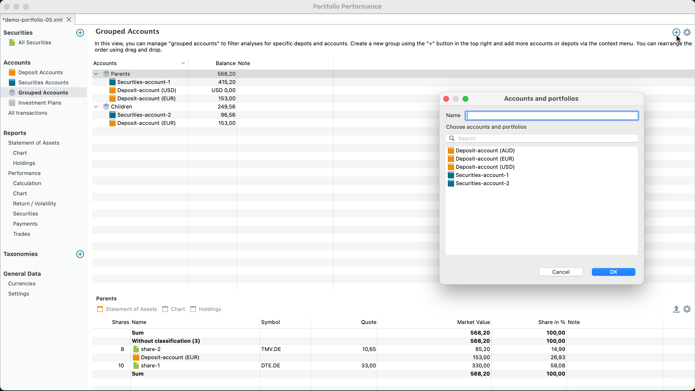

A portfolio can contain multiple `securities` and `deposit` accounts. For example, your portfolio might have securities accounts with multiple brokers, each with its own deposit account. Alternatively, you may want to separate investments made for yourself as a parent from those made for your children into different accounts.

Figure: Filter menu. {class="align-right"}

In views with the :material-layers-triple: icon, you can filter the results according to selected accounts. For example, in the [Statement of Assets](../reports/statement/index.md) view, you can filter the calculation results for a specific account or a combination of accounts (see Figure 1).

With the :material-layers-triple: `Grouped Accounts` view, these filters have their own dedicated view for management. Click the menu `View > Accounts > Grouped Accounts` or select the option in the sidebar. Use the :octicons-plus-circle-16:{.green} `New filter ...` button to add new filters.

Figure: Grouped Accounts. {class="pp-figure"}

As shown in Figure 2, [demo-portfolio-05.xml](../../../assets/portfolios/demo-portfolio-05.xml) contains two `securities` accounts and three `deposit` accounts. A filter named `Parents` includes `Securities-account-1` and the EUR and USD deposit accounts. The `Children` filter displays only the results from `Securities-account-2` and the EUR deposit account.

You can drag and drop to rearrange the order of the filters. The sort order of the accounts within a filter is determined by the sorting order of the column (click `v` or `^` on the column heading). Only three columns can be displayed: `Accounts`, `Balance`, and `Note`. Use the :gear: `Show or hide columns` icon to adjust the visible columns.

The information pane at the bottom provides detailed information about the selected account in the main pane. For more details, refer to the sections on [Statement of Assets](../reports/statement/index.md), [Chart](../reports/statement/statement-chart.md), and [Holding](../reports/statement/holdings.md). These views are filtered according to the selected filter in the main pane.

You can also create and manage filters in other views. Click the :material-layers-triple: icon to access the filter options. Creating new filters in other views, such as the Calculation view, will automatically add them to the `Grouped Accounts` view, where they will appear.

