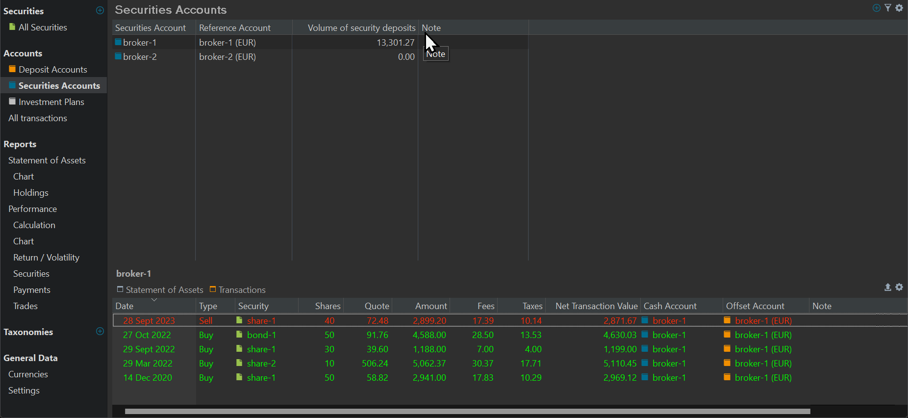

# Types of Accounts
An account is a collection of [transactions](../../transaction/index.md). These transactions could include buy and sell transactions of securities (shares, etc.) for a Securities account or withdrawals and deposits of money for a Deposit account. Each account has a default currency attached. As part of the installation process, you have already created at least one Security account and one Deposit account.

Portfolio Performance (PP) has two main types of accounts: [Deposit](./deposit-account.md) and [Securities](./security-account.md) accounts. They are described quite well in the [Guide on Getting Started](https://forum.portfolio-performance.info/t/guide-on-getting-started/5390) by Thomas (Contributor); you will need to scroll quite far down. Other related terms are Reference account, Offset account, and Cash account.

Figure: Example of Deposit Account. {class="pp-figure"}

Figure: Example of Security Account. {class = "pp-figure"}

## Related Terms

### Cash Account

The term Cash Account is somewhat inconsistently used. In Figure 1 (main pane; first column) it refers to a Deposit Account; which is in line with the name `Cash` Account. In Figure 2 (information pane bottom) the `Cash Account`column refers to a Security Account (broker-1). 

### Reference Account

A security account is always associated with a deposit account. This is the deposit account that will be used (if no other is explicitly assigned) for any buy or sell transaction on that security account. This deposit account is called the Reference Account. In Figure 2, the `Broker-1` security account has a reference (deposit)account named `Broker-1 (EUR)`.

The Reference account of a Security account must be set when creating this account (see Figure 2 of [Creating a Portfolio](../../../getting-started/create-portfolio.md)). You can always change the Reference account by selecting `Accounts > Securities Accounts` from the left sidebar. Double-click on the relevant Reference account currency and choose a new one from the drop-down menu (see Figure 2; second column).

### Offset Account

The offset or counter account is an essential component when dealing with securities transactions. It acts as the counterpart to the securities account. In other words, for every transaction that occurs in the securities account, an equal and opposite entry is recorded in the offset account.

When you perform actions like buying or selling securities within your securities account, these transactions are balanced by corresponding entries in the offset account. For example, when you buy securities, the purchased securities are added to the securities account, and an equivalent amount of cash is withdrawn from the offset account. This ensures that the overall balance of your accounts remains zero or balanced.

However, also the term "Offset account" is a relative concept. Compare the bottom panels of Figure 1 and 2. For a `Deposit Account`(Figure 1), it refers to a `Security Account` and vice versa.
