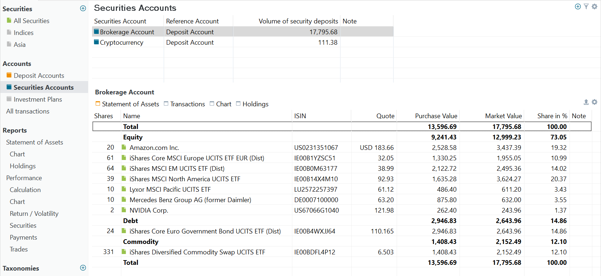
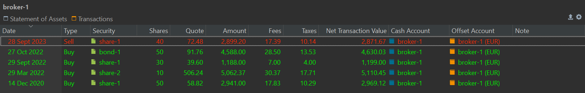

# View &rsaquo; Accounts &rsaquo; Securities Accounts

The `Securities Accounts` view presents a list of all security accounts in the main pane (top panel). For each account, the total market value of its assets is displayed as `Volume of security deposits`. The user interface (UI) of the main pane resembles that of the [Deposit Account](./deposit-account.md).

## Main pane

Figure: Example of Securities Accounts. {class = "pp-figure"}

A security account will hold your securities and will be used for buying or selling securities. A securities account is most often named after the broker or bank that you use for buying or selling. But other variants are possible. For example, you could collect all your bitcoin investments into a separate account `crypto`. 

Note that although `broker-1` has two deposit accounts (see [figure 1](images/sb-accounts-deposit-accounts.png) of Deposit Account), only one of them `broker-1 (EUR)` is set as the reference account. The bottom panel shows the purchase transaction with the `Broker-1`account.

## Information pane

The information pane features two tabs. The `Statement of Assets` tab, depicted in Figure 1, comprises a list of all assets in the account. It includes details such as the number of shares, the name and symbol of the asset, the latest price, the total market value (computed as shares multiplied by Quote), and the percentage of the asset in the total portfolio.

With the `Show or hide columns` icon (gear), you can add numerous other fields such as purchase price, dividends, and many more. These fields are described in full detail in [View > Reports > Statement of Assets](../reports/statement/index.md#available-columns). The Export Data as CSV icon will save this table as a CSV-file.

Figure: Transactions tab of the Information pane. {class = "pp-figure"}

The gear icon will let you add a few more fields such as `ISIN`, `Symbol`, and `WKN`. The export button will save the displayed table as CSV-file.

## One or more security accounts?

Should you create only one security account to hold all your transactions?

- Each security account is associated with a corresponding deposit account, established at the time of creation. When selecting a security account for a buy or sell transaction, the reference deposit account is automatically chosen. Manual selection is unnecessary in this case. However, opting for a different deposit account for the transaction necessitates manual selection, involving an additional click.
- In the portfolio view, you see the combined data from all sub-accounts. This means you get a single, unified overview of your investments without having to check each account separately.
- On the other hand, the Reports > Statement of Assets > Holdings pie chart can become quite crowded for the entire portfolio. Splitting it up into separate accounts is an easy way to make it more manageable. With the filter, you can create any combination of security and deposit accounts to view. This filter can also be used in other views.
- If you hold the same securities in one account, it’s recommended to set up separate accounts. This is because PP uses the First-In-First-Out (FIFO) method, where the oldest pieces are always sold first. For instance, if both you and your partner have purchased the same security at different times, merging them into a single security account will always prioritize selling the oldest shares when executing sell orders.

