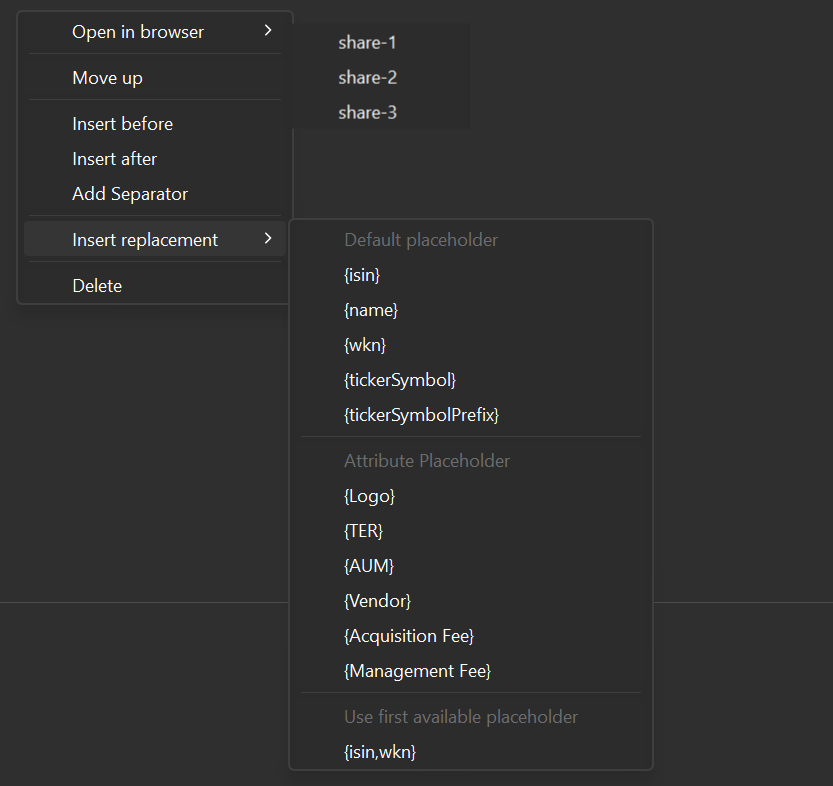

`Settings` is a submenu under `View > General Data`. Five sub-panels or tabs are available.

- # Bookmarks
    Most financial websites offer the option to search for a specific security. For instance, by clicking on the search box at [https://www.ariva.de/](https://www.ariva.de/), you can locate a security based on its `name`, `WKN`, or `ISIN`.

    Figure: Defining additional attributes.{class=pp-figure}

    

    The bookmarks defined in the settings panel serve to streamline this process. You can then `Open in Browser` any security by right-clicking on that security or transaction. The required attribute for that website will be automatically embedded in the URL, guiding you to the appropriate webpage on the financial site.

    The list contains several examples. On the [forum](https://forum.portfolio-performance.info/t/verschiedene-links-fur-im-browser-offnen/629), many more are suggested along with some workarounds.

    Using the `New Bookmark` icon (top right), you can add custom bookmarks for your personal situation. A line named "New Bookmark" is added to the list with the URL `http://example.net/{tickerSymbol}?isin={isin}&wkn={wkn}&name={name}` (see Figure 1, last line). Double click name or URL to change the value. You need to inspect the original website to figure out how to form a correct URL. For example, finance.yahoo.com requires a URL like https://finance.yahoo.com/quote/NVDA to retrieve the webpage of NVIDIA. Using the placeholder {tickerSymbol}, the URL will be dynamically populated with the appropriate symbol for the chosen security during runtime.

    Figure: Context menu of the bookmarks page.{class=align-right style="width:50%"}

    

    The available placeholders are listed in the context menu (accessible via right-click) on the bookmarks page under the "Insert replacement" option (see figure 2): {isin}, {name}, {wkn}, {tickersymbol}, and {tickersymbolprefix}. In the ticker format XXX.YY (for instance, DTE.DE), XXX corresponds to {tickersymbolprefix}, and xxx.YY represents {tickersymbol}. For some websites, you may need only the {tickersymbolprefix}.

    With this context menu, you can manage the bookmark list.

    - **Open in browser**: a second pop-up displays all available securities; this could be a very long, unsorted list. Opening a webpage from a selected security within the `All securties` view is a better approach.
    -**Move up**: moves a bookmark one line up in the list; for example to sort the bookmarks in a particular order.
    - **Insert before** and **Insert after**: using the new bookmark icon (see further) will append it at the end of the list. Using these options enable the placement of a new bookmark before or after the selected one.
    - **Add separator**: inserts a blank line after the selected bookmark.
    - Insert replacement: displays an additional pop-up with the available placeholders.  The selected placeholder will be append at the end of the URL. Please note that you can separate placeholders with a comma, indicating that the first available placeholder (in the website) should be used.
    - **Delete**: removes a bookmark from the list.

     

- # Attributes: Securities

    New attributes or fields can be defined for Securities (see Figure 2), Deposit Accounts, Security Accounts, and Investment plans.
    Besides the attributes which are already defined in the Security Master data such as Name, ISIN, Quote Feed, ..., Figure 2 contains six additional attributes such as logo, Total Expense Ratio, ....

    Figure: Defining additional attributes.{class=pp-figure}

    

    You can create new custom attributes for yourself with the `New Attribute with field type` icon (top right). Clicking on it will display a subpanel with the available data types (see Figure 2). For example, the existing `Àctive` attribute is probably of type `Yes/no`, while the name attribute should be of type `Text`.

    These additional attributes can be made will be visible in any table view concerning securities and in the panel [Additional Attributes](../../file/new.md#additional-attributes) of a Security. These attributes cannot be used in calculations, but you can sort the list with them.

- # Attributes: Deposit Accounts
- # Attributes: Securities Accounts
- # Attributes: Investment plans

