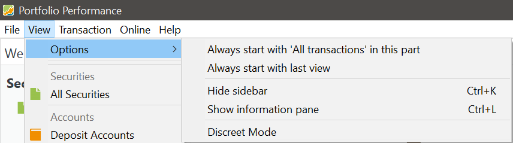

# Options

The **Options** submenu includes various settings to customize the program's startup behavior and the visibility of elements on the screen.

- **Always start with 'xxx' in this part**  
  The `xxx` part is variable, depending on the currently displayed view. For example, if the current view is *All Transactions*, the message will read as `Always start with 'All transactions' in this part`. Selecting this ensures that this view is always displayed in the top panel on startup.

- **Always start with last view**  
  This option makes the program remember the last view (only the top panel) that you used and show it again at the next startup.

- **Hide sidebar ... Ctrl+K**  
  This option hides or shows the sidebar on the left side of the screen. You can also use the keyboard shortcut `Ctrl+K` to toggle this.

- **Hide information panel ... Ctrl+L**  
  This option hides or shows the bottom panel of the screen, which displays details and charts related to the top panel. The keyboard shortcut `Ctrl+L` toggles this option.

- **Discreet Mode**  
  This option toggles the visibility of sensitive monetary values in your portfolio, providing a more discreet and private display. For example, the Number of Shares, Market Value, Taxes, Fees, and other details are replaced by `***`, ensuring privacy. However, Purchase Price, Quotes, and performance percentages such as IRR remain visible.
