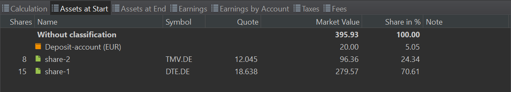
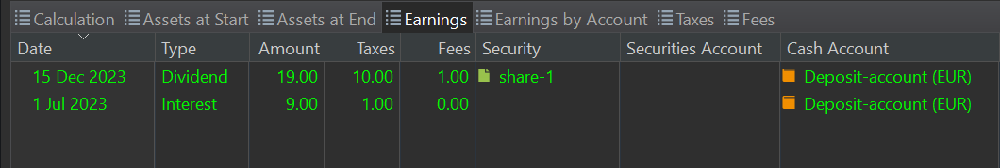

More detailed information about the performance calculation could be found under the menu `View > Reports > Performance > Calculation` or in the sidebar. The main pane contains the title bar icons (top right) and seven tabs or panels: `Calculation`, `Assets at Start`, `Assets at End`, `Earnings`, `Earnings by Account`, `Taxes`, and `Fees`. The information pane displays detailed information about the item that is selected in the main pane.

Figure: Calculation panel. {class=pp-figure}

 

## Main Pane

Figure: Filter menu.{class=align-right style="width:20%"}

The title bar (top right) displays the chosen [Reporting period](../../../../concepts/reporting-period.md) (named `2023`in Figure 1 & 2), and some utility icons. The `Filter Data by portfolio and Reference account` lets you narrow down the info shown for either the whole portfolio or a specific securities account, alone or with its associated deposit account. By default, it's set to `Entire portfolio`. You can only pick one filter option. You can also make your own `New` filter by choosing accounts to combine and giving it a name. They are listed below the defaults. The option `Manage...` lets you edit or delete custom filters. Just select the filter name and use the right-click menu to add additional accounts or delete the filter. Clicking the triangle reveals the chosen accounts, which you can delete individually. The option `remove entries` will delete all custom filters.
    
Using the `Export Data as CSV` icon, you can save each panel as a CSV file. This is useful for performing calculations, such as comparing `Assets at Start` and `Assets at End`, in a spreadsheet program. The columns in the CSV file match the headings of the panel, such as `Shares`, `Name`, `Symbol`, `Quote`, ....

The `Configure view` icon provides only one option, named `Pre tax`. A check mark is added when selected.

### Calculation & other detail panels

The calculation panel (see Figure 1) contains the initial and final value of the selected account or portfolio and all the different categories of changes that lead from the former to the latter. You can collapse or expand a single category or all categories at once with the context menu (right-click). A fully collapsed version of this panel is also displayed as a widget in the parent [Performance](./index.md) menu. 

- Initial Value: This represents the balance of the portfolio (or selected account) at the beginning of the reporting period. As can be seen from figure 1 & 2 the reporting period is set to the year `2023`.  It's important to note that this value is fixed at the end of the day, meaning transactions from the first day are *not* included. You can verify the Initial Value and its components in the Assets at Start panel (Figure 3). In terms of our [performance equations](../../../../concepts/performance/index.md), the MVB symbol (Market Value Begin) refers to this value.

    Figure: Assets at Start panel. {class=pp-figure}

    

    Between Initial and Final Value are the different categories of changes that lead from the former to the latter: Capital Gains, Earnings, Fees and Taxes, Cash Currency Gains, and Performance Neutral Transfers (see Figure 1).

- Capital Gains: A capital gain or loss refers to the increase or decrease in the value of a capital asset, such as stocks, bonds, or real estate, between the time it is purchased and the time it is valued *or* sold. In the latter case, the term "Realized Capital Gain" is used. For each security remaining in the portfolio, the absolute gain or loss is calculated. It is important to stress that the gain or loss is expressed in the portfolio's currency; *not* the currency of the asset. If the asset is denominated in a foreign currency, any gain or loss due to fluctuations in the [exchange rate](../../../file/currency.md) is accounted for and indicated in the column `thereof foreign currency gains`. Hovering with the mouse over the value will display a pop-up with a more detailed calculation. For example, take the calculation of `share-3` (see Figure 1 - information pane):

    - Jan 1, 2023: purchase of 5 shares (share-3) at 20 AUD/share = 100 AUD x 0.6372 AUD/EUR (exchange rate on Dec 30, 2022) = 63.72 EUR.
    - December 31, 2023: valuation of 5 shares at 15 AUD/share = 75 AUD x 0.6149 AUD/EUR (exchange rate on Dec 29, 2023) = 46.12 EUR.
    - Capital loss = 63.72 - 46.12 = -17.60 EUR.

    However, this loss is exacerbated by the change in the exchange rate. The 100 AUD purchased on Jan 1, 2023, were valued at 63.72 EUR, whereas on December 31, 2023, they were valued at only 61.49 EUR. Thus, quote price remaining unchanged, your investment (expressed in EUR) decreased already by -2.33 EUR due to the difference in the exchange rate. The total capital loss of -17.60 EUR is partly caused to the currency exchange loss of -2.33 EUR.
    
- Realized Capital Gains: refer to the profit or loss that occurs when an investment is sold for a price different from its original purchase price. The *hypothetical* capital gains or losses, as described above are then realized. There is only one realized capital gain in Figure 1. On April 12, 2023, 5 shares of `share-1` are sold for 5 x 22.40 EUR/share = 112 EUR (excluding fees and taxes). At the time of MVB (December 31, 2022), they were valued at 5 x 18.638 EUR/share = 93.19 EUR. The realized capital gain is thus 112 - 93.19 = 18.81 EUR. It's worth noting that `share-1` was purchased in two batches: 10 shares on January 15, 2021, at 15 EUR/share and 5 shares on January 14, 2022, at 16 EUR/share. Due to the FIFO principle that PP implements, the 5 shares that were sold are those from the first batch of 10. If we had considered a longer reporting period, thus including the initial purchase, the valuation of the sale would have been determined by the purchase price of the initial acquisition, not the second one.

- Earnings: Profit generated by the investment, consisting of dividends and interest. As can be seen in Figure 4, a dividend of 30 EUR (including fees and taxes) was paid for `share-1`. It was deposited in a cash account. That same cash account earns an interest, paid on July 1, 2023.

     Figure: Earnings panel. {class=pp-figure}

    

    A summary per account with a breakdown of dividend, interest, total earnings, fees, and taxes is provided by the Earnings by Account panel.

- Fees and taxes: Fees are charges imposed by banks, brokerage firms or investment platforms for their services. Taxes are levies imposed by the government on investment income. Fees and taxes are mostly recorded at the transaction itself (buy, sell, dividend, interest) but they can also be booked as a separate transaction.  For example, the one euro tax on the separate interest transaction is recorded as `Other` in Figure 1. The taxes on the purchase and dividend of share-1 are summed as 12 EUR.

     Figure: Taxes and Fees panel. {class=pp-figure}

    

- Cash Currency Gains: read the following section about Performance neutral transfer first to better understand this topic. Since some deposits and investments are made in a foreign currency, e.g. AUD, cash currency gains or losses could occur. Some of losses are made at sale time. For example,  (see above capital gain). There is also a loss on the remaining deposit since Jan 1, 2023 on the AUD cash account. Since only 100 AUD was needed for the purchase, the remaining 400 AUD remains on the cash account. The loss on this deposit was 100 x (0.6372 - 0.6149) = 8.93 EUR

- Performance Neutral Transfers: A transfer refers to money that flows into or out of the portfolio; also named cash flow (CFin and CFout) in our [performance equations](../../../../concepts/performance/index.md).  This could be a deposit or removal (withdrawal) into or out of a deposit account. It could also be a delivery of securities into or out of a securities account. In the example of Figure 1, there is one deposit of 500 AUD at the beginning of 2023. Given an exchange rate of 0.6372 AUD/EUR, this constitutes a neutral transfer of 318.61 EUR.

    There was also a delivery of 5 x 20 USD shares on July 1. Given the exchange rate transfer of 0.9203 USD/EUR, this results in a neutral transfer of 92.03 EUR. Taken together, there was a performance neutral transfer of 410.64 EUR in 2023.

    !!! Note
        The term `Neutral transfer` stresses the fact that the transfer (of money or stock) on its own doesn't influence the performance. When an investor deposits money into their cash account, they are simply adding to the available cash balance. No profit has been made so far. The other categories (capital gains, earnings, fees & taxes, cash currency gains) are transfers that do impact your profit or performance. They are *not* neutral to performance.

- Final value: The final value represents the valuation of the chosen account or portfolio at the end date of the reporting period. Figure 6 provides a breakdown with the end value of each asset held within the portfolio or account. The final value corresponds with the MVE symbol (Market Value Begin) in our [performance equations](../../../../concepts/performance/index.md).

    Figure: Assets at End panel. {class=pp-figure}

    

## Information pane

The information pane offers comprehensive details about the selected security in the main pane. It's essentially identical to the information pane in the [All securities](../../securities/all-securities.md#information-pane) view, with the only distinction being the absence of the `Data quality` submenu.