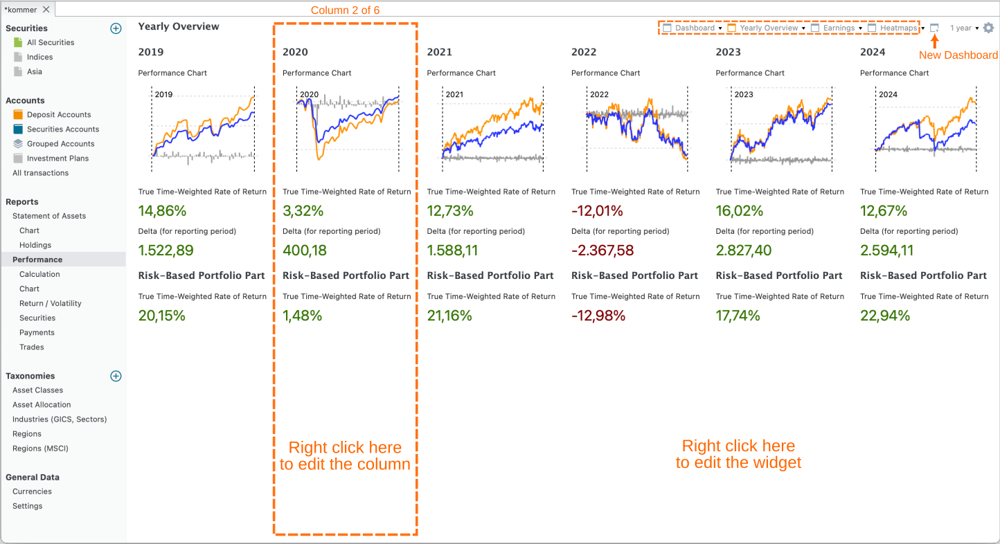
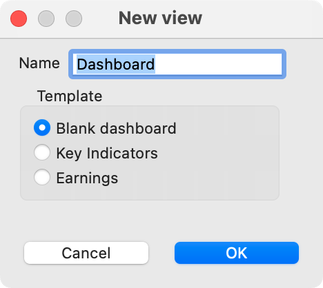
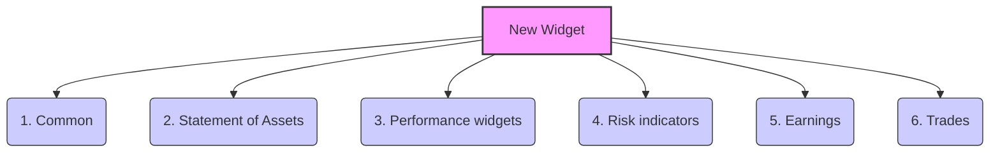
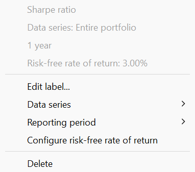

A dashboard is a configurable view that aggregates performance data into a one-page report format. You can access the default Performance dashboard through the menu `View > Reports > Performance` or with the sidebar. It contains three columns with key performance and risk indicators. A dashboard, however, can be much more complex ; see for example Figure 1.

Figure: Yearly Overview dashboard.{class=pp-figure}

You can create a new (empty) dashboard by clicking on the icon `New dashboard` at the left of the reporting period (see Figure 1). You can choose between a blank dashboard, key indicators (= the default Performance dashboard), and Earnings (see Figure 2). To remove a dashboard from the menu, click the arrow next to the name and choose `Delete`. You can move the dashboard to the first in the list (bring to front), rename the dashboard, or make a duplicate of the selected dashboard.

Figure: Creating a new dashboard. {class=align-right style="width:30%"}

A dashboard contains one or more columns; the dashboard of Figure 1 contains 6 columns.  You cannot see the borders of the column. Delete a column by right-clicking in the (empty) area. You can add a new column with the configure dashboard gear icon (top right). If there is already at least one column, you can also right-click in a column area and choose `New column on the left`,  `New column on the right`, or `Duplicate column` (see Figure 5). With `Column width` you can increase or decrease (step wise) the column width of the selected column. Of course, the width of the other columns is affected since the total width of the window stays the same. With the Option `Apply to All`, you can set the reporting period and the data series for all widgets in the dashboard.

 Each column can contain several configurable widgets: data blocks comprising a label and a numerical value or a diagram; e.g. Absolute Change or a Performance chart.  Right mouse click on an *empty space* in a column lets you manage the widgets, e.g. adding a widget. Right clicking the *widget label* lets you manage the specific widget; e.g. change the data series or reporting period.

Widgets are a very powerful tool to customize the dashboard to your liking. A thorough introduction is given in a [YouTube video by Finanzkoch](https://youtu.be/_-9iC7UqLsw) (German spoken but English subtitles are possible). A [list of very nice dashboards](https://forum.portfolio-performance.info/t/beispiele-fur-auswertungen-grafiken-und-berichte/5367/118) by fellow investors can be found at the forum.

The `New Widget` option reveals a submenu featuring six categories of widgets (refer to Figure 3). Below is a description of each widget. Right-clicking on the widget label will reveal a context menu. Most widgets feature options such as `Edit label`, `Delete`, and `Height`. You can drag and drop widgets within and between columns. Press the CTRL key (Windows) to duplicate instead of moving.

Figure: New Widget menu with overview of all available widgets. {class=pp-figure}

### 1. Common
 - *Heading*: A single line text field.
 - *Description*: A multi-line text field with a smaller font.
 - *Current date*: The text "Current Date", followed by the system date of the computer in the language and format, set in Help > Preferences > Presentation > Language.
 - *Collapsible Section*: After creation, you can drag and drop other widgets into this section. Click the ▼ (Down Arrow) icon to reveal the content widgets. Click the ▶ (Right Arrow) icon to hide the content.
  
 - *Exchange rate*: An exchange rate in the format XXX/YYY number. Right-click to choose the specific exchange rate, e.g. EUR/USD.
 
 - :material-chart-box-outline:*Trading activity*: A graph depicting time (per year and per month) is plotted on the X-axis, while the count of trades is represented on the Y-axis. With the context menu, you can add or remove the Y-axis, change the reporting period (by default the period of the dashboard is taken), or change the trading type (by default buy, sell, delivery inbound, and delivery outbound), and the filter (by default the entire portfolio).
 
 - *Securities: Limit price exceeded*: You can set a limit price per security in the security master data ([see how-to](../../../view/securities/all-securities.md#main-pane-list-all-securities)). If the current price (as of today; independent of the reporting period) of the security exceeds the limit price, the name of the security, the current price and the limit will be displayed, as well as displaying shares with dates `only in the past` or `only in the future`.
 
 - *Securities: Date reached*: As with limit price (see above), you can link a "special" date to a security as an additional attribute. This widget will exhibit the text `Securities: Date reached (xxx)`, where xxx represents the count of securities for which today's date exceeds the date set for the security. Additionally, a list of share names and dates will be provided. This list can be sorted from the context menu.

 - *Securities: Events*: An event is a kind of note that could be attached to a specific security on a particular date such as stock split, dividend payment, and note. This widget will display the event date, the type, the name of the security, and a description of the event.  
 
 - *Securities: Latest Price*. This is a single line widget with the current price of a security; which can be chosen from the context menu. The label will mention the name of the selected security.

- Security: Distance from ATH: The difference of the current price with the All Time High (ATH) price of the security, measured in %. The security should be specified with the context menu.

 - *Website*: A textbox containing the content of a website; specified by an URL in the context menu. Anchors are allowed; for example `https://help.portfolio-performance.info/en/concepts/performance/#the-money-weighted-rate-of-return`. The height of the widget can be increased with the context menu.

- Vertical spacer: This widget produces an invisible rectangle that occupies space. It is used to visually separate widgets (vertically). Hovering over the widget with the mouse will reveal its label. With right-click, you can change its height.

### 2. Statement of Assets

All widgets, except the last three, are single line text widgets. 

- *Total*: The market Value of the asset at the end of the reporting period.  The asset and the reporting period can be specified with the context menu.

- *Absolute change*, *Delta (for reporting period)*, *Delta (since first transaction)*: [see above](./index.md#absolute-change) for definition of these terms.

- *Performance-neutral transfers*: Displays the total of the performance-neutral transfers in the selected holding period; these transfers are explained in [View > Reports > Performance > Calculation](./calculation.md#main-pane).

- *Monthly performance-neutral transfers*: Shows a table listing all performance-neutral transfers. The values are broken down by year and month.

- *Invested Capital (for reporting period)* and *Invested Capital (since first transaction)*: The Invested capital in a portfolio of stocks refers to the total amount of money that has been invested in the portfolio.
- *FIRE Calculation*:  Your FIRE Number is the target amount of savings and investments you want to reach for Financial Independence / Retire Early. A common rule of thumb estimates it as 25 times your desired annual retirement expenses, based on a sustainable 4% withdrawal rate. In this widget, you set the FIRE Number manually. Time to FIRE is then estimated from your current net worth, estimated monthly savings, and estimated annual returns, compounded monthly.

- *Ratio*: This widget computes the proportion between two assets; for instance, Share 1 / Entire Portfolio.

- *Statement of Assets - Chart*: This widget produces a mini version of [View > Reports > Statement of Assets > Chart](../../reports/statement/statement-chart.md). If multiple chart view are defined, they can be selected with the context menu.

- *Statement of Assets - Holdings*: Pie chart which is a mini version of [View > Reports > Statement of Assets > Holdings](../../reports/statement/holdings.md).

- *Taxonomies*: Pie chart illustrating the proportional distribution of the taxonomy categories. 

- *Taxonomies: TARGET Value: Displays two pie charts with the actual and target allocation per category of the selected taxonomy.

- *Actual vs Target Allocation*: Displays a bar chart with the actual and target allocation per category. Left-clicking the chart displays a tooltip showing the deviation (delta).
- *All time high*: Displays the highest value of the total portfolio (or an alternative data series).

### 3. Performance widgets

The first three widgets are single line text; representing the common performance indicators. 

- *True Time-Weighted Rate of Return (cumulative)*, *True Time-Weighted Rate of Return (annualized)*, and *Internal Rate of Return (IRR)* are the [known](../../../../concepts/performance/index.md) single line performance indicators. The data series and reporting period can be selected in the context menu.

- *Performance Calculation*: A fully collapsed table, similar to [View > Reports > Performance > Calculation](calculation.md); first panel. The categories cannot be expanded.

- *Top Contributors (Value)*:  The top 3 securities with the largest  absolute (positive and negative) change in the reporting period.

- *Top Performers (TTWROR)*: The top 3 securities with the highest (positive and negative) [TTWROR](./index.md) performance in the reporting period.
  
- *Performance Chart*: This widget produces a mini version of [View > Reports > Performance > Chart](../../reports/performance/performance-chart.md). With the `Aggregation` context menu, one could set the level of detail (daily, weekly, monthly, quarterly, or yearly).

- *Monthly returns in a heat map*: A heatmap is a graphical representation of data that uses color-coding to visualize the performance of different stocks in a portfolio. A heatmap typically consists of a table or matrix, with each cell representing the monthly performance of a selected asset. The color of each cell corresponds to the performance of that stock. 

- *Yearly returns in a heatmap*: Each cell in the heatmap represents one year.

- *Portfolio Tax Rate*: The ratio of taxes / (realized and unrealized capital gains + earnings - fees).

- *Portfolio Fee Rate*: The ratio of Fees / (realized and unrealized capital gains + earnings).

### 4. Risk indicators

The following six widgets are single line text widgets, representing common risk indicators. See [the top of this page](index.md#maximum-drawdown) for an explanation of `Maximum Drawdown`, `Current Drawdown`, `Max Drawdown Duration`, `Volatility`, and `Semivariance`.

The :material-chart-line: `Drawdown chart` option will create a widget version of the chart as shown in [Figure 1](./images/performance-mdd.svg).

Figure: Setting the risk-free return from the context menu. {class=align-right style="width:30%"}

The `Sharpe ratio` is a financial metric that measures the performance of a portfolio compared to a risk-free asset, taking into account the portfolio's risk. It is calculated by subtracting the risk-free return from the portfolio's return, such as the Internal Rate of Return (IRR), and then dividing the result by the standard deviation of the portfolio's return, which is a measure of its volatility.

The risk-free return is set by default to 0%, but this can be adjusted through the context menu to reflect your current risk-free rate (see Figure 4). As the ratio is based on volatility, complete historical prices are required. Without complete prices, the calculated volatility may be underestimated.

### 5. Earnings

- *Transactions overview*: A table displaying the monthly earnings, comprising dividends, interest, or both individually. The year can be adjusted using a spin button located at the top of the widget.

- *Monthly earnings*:  A table displaying the monthly earnings. The year should be set with the context menu.
- *Upcoming dividends*: A table displaying the upcoming dividends, sorted by date. The ex-date and the payment date are shown for each security that has a dividend in the coming month. The data is loaded from [DivvyDiary](https://divvydiary.com/en/settings) if the security in your portfolio has an ISIN and you have stored a DivvyDiary API key in the [Settings](../../../help/preferences.md). You can also find this info in the Information pane of a security under the [Events](../../../view/securities/all-securities.md#information-pane) tab.
- *Earnings per month*, *Earnings per quarter*, and *Earnings per year*: Graphical representation (bar chart) of the earnings per month, quarter or per year.
- *Earnings by taxonomy*: Graphical representation (doughnut) of the earnings by taxonomy.

### 6. Trades

- *Number of trades with profit/loss*: A single-line widget presenting the total number of trades in grey color, along with an upward-pointing green arrow + counter indicating the number of trades with profit, and a downward-pointing red arrow indicating the number of trades with loss.

- *Trades Profit/loss*: The total net value of the trades in the reporting period. Green color used for profits, red for loss. Assets and reporting period could be set with the context menu.

- *Average holding period*: The average holding period is calculated as follows: All trades are included that were in the portfolio at some point within the selected reporting period. The holding period of each security is the difference between the time of purchase and sale. Immediate sales are assumed for positions currently held. The position weight is calculated from the purchase price of the position relative to the total number of all purchase prices. The Average holding period is the sum of the products "holding period x percentage position weight" across all positions. The metric could be displayed in days or in years.

- *Portfolio Turnover Rate*: The Portfolio Turnover Rate measures how much (in money) of the portfolio was "replaced" throughout the holding period, as a fraction of the average portfolio value. A turnover of 100% means that all money invested in the portfolio is since then replaced.

- *Monthly investments*, *Monthly fees*, and *Monthly taxes*: A table illustrating the total amount of investments, fees, or taxes. The rows correspond to the years, while the columns represent the months, making each cell a monthly record within a year.