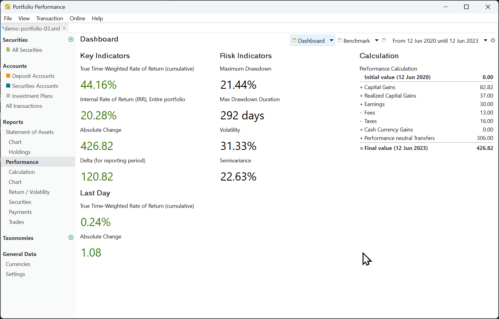
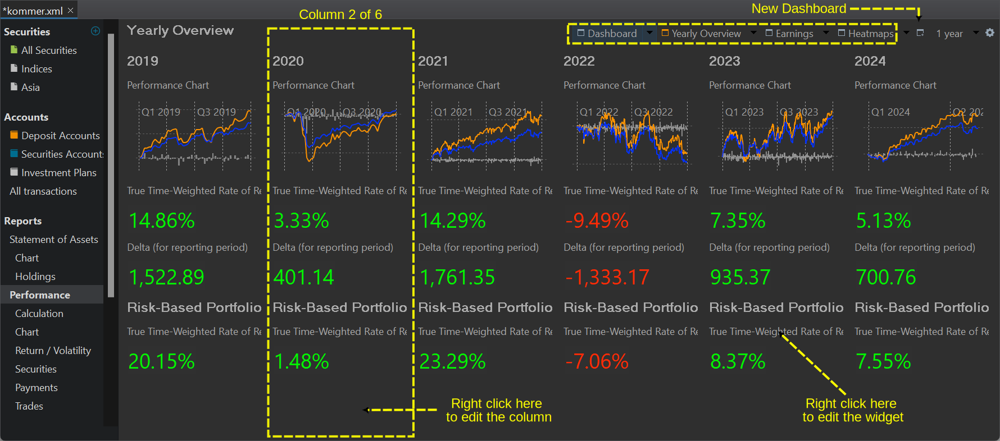
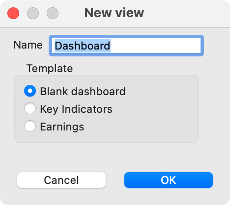
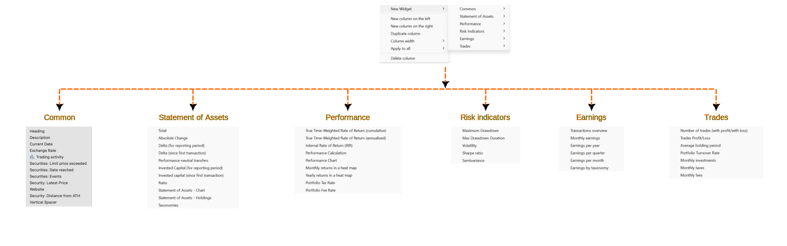

Key performance and risk indicators are summarized in a dashboard, along with a calculation widget. The dashboard can be accessed through the menu `View > Reports > Performance` or with the sidebar (see figure 1).

Figure: Dashboard with key performance and risk indicators and calculation widget.{class=pp-figure}

Please note that the performance and risk indicators are always calculated for the entire portfolio and for a specific [reporting period](../../../../concepts/reporting-period.md). By default, this is one year from today. You can change the period by selecting a different one or create a new one in the drop-down (top-right). In Figure 1, the reporting period is `from Jun 12, 2020 till Jun 12, 2023`. For the performance key indicators, the color green indicates a profit, while red signifies a loss. 

## Key performance indicators

### True Time-Weighted Rate of Return (cumulative)

The cumulative True Time-Weighted Rate of Return (TTWROR) is the geometric average of the daily returns within the reporting period. For each day within the reporting period, the daily return is calculated using Equation 1. The cumulative return is computed with Equation 2.

$$\mathrm {r_{daily} = {\frac{MVE + CF_{out}}{MVB + CF_{in}} - 1 {\qquad \text{(Eq 1)}}}}$$

and

$$\mathrm {r_{cum} = [(1 + r_1) \times (1 + r_2) \times ... \times (1 + r_n)] - 1 {\qquad \text{(Eq 2)}}}$$

where MVE = the market value of the asset at the end of day, MVB = the market value at the beginning of the day (or the end of the previous day).  CFin and CFout represent the net incoming or outgoing cashflows for the day. When a stock pays a dividend, that's an outgoing cashflow from the stock's perspective. A deposit (for buying the stock) is a cash inflow, as is paying the associated fees.

An in-depth explanation of the TTWOR calculation is given [Concepts > Performance > True Time-Weighted Rate of Return](../../../../concepts/performance/time-weighted.md). A step-by-step calculation for a very simplified example can be found at [View > Reports > Performance > Chart](../performance/performance-chart.md).

### Internal Rate of Return (IRR)

The money-weighted rate of return or IRR of a reporting period is the annual interest rate that is necessary to bring the market value of the investment at the beginning of the period (MVB) and all subsequent cash flows to the market value (MVE) at the end of the reporting period. To generate the specified cash flows within the given time period, your portfolio must grow each year by a percentage equal to the IRR. The base formula for the IRR calculation is:

$$\mathrm{MVE = MVB \times (1 + IRR)^{\frac{RD_1}{365}} + \sum_{t=1} ^{n}CF_t \times (1+IRR)^{\frac{RD_t}{365}} \qquad \text{(Eq 3)}}$$

where *n* = the number of cash flows in the reporting period, $CF_t$ = cash flow at time *t* within the period, and $RD_t$ = the number of remaining days within the period. For MVB, the $RD_t$ equals the entire period, representing the period length in years. You can simplify the equation by treating the MVB as the initial cash flow. A cash flow is any amount of money that is added to or withdrawn from an investment. For an in-depth explanation, see  [Concepts > Performance > Money-Weighted Rate of Return](../../../../concepts/performance/money-weighted.md).
 
### Absolute Change

The absolute Change is the difference between the market value of the portfolio at the end date of the reporting period (MVE) and the market value at the beginning (MVB).

$$\mathrm{MVE - MVB\qquad \text{(Eq 4)}}$$

For example, in Figure 1 (calculation widget), the absolute change equals the Final Value (426.82 EUR) minus the Initial value (0 EUR).

### Delta

The Delta value (for the reporting period) is equal to the Absolute Change (see above) minus the external cash flows that occurred in the period.

$$\mathrm{(MVE - MVB) + \sum_{t=1} ^{n}CF_t {\qquad \text{(Eq 5)}}}$$

For example, the Delta in Figure 1 is 120.82 EUR. This value represents the actual return of securities in the portfolio. The absolute change in the portfolio is partly caused by external cash inflows (306 EUR to buy the securities). This money comes from an external source and should be subtracted from the Absolute change. They are summarized as Performance neutral Transfers in the calculation panel.

## Last Day
 
### Last Day: True Time-Weighted Rate of Return

One would assume that the Last Day is the same as the ending day of the reporting period. Unfortunately, it is not. It is the previous trading day before 'today' as can be seen when hovering over the label. Figure 1 is created on December 8, 2023. The market value of the portfolio was at that time 459.31 EUR. The last trading day before this date is 2023-12-07 with a MV = 455.84 EUR. There are no cashflows on the last day.

The TTWOR for that day is given by Eq. 1 or `(459.31 - 155.84)/455.84 = 0.76%`. 

### Last Day: Absolute Change
Equation 3 can be used to calculate the Absolute Change of the last day. It's obvious that the value equals `3.47 EUR = 459.31 EUR - 155.84 EUR`.

## Risk indicators

Risk refers to the possibility of losing some or all of the invested capital or not achieving the expected return from your investment. Several indicators are provided to measure the risk.

### Maximum Drawdown
Maximum drawdown (MDD) refers to the largest peak-to-trough decline in the performance of a portfolio or investment over a specific period, typically expressed as a percentage. It measures the extent of loss incurred from the highest point to the lowest point before a new peak is reached.

With `View > Reports > Performance > Chart` you can create a graph of the cumulative performance of your portfolio, accounts, or specific securities. Figure 1 displays the portfolio performance for the reporting period 2020 - 2023.

Figure: Cumulative performance of portfolio with indication of Maximum Drawdown .{class=pp-figure}

The largest drawdown occurs between August 18, 2021 and March  8, 2022.  Cumulative performance dropped from 22.04% to - 4.12% (see Figure 2). The MDD for the reporting period of Jun 12, 2020 till June 12, 2023 is 21.44% (see Figure 1). Hovering with the mouse over the value (the label displays the reporting period) will reveal the dates.

### Maximum Drawdown Duration

The MDD Duration is the worst or longest amount of time an investment has been between peaks. 
This is 292 days or between August 18, 2021 and June 6, 2022. The longest recovery period (duration from a low to a peak) is 90 days or between March 8, 2022 and June 6, 2022.

### Volatility
Volatility in portfolio performance refers to the degree of variability in the returns of a portfolio over time. It is a measure of the risk or uncertainty associated with the portfolio's future performance. A portfolio with high volatility will have returns that fluctuate widely over time, while a portfolio with low volatility will have returns that are more consistent.

The volatility shown in Figure 2 is 31.33% (refer to Figure 1). It represents the standard deviation of daily returns during the reporting period. To be precise, it is calculated by taking the natural logarithm of (1 + daily return) and then multiplying it by the square root of the total number of days in the reporting period. Notably, weekends and holidays are excluded from this calculation. An efficient method to obtain all the daily returns is by exporting the return/volatility chart as a CSV file.

### Semivariance
The Semivariance exclusively considers the negative fluctuations of an investment. The semivariance value is 22.63% (refer to Figure 1), with weekends and public holidays disregarded. Hovering over this value with the mouse provides additional information.

In instances where negative and positive fluctuations are balanced, the formula Volatility (v) = Semi-variance (s) x sqrt(2) applies. For a dataset evenly distributed as depicted in Figure 2, the semivariance would be calculated as follows: `s = v / sqrt(2) = 31.33% / sqrt(2) = 22.15%`.

Given that the actual semivariance is slightly lower than the estimated semivariance (22.15% < 22.63%), it suggests that the returns are not symmetrically distributed, and the negative returns slightly outnumber the positive ones.

## Configuring the dashboard

By default, the Performance dashboard contains three columns: `Key Indicators`, `Risk Indicators`, and `Calculation` (see Figure 1).  Each column can contain several configurable widgets: data blocks comprising a label and a numerical value or diagram; e.g. Absolute Change or a Performance chart.  Right mouse click on an *empty space* in a column lets you manage the widgets, e.g. adding a widget. Right clicking the *widget label* lets you manage the specific widget; e.g. change the data series or reporting period. (see later).

Figure: Yearly Overview dashboard.{class=pp-figure}

Widgets are a very powerful tool to customize the dashboard to your liking. A thorough introduction is given in a [YouTube video by Finanzkoch](https://youtu.be/_-9iC7UqLsw) (German spoken but English subtitles are possible). A [list of very nice dashboards](https://forum.portfolio-performance.info/t/beispiele-fur-auswertungen-grafiken-und-berichte/5367/118) by fellow investors can be found at the forum.

Figure: Creating a new dashboard. {class=align-right style="width:30%"}

The best way to experiment is by creating a new (empty) dashboard (see Figure 3). Click on the icon `New dashboard` at the left of the reporting period. You can choose between a blank dashboard, key indicators (= the default dashboard), and Earnings (see Figure 4). To remove a dashboard from the menu, click the arrow next to the name and choose `Delete`. You can move the dashboard to the first in the list (bring to front), rename the dashboard, or make a duplicate of the selected dashboard.

A dashboard contains one or more columns; the dashboard of Figure 3 contains 6 columns.  You cannot see the borders of the column. Delete a column by right-clicking in the area. You can add a new column with the configure dashboard gear icon (top right). If there is already at least one column, you can also right-click in a column area and choose `New column on the left`,  `New column on the right`, or `Duplicate column` (see Figure 5). With `Column width` you can increase or decrease (step wise) the column width of the selected column. Of course, the width of the other columns is affected since the total width of the windows stays the same. With the Option `Apply to All`, you can set the reporting period and the data series for all widgets in the dashboard.

The `New Widget` option reveals a submenu featuring six categories of widgets (refer to Figure 5). Below is a description of each widget. Right-clicking on the widget label will reveal a context menu. Most widgets feature options such as `Edit label`, `Delete`, and `Height`. You can drag and drop widgets within and between columns. Press the CTRL key (Windows) to duplicate instead of moving.

Figure: New Widget menu with overview of all available widgets. {class=pp-figure}

### Common
 - *Heading*: A single line text field.
 - *Description*: A multi-line text field with a smaller font.
 - *Current date*: The text "Current Date", followed by the system date of the computer in the language and format, set in Help > Preferences > Presentation > Language.
 
 - *Exchange rate*: An exchange rate in the format XXX/YYY number. Right-click to choose the specific exchange rate, e.g. EUR/USD.
 
 - *Trading activity*: A graph depicting time (per year and per month) is plotted on the X-axis, while the count of trades is represented on the Y-axis. With the context menu, you can add or remove the Y-axis, change the reporting period (by default the period of the dashboard is taken), or change the trading type (by default buy, sell, delivery inbound, and delivery outbound), and the filter (by default the entire portfolio).
 
 - *Securities: Limit price exceeded*: You can set a limit price per security in the security master data ([see how-to](../../../view/securities/all-securities.md#main-pane-list-all-securities)). If the current price (as of today; independent of the reporting period) of the security exceeds the limit price, the name of the security, the current price and the limit will be displayed, as well as displaying shares with dates `only in the past` or `only in the future`.
 
 - *Securities: Date reached*: As with limit price (see above), you can link a "special" date to a security as an additional attribute. This widget will exhibit the text `Securities: Date reached (xxx)`, where xxx represents the count of securities for which today's date exceeds the date set for the security. Additionally, a list of share names and dates will be provided. This list can be sorted from the context menu.
 
 - *Securities: Latest Price*. This is a single line widget with the current price of a security; which can be chosen from the context menu. The label will mention the name of the selected security.

 - *Website*: A textbox containing the content of a website; specified by an URL in the context menu. Anchors are allowed; for example `https://help.portfolio-performance.info/en/concepts/performance/#the-money-weighted-rate-of-return`. The height of the widget can be increased with the context menu.

 - Security: Distance from ATH: The difference of the current price with the All Time High (ATH) price of the security, measured in %. The security should be specified with the context menu.

- Vertical spacer: This widget produces an invisible rectangle that occupies space. It is used to visually separate widgets (vertically). Hovering over the widget with the mouse will reveal its label. With right-click, you can change its height.

### Statement of Assets

All widgets, except the last three, are single line text widgets. 

- *Total*: The market Value of the asset at the end of the reporting period.  The asset and the reporting period can be specified with the context menu.

- *Absolute change*, *Delta (for reporting period)*, *Delta (since first transaction)* : [see above](./index.md#absolute-change) for definition of these terms.

- *Performance-neutral transfers*: these transfers are explained in [View > Reports > Performance > Calculation](./calculation.md#main-pane).

- *Invested Capital (for reporting period)* and *Invested Capital (since first transaction)*: The Invested capital in a portfolio of stocks refers to the total amount of money that has been invested in the portfolio.

- *Ratio*: This widget computes the proportion between two assets; for instance, Share 1 / Entire Portfolio.

- *Statement of Assets - Chart*: This widget produces a mini version of [View > Reports > Statement of Assets > Chart](../../reports/statement/statement-chart.md). If multiple chart view are defined, they can be selected with the context menu.

- *Statement of Assets - Holdings*: Pie chart which is a mini version of [View > Reports > Statement of Assets > Holdings](../../reports/statement/holdings.md).

- *Taxonomies*: Pie chart illustrating the proportional distribution of the taxonomy categories. 

### Performance widgets

The first three widgets are single line text; representing the common performance indicators. 

- *True Time-Weighted Rate of Return (cumulative)*, *True Time-Weighted Rate of Return (annualized)*, and *Internal Rate of Return (IRR)* are the [known](../../../../concepts/performance/index.md) single line performance indicators. The data series and reporting period can be selected in the context menu.

- *Performance Calculation*: A fully collapsed table, similar to [View > Reports > Performance > Calculation](calculation.md); first panel. The categories cannot be expanded.

- *Performance Chart*: This widget produces a mini version of [View > Reports > Performance > Chart](../../reports/performance/performance-chart.md). With the `Aggregation` context menu, one could set the level of detail (daily, weekly, monthly, quarterly, or yearly).

- *Monthly returns in a heat map*: A heatmap is a graphical representation of data that uses color-coding to visualize the performance of different stocks in a portfolio. A heatmap typically consists of a table or matrix, with each cell representing the monthly performance of a selected asset. The color of each cell corresponds to the performance of that stock. 

- *Yearly returns in a heatmap*: Each cell in the heatmap represents one year.

- Portfolio Tax Rate: The ratio of taxes / (realized and unrealized capital gains + earnings - fees).

- Portfolio Fee Rate: The ratio of Fees / (realized and unrealized capital gains + earnings).

### Risk indicators

All five widgets are single line text widgets, representing common risk indicators. See [above](index.md#maximum-drawdown) for an explanation of `Maximum Drawdown`, `Max Drawdown Duration`, `Volatility`, and `Semivariance`.

Figure: Setting the risk-free return from the context menu. {class=align-right style="width:30%"}

The `Sharpe ratio` is a financial metric that measures the performance of a portfolio compared to a risk-free asset, taking into account the portfolio's risk. It is calculated by subtracting the risk-free return from the portfolio's return, such as the Internal Rate of Return (IRR), and then dividing the result by the standard deviation of the portfolio's return, which is a measure of its volatility.

The risk-free return is set by default to 0%, but this can be adjusted through the context menu to reflect your current risk-free rate. As the ratio is based on volatility, complete historical prices are required. Without complete prices, the calculated volatility may be underestimated.

### Earnings

- *Transactions overview*: A table displaying the monthly earnings, comprising dividends, interest, or both individually. The year can be adjusted using a spin button located at the top of the widget.

- *Monthly earnings*:  A table displaying the monthly earnings. The year should be set with the context menu.
- *Earnings per month*, *Earnings per quarter*, and *Earnings per year*: Graphical representation of the earnings per month, quarter or per year. 

### Trades

- *Number of trades with profit/loss*: A single-line widget presenting the total number of trades in grey color, along with an upward-pointing green arrow + counter indicating the number of trades with profit, and a downward-pointing red arrow indicating the number of trades with loss.

- *Trades Profit/loss*: The total net value of the trades in the reporting period. Green color used for profits, red for loss. Assets and reporting period could be set with the context menu.

- *Average holding period*: The average holding period is calculated as follows: All trades are included that were in the portfolio at some point within the selected reporting period. The holding period of each security is the difference between the time of purchase and sale. Immediate sales are assumed for positions currently held. The position weight is calculated from the purchase price of the position relative to the total number of all purchase prices. The Average holding period is the sum of the products "holding period x percentage position weight" across all positions. The metric could be displayed in days or in years.

- *Portfolio Turnover Rate*: The Portfolio Turnover Rate measures how much (in money) of the portfolio was "replaced" throughout the holding period, as a fraction of the average portfolio value. A turnover of 100% means that all money invested in the portfolio is since then replaced.

- *Monthly investments*, *Monthly fees*, and *Monthly taxes*: A table illustrating the total amount of investments, fees, or taxes. The rows correspond to the years, while the columns represent the months, making each cell a monthly record within a year.

