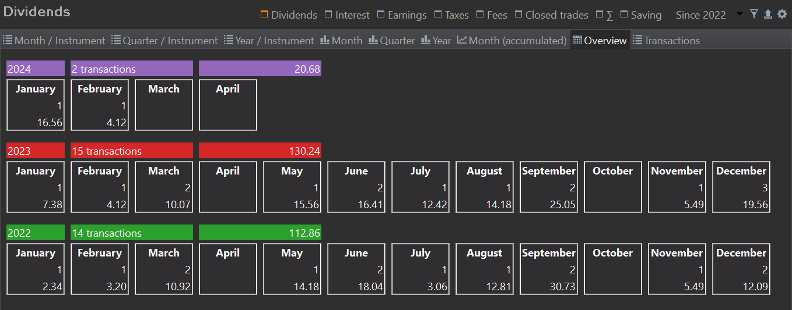

The menu `View > Reports > Performance > Payments` presents an overview of payments per period. A payment constitutes a transfer of money into an account, encompassing dividends, interest, fees, and taxes. The view is structured as a table with periods arranged in columns, instruments (accounts and securities) in rows, and an aggregated summary payment allocated per cell. Utilizing the primary and secondary menu at the top, you can specify the payment type and the period selection (refer to Figure 1).

All payments are denoted in the default portfolio currency, such as EUR as illustrated in Figure 1. Payments made in a foreign currency undergo automatic conversion using the currency exchange rate applicable on the payment date. For instance, the Interest Charge of 13 AUD on 2023-08-01 is converted to 7.85 EUR utilizing the conversion rate of 0.6040 AUD/EUR.

Figure: Payments overview. {class=pp-figure}

## Primary menu

- *Reporting period*: In the primary menu (far right), you can select the overall reporting period. Utilize the drop-down `Since xxxx` to designate the time period; for instance, `since 2023`. When combined with the sub-period selection (e.g., Month), this could potentially result in numerous columns in the main pane. Indeed, four years would yield 48 columns.

- The *filter* function operates identically to that in the [Performance > Calculation](./calculation.md#main-pane) view, allowing you to refine the information displayed for either the entire portfolio or a specific securities account, either alone or in conjunction with its associated deposit account.

- The *Export* Data as CSV function exports the monthly, quarterly, and yearly table view, as well as the transactions view. The chart diagrams cannot be exported.

- The *Configure* icon enables you to reverse the column order (from `Jan > Feb > Mar > ...` to `Mar > Feb > Jan`), display only the first year of the list of years `since xxxx`, and consolidate inactive securities. The consolidation results in a new line &sum; `Retired securities`, summarizing (consolidating) the results of all [inactive securities](../../../file/new.md#security-master-data) into one row. By default, both active and inactive securities are listed.

- *Type of payment*

    - *Dividends*: all payments of the type [Transaction > Dividend ...](../../../transaction/dividend.md). In Figure 1, the dividends payment type is selected
    - *Interest*: all payments of the type [Transaction > Interest](../../../transaction/interest.md) and `Interest Charge`. If both payments occur in the same period, the net value of (Interest - Interest Charge) is displayed.
    - *Earnings*: the sum of all dividends and (net) interest payments.
    - *Taxes & Fees*: all payments regarding [taxes & fees](../../../transaction/fees-taxes.md). These payments could be either as part of another transaction; for example, buy or interest. Or, they can be booked separately with the transaction type `Taxes`,`Tax refund`, `Fees`, or `Fees refund`. If payment and refund occur in the same period; the net value is displayed.
    - *Closed trades*: The result of a sell transaction is a closed trade. The value displayed here is the Gross Profit/Loss of the sale; thus without deducting the paid taxes and fees. 
    - *&sum; (Sum)*: the sum (&sum;) of all payments per period; e.g. `dividends + net interest + net fees + net taxes`.
    - *Saving*: all [deposits and withdrawals (removals)](../../../transaction/deposit-removal.md) and [Inbound and Outbound Deliveries](../../../transaction/delivery.md), including taxes and fees. Buy and sell transactions are not included since these contain already a deposit or withdrawal.

## Secondary menu

The secondary menu (below the primary) allows you to adjust the layout of the main pane. The first three options enable you to select a table view per month, quarter, or year; marked with the green line in Figure 1. The following four options will present the same data but in the form of a graph (blue line). The last two options (orange line) provide detailed information. Clicking the header of a column will sort the rows in ascending or descending order.

- *Month/Instrument*: The reporting period (`Since xxxx`) is divided into months, with one column per month. The first and last columns contain the names of the instruments, which could be securities and/or deposit accounts. The filter option (see above) allows you to restrict this view to certain accounts. A sum is provided for each column (month) and for each row (instrument). As mentioned before, this view could be exported as a CSV file.
- *Quarter/Instrument*: The reporting period (`Since xxxx`) is divided into quarters with one column per quarter. The instrument column is only displayed once.
- *Year/Instrument*: Similar to the previous description, but organized by year instead of month. The number of displayed years depends on the selected reporting period (`Since xxxx`).
    Figure: Dividend payments per year since 2022. {class=pp-figure}

    

    As can be seen by comparing Figure 1 and Figure 2, the value for the first security in 2023 is the sum of the monthly payments (19.80 = 7.38 + 12.42).

- :bar_chart: *Month*: A bar chart of the `Month/Instrument` view with the months (Jan - Dec) on the X-axis, the payments on the Y-axis, and the years represented by differently colored bars with a corresponding legend. Figure 3 depicts a bar chart illustrating the monthly dividend payments since 2022, derived from the tabular view shown in Figure 1.
    Figure: Bar chart of monthly dividend payments since 2022. {class=pp-figure}

    

- :bar_chart: *Quarter and Year*: Similar to the monthly bar chart but organized by quarter or year.
- :chart_with_upwards_trend: *Month (accumulated)*: A line chart with the summed payments per month. The X-axis displays the months (Jan - Dec), while the Y-axis represents the accumulated payments. Each year will be represented by a different colored line (legend).
- *Overview*: a special kind of 'boxed' view, with a box for each year and month, containing the number of transactions and the total amount of payments in that period (see Figure 4).

      Figure: Box view of monthly dividend payments since 2022. {class=pp-figure}

    

- *Transactions*: A list of all transactions related to the selected type of payment in the primary menu. For instance, after choosing the `Dividends` and `Year/Instrument` options in the primary and secondary menu, the main pane will display the total dividend payment per year. If you wish to identify the transactions that lead to these dividend payments, you can switch to the "transactions" option in the secondary menu.
