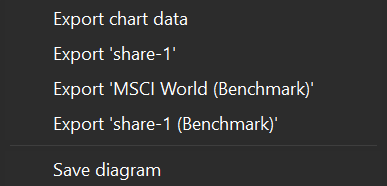

# Performance &rsaquo; Chart

With the menu `View > Reports > Performance > Chart` or the sidebar, you can generate a graphical representation of the relative performance of your assets over time.

The x-axis represents time, and you can select the desired time period using the dropdown menu in the top-right corner. By default, the periods of 1 year, 2 years, 3 years, 4 years, 6 years (from today), and the previous day are available. Additionally, you have the option to create a custom time period using the 'New' feature; see [Reporting Period](../../../../concepts/reporting-period.md) for a description.

The y-axis displays the cumulative performance as a percentage from the beginning of the reporting period; indicating how much the asset value has increased or decreased compared to the previous period (daily, weekly, monthly, quarterly, or yearly). For a daily report, the formula could be written as:

$$\mathrm {r_{daily} = {\frac{MVE + CF_{out}}{MVB + CF_{in}} - 1 {\qquad \text{(Eq 1)}}}}$$

and

$$\mathrm {r_{cum} = [(1 + r_1) \times (1 + r_2) \times ... \times (1 + r_n)] - 1 {\qquad \text{(Eq 2)}}}$$

where MVE = the market value of the asset at the end of day, MVB = the market value at the beginning of the day (or the end of the previous day).  CFin and CFout represent the net incoming or outgoing cashflows for the day. When a stock pays a dividend, that's an outgoing cashflow from the stock's perspective. In fact, the MVE should be increased by this amount. Should this stock be sold on the day, you would receive the MVE + dividend! A deposit (for buying the stock) is a cash inflow. Paying the associated fees is also a cash inflow, as they are paid externally to the stock. The MVB, which is initially zero, should be increased by these sums. One does not acquire magically the stock for nothing.

Taxes are usually **NOT**** considered as cash inflows because they represent a mandatory payment to the government. Investors have little control over taxation and the performance of their investment should ideally remain unaffected by it. In contrast, fees typically represent upfront costs incurred during the buying or selling of stocks. Taxes on investments, however, typically come into play upon selling the investment, exerting their impact on performance more noticeably at the conclusion of the investment cycle.

## Calculation method

### Simplified example
Let's start with a *very simplified example* without cashflows (see Figure 1). You purchased 10 shares on January 1, 2023. The quote of share-1 fluctuates between 9 and 17.

- Jan 1: the market value of your asset at the beginning of the day is zero (MVB = 0). You haven't purchased any stock yet. The market value at the end of the day MVE = 90; you have purchased 10 shares a 9 per share.  For that, you made a deposit or CFin = 90. There are no fees or other cash flows. According to equation 1, the `daily performance = [(0 + 90)/90] - 1` = 0. The cumulative performance is also `(1 + 0) - 1 = 0`.

- From Jan 2 until 1 until March 31, the daily performance remains at zero because there are no incoming or outgoing cashflows and MVB = MVE e.g. `(90/90) - 1 = 0`. The performance is solely driven by the historical prices.

- On April 1, the price increases from 9 to 15 per share. Thus, MVB = 90 and MVE = 150 and the `daily performance = (150/90) - 1 = 0.6667` or 66.67%. The cumulative performance from the beginning of the reporting period is also `[(1+0) x (1+0) x ... x (1+0.6667)] - 1 = 0.6667` or 67.67%. 

- On July 1, the price drops to 14 per share. The daily performance for that day is `(140/150) - 1 = -0.0667` or -6.67%. The cumulative performance however becomes   
`[(1+0) x (1+0) x ... x (1+0.6667) x (1+0) x ... x (1-0.0667)] - 1 = (1.6667 x 0.933) - 1 = 0.5555` or 55.55%. 

Figure: Simplified example to calculate the performance (%) without cashflows. {class=pp-figure}

### Complex example
Now, let's introduce some complexity as depicted in Figure 2. The initial purchase includes both fees and taxes. On May 1, a dividend is paid. Subsequently, there are additional taxes or fees along with refunds.

- Jan 1: the performance drops from 0% on December 31 to -6.25% on Jan 1. As in the previous example, MVB = 0 and MVE = 90. However, there are *two* CFin: a deposit and a fee payment. Taxes are not taken into account. According to Eq 1, the `daily r = [90/(0 + 90 + 6)] - 1 = -0.0625` or 6.25%. The cumulative performance is the same `(1 - 0.0625) - 1 = -0.0625` 

- From Jan 2 until 1 until March 31: the daily performance becomes zero and the cumulative performance remains at -6.25% (see above for an explanation).

- On April 1, the historical quote increases to 15 per share. There are no additional cashflows. The `daily performance = (150/90) - 1 = 0.6667` or 66.67%. The cumulative performance becomes: `[(1-0.0625) x (1 - 0) x ... x (1 + 0.6667)] - 1 = 0.5625` or 56.25%.

- A dividend is paid on May 1. This represents a CFout. Only the net value of this cashflow (8) is taken into Eq 1, giving the `daily performance = [(150 + 8)/(150] - 1 = 0.0533` or 5.26%. Because most daily performances are zero, I will leave them out in the formula for the cumulative performance = `[(1-0.0625) x (1 + 0.6667) x (1 + 0.0533)] - 1 = 0.6458` or 64.58%.

- July 1, historical price decreases to 14 per share. The daily performance becomes `(140/150) - 1 = - 0.06667`. The cumulative performance decreases to `[(1-0.0625) x (1 + 0.6667) x (1 + 0.0533) x (1 - 0.0667)] - 1 = 0.5360` or 53.60%.

- The taxes (50) on Aug 1 have no effect on the daily or cumulative performance, which remains at 53.60%.

- The fee or CFin on Sept 1 does have an effect. The daily performance = `[140/(140 + 20)] - 1 = - 0.125`. The cumulative performance decreases to `[(1-0.0625) x (1 + 0.6667) x (1 + 0.0533) x (1 - 0.0667) x (1 - 0.125)] - 1 = 0.3440` or 34.40%.

Figure: Simplified example to calculate the performance (%) with cashflows. {class=pp-figure}

## User interface

The user interface of `View > Reports > Performance > Chart` is quite comparable to the chart interface of [View > Reports > Statement of Assets > Chart](../statement/statement-chart.md). We cover only the differences in this section; see link above for the common features.

### New features

The gear icon (top right) provides an additional type of data series, called `Add benchmark ...` (see Figure 3).  A benchmark is a security from which only the historical prices are taken to calculate the daily and cumulative performance. Figure 3 displays two benchmarks are displayed: the MSCI World index and share-1 (benchmark). For more information on indexes and benchmarking, refer to [How-to > Benchmarking your portfolio](../../../../how-to/benchmarking.md).

Please note that the share-1 (benchmark) graph is identical to the one in Figure 1, where cash flows such as dividends and fees were not taken into account. Since the daily historical prices of the MSCI World index exhibit slight daily variations, the resulting curve appears somewhat more irregular.

Figure: Adding a benchmark to the performance chart. {class=pp-figure}

Figure: Export CSV. {class=align-right style="width:30%"}

In addition to the `Export chart data` and `Save diagram`, already available in Statements of Assets chart, the 'Export data as CSV' button, located in the top right corner, enables you to export each data series or benchmark separately as a CSV file. Only the series that are currently displayed on the chart can be exported. For example, to validate the calculations discussed previously, you can display and export the share-1 data series. In the exported CSV file, you will find the numerical daily and cumulative performance values for each day.

Another addition to the Statement of Assets chart, is the 'Interval' drop-down with choices: daily, weekly, monthly, quarterly, or yearly. In the previous examples, we computed the daily (cumulative) performances. Exporting share-1 data series as csv-file with a quarterly time interval will produce the following table.

| Date       | Value | Cfin | Cfout | Daily % | Cumulative % |
| ---------- | ----: | ---: | ----: | ------: | ---------:   |
| 2022-12-31 | 0     | 0    | 0     | 0       | 0            |
| 2023-03-31 | 90    | 96   | 0     | -6.25   | -6.25        |
| 2023-06-30 | 150   | 0    | 8     | 75.56   | 64.58        |
| 2023-09-30 | 140   | 20   | 0     | -18.33  | 34.41        |
| 2023-12-31 | 120   | 0    | 0     | -14.29  | 15.21        |
| 2024-01-01 | 170   | 0    | 0     | 41.67   | 63.21        |

To calculate the performance of the second quarter, you need to know the values of MVB, MVE, CFin, and CFout. MVB is the market value of share-1 on March 31, which is 90 (see Figure 1). MVE is the market value on June 30, which is 150. If you look closely at the transaction list of Figure 2, you will notice that there is only one CFout: dividend minus fees on May 1 (8). There are two CFin: deposit and fee on Jan 1 (96) and another fee on September 1 (20). The second quarter only contains the CFin. Following Eq 1, the quarterly performance (of quater 2) is: `[(150 + 8)/90] - 1 = 0.7555` or 75.56%. The cumulative performance is`[(1 - 0.0625) x (1 + 0.7556)] - 1 = 0.6458` or 64.58%.

Please, refer to [View > Reports > Statement of Assets > Chart](../statement/statement-chart.md) for a description of the other features such as zooming, adding data series, context menu of the canvas and legend, and others.

